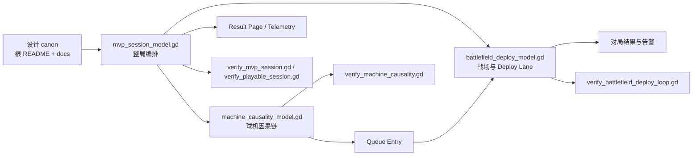
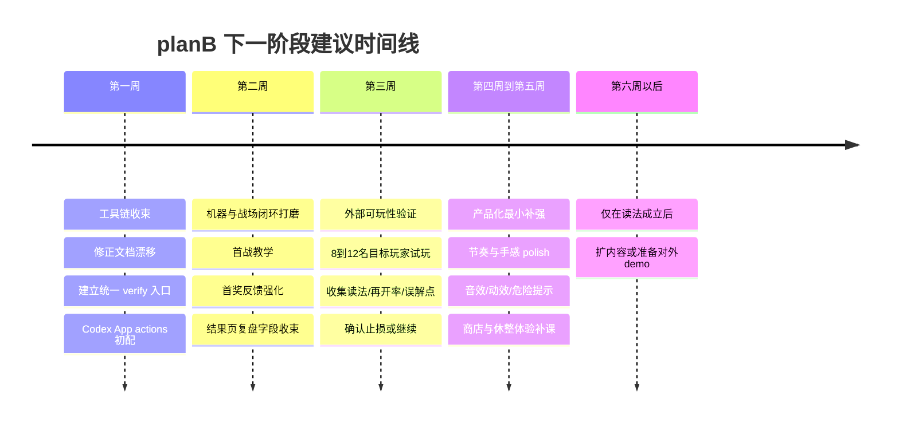

# planB 仓库 mvp 分支评估报告

## 执行摘要

先给结论：**这个项目已经具备“进入内部可玩 MVP 开发”的设计条件，但还不具备“冲商业成功”的产品条件。** 仓库最强的部分不是现成内容量，而是**设计边界、术语体系、MVP 失败定义、以及验证脚本意识**都 unusually 清楚；这让它很适合独立开发者用 AI 做高频迭代。最弱的部分则是：当前实现仍明显偏向**验证用的纵切 harness**，而不是面向真实玩家的完整产品层。主动可控的商业风险，不在“能不能把代码继续写出来”，而在**玩家能不能在二十分钟内真正读懂“机器轴如何改变战场”**。仓库文档自己已经把这一点定义成成败关键。citeturn16view1turn20view0turn30view0turn52view2turn52view3

从仓库一手资料看，当前 active 实现已经围绕 Godot 4.6、GDScript、Compatibility renderer、`mvp/` 工程根、球机因果链验证、战场部署循环验证、整局 session 验证搭出了一套轻依赖、强边界的工程骨架；工程规则明确要求优先使用 Godot 原生 Scene/Node/Resource/Signal，而不是 ECS、服务定位器或大型事件总线。与此同时，`mvp_session_model.gd` 预加载了两名 Guardian、九个经济修正、三个反制资源，并把整局流程固定成 Guardian 选择、五场战斗、两次奖励、一次商店、终点准备与终点战，说明当前代码已经在努力把设计文档压缩成可运行的 MVP 轮廓，而不是停留在纯文档阶段。citeturn36view0turn37view0turn46view0turn35view0turn52view0turn52view2turn50view0turn51view0turn51view2turn51view3

我的总体判断是：**工具链应以“保留主栈、补强工作流、避免大迁移”为原则；游戏设计应以“先做可读性证明，再做内容扩张”为原则；商业化应先把产品收束成一个一句话就能卖的独特钩子，再决定是否扩大投入。** 如果你想追求商业成功而不是单纯完成作品，那么下一阶段最优先的不是第二种族、更多事件或更复杂经济，而是把“机器—队列—Deploy Lane—三路战场—结果页复盘”这条链做成**新玩家第一次就能看懂、第二次想再来一局**的体验。citeturn17view0turn18view0turn18view2turn20view0turn54search0turn58search0turn58search1turn58search2turn58search7

下面这张表先把最终判断压缩成一页：

| 维度 | 当前判断 | 主要依据 | 建议 |
|---|---|---|---|
| 工具链 | **方向正确，层次清楚，但有文档漂移与平台假设风险** | 工具链已分成 gstack-game、GodotPrompter、Superpowers、GoPeak MCP 与本地验证脚本；同时仓库已记录根文档与工程文档之间存在状态不一致。citeturn46view0turn35view0 | **保留主栈，补强 Codex App 适配、验证动作与文档同步** |
| 游戏设计 | **核心 thesis 强，MVP 目标清晰，但“可读性兑现”仍未被真实玩家证明** | GDD、MVP scope、学习检查点把“不是更多兵、不是点对路线，而是机器轴改变战场”写成验收条件。citeturn16view0turn16view1turn20view0 | **继续做可玩 MVP，但先做教学、反馈、复盘，不要扩内容** |
| 工程实现 | **已能支撑内部纵切试玩，不足以支撑商业化 demo** | `mvp/` 下已有场景、脚本、资源、验证工具；但 `scripts/economy/` 仍为空，session 模型承担了大量编排责任。citeturn32view2turn36view2turn36view3turn39view2turn40view0 | **把 debug 编排逐步拆成数据驱动与独立模块** |
| 市场吸引力 | **有差异化潜力，但属于高解释成本的混合品类** | 项目试图把“球机/弹球感”“自动战斗”“三路线宏观选择”“roguelite 构筑”组合在一起；相邻成功样本存在，但没有一款与其完全同构。citeturn20view1turn58search0turn58search1turn58search2turn58search7 | **先验证一句话卖点是否成立，再决定是否扩大内容投入** |
| gstack-game 与 Codex Desktop | **适合做增量适配，不适合做替换式迁移** | gstack-game 是本地化的游戏开发 rubric；Codex app 强在 worktree、automations、browser、computer use、skills/plugins，不强在 Godot 专业运行时本体。citeturn57view0turn46view0turn54search0turn54search2turn54search3 | **把 Codex App 当 orchestration 层，而不是 Godot 专家层** |

## 先从仓库证据出发

按你的要求，我先以仓库的一手资料作为基准，再补充外部资料。仓库根 README 明确说明：**当前项目是“文档主导的 Godot MVP 项目”**，正式设计权威仍在根目录与 `docs/`；`mvp/` 是当前 Godot MVP v0 实现目录，但**不替代设计文档的权威性**。同一份 README 还特别写明：`docs/archive/prototypes/` 不是当前实现来源，旧 prototype 不应恢复为当前依据。也就是说，这个仓库不是“文档失控、代码乱长”的状态，恰恰相反，它是在有意识地把设计 canon 与实现层分开。citeturn30view0

仓库活跃实现目录 `mvp/` 的顶层结构相当干净：有 `assets/`、`docs/`、`resources/`、`scenes/`、`scripts/`、`tools/`、`AGENTS.md` 与 `project.godot`；项目配置直接把 Godot 4.6、主场景 `res://scenes/ui/main_menu.tscn`、1600×900 窗口与 `gl_compatibility` 渲染方法写在 `project.godot` 里。`scenes/` 又被拆成 `ball_machine`、`battlefield`、`deploy`、`economy`、`enemy`、`run`、`test`、`ui`，`scripts/` 则对应拆成 `ball_machine`、`battlefield`、`data`、`deploy`、`economy`、`enemy`、`run`、`ui`。这说明实现组织方式与设计剖面基本一致。citeturn32view2turn36view0turn36view2turn36view3

不过，代码层也暴露了一个很关键的成熟度信号：**核心纵切已经有了，模块化尚未完全到位。** 例如 `scripts/run/` 下已有 `mvp_session_model.gd`、`mvp_playable_session.gd`、`mvp_shell.gd` 与 debug/model 脚本；`scripts/ball_machine/` 和 `scripts/battlefield/` 各自都有 model / view / debug 三件套；但 `scripts/economy/` 在当前树里仍是空目录。这意味着经济系统的设计虽然在文档层很完整，在实现层却还没有形成对等的独立模块，当前更像是被 session 脚本以资源与编排逻辑“托管”着。citeturn38view0turn39view0turn39view1turn39view2

再看 `mvp_session_model.gd`，它不仅预加载了机器模型和战场模型，还预加载了两名 Guardian、九个 modifier、三个 counter，并把整局流程写成固定的 `FLOW_STEPS`：Guardian Select、Battle 1、First Reward、Battle 2、Shop / Gold / Rest、Battle 3 with counter、Battle 4、Second Reward、Battle 5、Endpoint Prep、Endpoint、Result Page。同时，代码把金币水龙头首版写死为 `6 / 6 / 8 / 0 / 0 / 0`，并明确标记“调试首版，非最终平衡”。这不是坏事；这说明作者已经开始把文档转译为**可验证的、可收缩的 MVP 剧本**。但这也意味着当前实现离“可卖的系统游戏”还有一层距离：它首先是一个**验证机器可读性的实验框架**。citeturn52view0turn52view2turn52view3

基于这些仓库证据，我建议你把当前代码状态定位为：**已经进入“实现验证期”，还没进入“内容生产期”。** 这一定义很重要，因为它决定了后面的策略：现在最值钱的不是继续铺设更多玩法面，而是尽快拿到可读性与可玩性的外部证据。citeturn20view0turn30view0turn52view2

为方便定位，我实际重点审阅了以下路径：

| 路径 | 作用 |
|---|---|
| `README.md` | 项目定位、权威文档边界、归档/原型排除规则。citeturn30view0 |
| `development-tools.md` | 当前 vibe coding 工具链总表、技能/MCP/插件现状。citeturn46view0 |
| `.codex/skills/README.md` | gstack-game 的来源、技能分组与运行假设。citeturn57view0 |
| `docs/gdd.md`、`docs/concept.md` | 核心幻想、设计支柱、目标玩家与最大风险。citeturn16view0turn20view1 |
| `docs/mvp-scope.md`、`docs/mvp-learning-checkpoints.md` | MVP 成败边界、学习目标与失败信号。citeturn16view1turn20view0 |
| `docs/machine-warehouses.md`、`docs/battlefield-rules.md`、`docs/enemy-rules.md`、`docs/deploy-lane-ui.md` | 系统核心规则与交互合同。citeturn17view0turn18view0turn18view1turn18view2 |
| `docs/guardian-system.md`、`docs/mvp-hive-loadout.md`、`docs/rewards-economy.md` | 种族、Guardian、局内经济与构筑内容。citeturn19view0turn19view1turn16view2 |
| `mvp/AGENTS.md`、`mvp/project.godot` | 工程规范、引擎与渲染目标。citeturn35view0turn36view0 |
| `mvp/scripts/run/mvp_session_model.gd` | 当前整局编排与 debug-first 实现事实。citeturn50view0turn51view0turn52view2 |
| `mvp/scripts/ball_machine/*.gd`、`mvp/scripts/battlefield/*.gd` | 机器因果链与战场部署循环实现轮廓。citeturn39view0turn39view1turn53view2turn53view6turn53view7turn53view9 |
| `mvp/tools/*.gd`、`mvp/tools/verify_godot.sh` | 验证脚本与烟测入口。citeturn37view0turn40view8turn40view9 |

当前仓库所呈现的系统流，大致可以抽象为下面这条链：

这个流图并不是文档幻想，而是当前目录结构、脚本命名与验证工具共同指向的实际实现关系。citeturn36view2turn36view3turn37view0turn52view0turn53view2turn53view6

## 工具链评估

当前工具链最大的优点是**分层清晰**。`development-tools.md` 明确把链路分成四层：`gstack-game` 负责游戏设计 canon 与评审方法，`GodotPrompter` 负责 Godot 4.x 实现知识，`Superpowers` 负责执行纪律、规格、调试与代码审查，`GoPeak MCP` 负责真正的 Godot 运行验证；再辅以 Node REPL、Browser/Chrome Plugin、Shell、web browsing、GitHub 插件与 `gh` CLI。对一个由独立开发者 + AI 驱动的项目来说，这种“设计 / 工程知识 / 执行流程 / 运行时验证”四层分离，是成熟度较高的配置方式。citeturn46view0

更重要的是，工程规范没有追求过度技术化。`mvp/AGENTS.md` 写得很明确：先读现状，再改代码；先做最小可运行闭环，再抽象；优先使用 Godot 原生 Scene、Node、Resource、Signal、Group、Autoload；**不默认引入复杂框架、ECS、服务定位器或大型事件总线**。这与当前 `mvp/` 目录里没有明显第三方 addon 重度依赖、并且直接通过 `project.godot` 与验证脚本驱动 MVP 的工程气质，是一致的。对于一个仍在证明玩法可读性的项目，这是正确选择。citeturn35view0turn32view2turn36view0turn37view0

但工具链也有两个现实风险。第一，**文档漂移已经出现**：仓库自己承认根 `AGENTS.md` 仍写着“没有构建或验证命令”，而 `README.md` 与 `mvp/AGENTS.md` 已经描述了 `mvp/tools/verify_godot.sh`。第二，**平台假设不完全中立**：gstack-game 的 README 明确说它是从 `/Users/yang/Projects/gstack-game` 迁移来的，并保留了面向 Codex/macOS 的运行适配与 shell 假设。这不会阻止你继续用，但会在你把工作流搬进更标准化的 Codex App / Windows / 远端主机环境时产生摩擦。citeturn46view0turn57view0

下面是我对当前工具链的直接判断：

| 组件 | 仓库证据 | 适配性 | 可维护性 | 建议 | 预计工作量 | 风险 |
|---|---|---|---|---|---:|---|
| `gstack-game` 本地 skills | 项目把它定义为游戏设计、验证、评审、QA、handoff 的主链路；skills README 也说明它保留原始游戏开发 rubric。citeturn46view0turn57view0 | 很高，尤其适合你的“设计由你定、AI 协助执行”模式 | 中等；问题不在方法，而在本地迁移痕迹与平台耦合 | **保留 + 平台中性化**，不要替换 | 2–4 人日 | 低 |
| `GodotPrompter` | 仓库把它作为 Godot 4.x 实现知识主来源，并记录安装版本 `1.9.0`。citeturn46view0 | 很高 | 高 | **保留** | 0–1 人日 | 低 |
| `Superpowers` | 用于规格、计划、调试、验证、code review、worktree。citeturn46view0 | 高 | 高 | **保留，但减少与 Codex App 原生 worktree/automation 的重叠说明** | 1–2 人日 | 低 |
| `GoPeak MCP` | 被明确定义为 Godot 运行验证首选，支持 editor_run / export_run / project_setting 等。citeturn46view0 | 非常高 | 中高；关键在于是否持续可用 | **强保留**，这是你最不能丢的环节 | 0–1 人日 | 中 |
| Node REPL MCP | 仓库把它定位为轻量 glue code 与数据处理。citeturn46view0 | 中等 | 高 | **保留为辅助，不要上升为主实现链** | 0 人日 | 低 |
| Browser / Chrome Plugin | 仓库自己说不是当前 Godot MVP 默认工具。citeturn46view0 | 当前阶段有限 | 中 | **仅在浏览器原型、截图、视觉 QA 时使用** | 0–1 人日 | 低 |
| Godot 4.6 + GDScript + Compatibility renderer | 工程规则与项目配置都已锁定这个组合。citeturn35view0turn36view0turn46view0 | 高 | 高 | **保留**，不要换引擎 | 0 人日 | 低 |
| 本地验证脚本组 | `verify_project`、`verify_machine_causality`、`verify_battlefield_deploy_loop`、`verify_mvp_session`、`verify_playable_session` 已存在。citeturn37view0turn46view0 | 很高 | 中高 | **补强并串成统一验证入口** | 2–3 人日 | 低 |
| `gh` / GitHub plugin | 仓库视为外部协作可选层。citeturn46view0 | 中高 | 高 | **保留，结合 Codex App review/ship 能力使用** | 0–1 人日 | 低 |
| GUT / gdUnit4 | 仓库当前只把它列为候选。citeturn46view0 | 中等 | 中高 | **补强，不必立刻引入；先只覆盖纯逻辑** | 2–4 人日 | 中 |

我不建议你现在替换 Godot、替换主要技能体系，或把工具链重做成“纯 Codex App 工作流”。真正应该做的是三件事：  
其一，把 `development-tools.md`、根 README、根/`mvp` AGENTS 里的状态差异收敛成一致口径；其二，把现有验证脚本串成一个**单按钮任务矩阵**；其三，把 gstack-game 的本地 skill 文档改成**不依赖 macOS 私有目录**、可以直接被 Codex App / CLI / 远程主机复用的说明格式。这样做是补强，不是迁移，ROI 最高。citeturn46view0turn57view0turn54search0

## 游戏设计与 MVP 可玩性评估

从设计角度看，`planB` 的 thesis 很清楚：玩家不是直接操控单位，而是在一台“会出兵的物理机器”上，围绕 `Launch / Tuning / Unit` 选择主轴，再通过三路自动战斗看到机器输出兑现为持续流、重击或批量冲锋。这个 thesis 的厉害之处在于，它**不是把多个流行关键词硬拼在一起**，而是给每一层都定义了明确职责：`Launch` 管输入与回流、`Tuning` 管结算质量、`Unit` 管槽位进度与队列、`Deploy Lane` 只决定后续落点。文档里甚至反复强调：玩家不能只觉得“我造了更多兵”或“我只是点对了路线”，否则 MVP 就算失败。这个设计目标非常锋利。citeturn16view0turn17view0turn18view2turn20view0

你的设计文档还有一个非常强的地方：**它把“可读性”当作第一公民，而不是把内容量当作护城河。** `mvp-scope.md` 把第一版压到 15–20 分钟、1 个种族、2 个 Guardian、最多 9 个实际奖励/商店效果、3 个反制家族、1 个终点战；并且明确写出“不可读时先减少内容或加强反馈”。这对独立开发尤其重要，因为它防止项目掉进“先堆内容再说”的经典陷阱。citeturn16view1turn16view2

从实现侧看，当前代码与设计文档的 **MVP 会话结构基本对齐**。`mvp_session_model.gd` 确实把 Guardian 选择、首战、第一次奖励、第二战、第一次商店、带反制的第三战、第四战、第二次奖励、第五战、终点准备、终点战和结果页串成了固定流程；同时预加载的 modifier 列表正好覆盖首奖三轴锚点、第一次商店候选与第二次奖励深化项。这说明项目已经从“纸面设计”推进到了“可跑通的规则路由”。citeturn52view0turn52view2turn51view0turn51view1turn51view2turn51view3

但我仍然不会把它判断成“已经足以直接冲正式商业版可玩 alpha”。原因不在设计，而在**当前缺的恰恰是会让外部玩家感受到‘好玩’而不是‘聪明’的那一层**。文档里要求 Battle 1 前 30 秒玩家就能用自己的话解释 Pool、Tuning、Unit 槽、Deploy Lane、暴露闸门与队列。而当前实现虽然已经有 `machine_causality_model.gd`、`battlefield_deploy_model.gd`、lane warning、queue entry 等逻辑接口，但整体仍明显偏验证驱动：存在 `force_tuning_result`、`force_battle_result_for_debug`、`set_public_warning`、`force_lane_state_for_debug` 等专用入口，说明系统现在优先在验证“机制是否因果闭环”，不是在优化“玩家是不是自然读懂”。citeturn20view0turn53view2turn42view2turn53view6turn53view8turn53view9

所以我的明确判断是：

**它足以支撑“进入内部 MVP 可玩版本开发”，但还不足以支撑“进入外部展示型 demo 开发”。**  
原因有三点。  
第一，设计文档已经完整到可以转实现。  
第二，代码骨架已经能跑完整局节奏。  
第三，真正未被证明的不是系统有没有，而是玩家是否能快速理解并因此获得乐趣。citeturn16view1turn20view0turn52view2turn52view3

当前最小缺口，我建议你按下面的优先级处理：

| 缺口 | 为什么关键 | 现状判断 | 优先级 | 预计工作量 | 风险 |
|---|---|---|---|---:|---|
| 新手读法与首战教学 | 项目成败取决于玩家是否能在 Battle 1 前 30 秒看懂机器链路。citeturn20view0 | 文档定义清楚，代码证据不足 | **最高** | 4–6 人日 | 中 |
| 第一奖励与战场兑现的强反馈 | 首奖是玩家第一次“承诺主轴”的时刻。citeturn20view0turn16view2 | session 模型已支持，表现层仍待强化 | **最高** | 3–5 人日 | 中 |
| 结果页复盘可读性 | 你的设计天生需要复盘，不然玩家只记得输赢。citeturn20view0turn50view9 | 已有结果页结构，但未见足够玩家向表述 | **高** | 2–4 人日 | 低 |
| 经济系统独立模块化 | 经济设计完整，但实现层目前未独立成 `scripts/economy` 模块。citeturn16view2turn39view2turn52view0 | 中央编排过重 | **高** | 5–8 人日 | 中 |
| 节奏/手感 polish | 这是把“聪明系统”变成“想再玩一局”的关键 | 验证脚本已在，手感证据不足 | **高** | 5–10 人日 | 中高 |
| 内容扩张 | 没有可读性前，扩张会放大噪音。citeturn16view1 | 现在不该优先 | 低 | 暂缓 | 高 |

如果你要我给一句直接建议：**先别做第二种族，也别扩事件池；先把 Hive 的 20 分钟闭环做到“第一次外部试玩之后，玩家能准确复述自己走了哪条轴，以及它怎么影响了某一路战场”。** 在这件事成立前，任何扩内容都属于放大不确定性。citeturn16view1turn19view1turn20view0

## 市场与商业吸引力评估

市场上并不是没有与你相邻的成功样本。`Peglin` 证明了“弹球/物理球路 + roguelike”可以成立，而且其 Steam 页面显示总评已积累到一万六千级别的购买者评价量级；`Ballionaire` 证明了更偏“球/板/收益链”的新奇玩法在 2024 年之后仍有新鲜感；`Backpack Battles` 证明低操作强构筑、读对局面并反制的产品能形成明确吸引力；`Thronefall` 则说明“极简、短局、宏观决策、强 replayability”的策略产品是有商业空间的。你的 `planB` 其实正站在这几条相邻路径的交叉点上。citeturn58search0turn58search1turn58search2turn58search7

但也正因为如此，**它的解释成本比这些竞品更高。** `Peglin` 的一句话很好懂：弹球打怪 roguelike；`Backpack Battles` 的一句话也很好懂：背包构筑自动对战；`Thronefall` 卖的是极简城防/策略爽感。你的项目目前对玩家的第一句话仍更像开发语言——“三仓机器、Deploy Lane、Machine Contract、Guardian Contract”。这些术语在设计上是合理的，甚至是优秀的，但在商业传播层，它们还不是天然卖点。仓库文档也承认核心风险是：玩家可能看不出机器轴如何改变战场。这个风险既是设计风险，也是市场风险。citeturn20view1turn16view0turn17view0

所以我对商业潜力的判断是：**中等偏上，但前提非常苛刻。**  
如果你把产品做成“一个需要先理解术语才能开始爽”的独立游戏，商业潜力会迅速下滑。  
如果你把它做成“一个一眼就能懂、但越玩越能发现机器构筑深度”的短局策略 roguelite，它反而有机会打出非常鲜明的 niche 品牌。citeturn20view1turn58search0turn58search7

我建议你把竞品参照关系理解成下面这样：

| 参照产品 | 它证明了什么 | 对 planB 的启发 | 不该照抄的地方 |
|---|---|---|---|
| `Peglin` | 物理球路与 roguelike 构筑可以形成强记忆点，且市场已被教育。citeturn58search0 | 你的球机不是噱头，它有市场语言基础 | 不要把战场层做成完全被物理随机吞掉的“看戏” |
| `Ballionaire` | 球板/收益链仍然是新鲜题材，2024 年后仍能吸引注意。citeturn58search2 | 你的物理机器可作为强视觉招牌 | 不要把项目变成只剩“球机酷炫”的玩具 |
| `Backpack Battles` | 低操作、强构筑、对位与反制能成立。citeturn58search1 | `Deploy Lane` 与反制应服务读局，而不是变成高频微操 | 不要把核心决策塞成过多 meta 信息管理 |
| `Thronefall` | 极简表达 + 宏观策略 + 短局 replayability 有商业空间。citeturn58search7 | 你应优先追求“短局、清晰、再来一局” | 不要太早追求复杂 RTS 感或大地图复杂性 |

如果后续测试显示潜力低，我建议用你自己的失败条件来做止损，而不是用“作者还想不想做”来判断。你的仓库已经给出了非常好的失败判据：如果玩家最后只能说“我造了更多兵”或“我点对了路线”，那就说明机器轴没立住。基于这个逻辑，我建议你把止损门槛量化成下面几条——这部分是我基于仓库失败条件做的推断：citeturn16view1turn20view0

| 止损指标 | 建议阈值 | 含义 |
|---|---:|---|
| Battle 2 后能正确说出“我走的是哪条轴”的玩家占比 | **低于 70%** 就不要扩内容 | 可读性没站住 |
| 终点战后把结果主要归因于“点路”的玩家占比 | **高于 40%** 就要重做反馈 | `Deploy Lane` 抢走了主系统位置 |
| 愿意立即再开一局的试玩玩家占比 | **低于 50%** 就先做节奏/反馈，不做新内容 | 闭环没形成 |
| 能复盘“奖励/商店改了哪个组件”的玩家占比 | **低于 60%** 就说明经济系统仍像泛 buff | 构筑语言没成立 |

如果触发止损，我看有两条可行的改造方向。  
一条是**更偏物理 roguelite**：弱化三路战场复杂度，强化球机构筑与结果兑现的爽感，向 `Peglin / Ballionaire` 侧靠。  
另一条是**更偏极简守线策略**：保留球机作为后端生产引擎，但把前台表达更接近短局、极简、强 replayability 的宏观防线游戏，向 `Thronefall` 侧靠。  
我不建议第三条路——同时把两边都继续加厚——因为那条路最容易把卖点做糊。citeturn58search0turn58search2turn58search7

## gstack-game 与 Codex Desktop 适配评估

先说结论：**gstack-game 很适合继续保留；Codex Desktop 很适合增量接入；但“用 Codex Desktop 替换 gstack-game / GodotPrompter / GoPeak”并不合理。** 因为这三者压根不在同一层。gstack-game 是项目本地化的**游戏设计与评审 rubric**，GodotPrompter 是**引擎实现知识层**，GoPeak MCP 是**运行时验证层**；而 Codex app 更像是**线程编排、review/ship、自动化、浏览器与多工作树协作层**。citeturn46view0turn57view0turn54search0

`.codex/skills/README.md` 已经写得非常清楚：这些 skills 是从另一个本地项目 `gstack-game` 迁移过来的，目的是保留原有游戏开发方法与 rubric；生成产物默认写入 `docs/gstack-artifacts/`，并且明确要求“工程执行纪律交给 Superpowers，游戏 intent / design / playability / QA / release judgment 交给 gstack-game”。这说明 gstack-game 在你的体系里，本质上是**认知与流程资产**，不是一个“库”或“SDK”。这种东西没必要迁移掉，反而应该保护。citeturn57view0

而 OpenAI 官方的 Codex app 当前强调的是另一组能力：它是面向 macOS 和 Windows 的桌面中枢，支持**并行线程、内建 Git worktree、远程连接、Computer Use、Appshots、review & ship changes、每线程 terminal/actions、in-app browser、Chrome 扩展、image generation、automations、skills、plugins、Sites、与 IDE Extension 同步**。此外，Codex mobile 与 Codex cloud 还能把远程操控和后台并行任务延伸到手机与云端环境。换句话说，Codex app 很强，但它强在**编排与执行场景的广度**，并不自动带来 Godot-specific runtime competence。citeturn54search0turn54search2turn54search3

因此，真正值得关心的不是“迁不迁移”，而是**哪些地方有接口不匹配**。我认为最关键的几个不匹配点如下：

| 不匹配点 | 仓库证据 | Codex Desktop 对应能力 | 判断 | 建议 |
|---|---|---|---|---|
| gstack-game README 带有 macOS 本地路径与 shell 假设 | skills README 直接写到 `/Users/yang/Projects/gstack-game`，并强调 macOS shell。citeturn57view0 | Codex app 支持 macOS/Windows、远程连接、多设备协作。citeturn54search0turn54search2 | **存在可移植性摩擦** | 把 skill 文档改成平台中性命令与相对路径 |
| 仓库把 GoPeak MCP 定义为 Godot 运行验证首选 | `editor_run`、`export_run`、`project_setting_*` 等被列为关键能力。citeturn46view0 | Codex app 支持 plugins/MCP、terminal/actions，但官方页面并未承诺 Godot 原生专用运行工具。citeturn54search0 | **不能替代** | 保留 GoPeak，Codex app 只负责编排入口 |
| Superpowers 内含 worktree/parallel agents 技能 | `using-git-worktrees`、`dispatching-parallel-agents` 等已在工具链中。citeturn46view0 | Codex app 原生支持 worktrees、parallel threads、automations。citeturn54search0 | **部分重叠** | 把重复内容从“技能说明”下沉到 Codex app project actions |
| 仓库变更规则强调“先得用户确认，才能创建/修改代码与场景” | `development-tools.md` 多处写明这一点。citeturn46view0 | Codex app / cloud 支持 automations 与更强的持续执行能力。citeturn54search0turn54search3 | **存在治理冲突** | 自动化只做读操作、验证、报告，不自动写关键资产 |
| gstack-game 主要是设计 rubric，不是引擎 API | repo 文档反复强调设计 canon 与 Godot 实现细节分层。citeturn46view0turn35view0 | Codex app 的 skills/plugins 很强，但不是 Godot 专家系统本体。citeturn54search0 | **定位不同，不应强合并** | 继续保留“三层分工”：gstack-game / GodotPrompter / Codex app |

所以我的判断是：**移植适配合理，但应当是“加一层 orchestrator”，不是“换一套方法论”。** 如果你准备把开发主阵地升级到 Codex Desktop，我建议这样做：

| 动作 | 目的 | 工作量 | 风险 |
|---|---|---:|---|
| 把 `verify_*` 脚本封装成 Codex app actions | 让验证从命令记忆变成一键执行 | 1–2 人日 | 低 |
| 把 gstack-game 与 Superpowers 的常用流程写成项目内快捷入口 | 减少技能 discover 成本 | 2–3 人日 | 低 |
| 把 gstack-game README 改成平台中性相对路径 | 解决 Windows / 远端 host 摩擦 | 1–2 人日 | 低 |
| 明确“哪些 automations 只允许读，不允许写” | 避免自动化越权改设计或资产 | 1 人日 | 低 |
| 保留 GoPeak 作为 Godot runtime authority | 防止桌面编排层挤占引擎验证层 | 0–1 人日 | 中 |

一句话总结这一节：**Codex Desktop 对你最有价值的不是“更会写 Godot”，而是“更会组织并行线程、工树、验证与 review”；Godot 专业能力仍应由 GodotPrompter + GoPeak + 本地 agent 文档承担。** citeturn46view0turn57view0turn54search0

## 路线图与其他建议

如果目标是“商业成功的独立游戏”，我建议你把接下来阶段目标改成：**不是把 MVP 做完，而是把“一个值得进入 Steam 愿望单漏斗的 20 分钟闭环”做出来。** 这两者非常不同。前者会驱动你把文档逐项实现；后者会驱动你优先解决玩家理解、爽点兑现、复盘清晰与传播钩子。以你当前仓库的成熟度，后者更合理。citeturn16view1turn20view1turn52view2

我建议的阶段性路线图如下：

这条时间线不是“理想主义路线图”，而是**最符合当前仓库证据的现实路线图**：先把会话闭环变清楚，再做产品层加法。citeturn20view0turn37view0turn46view0turn52view2

最后给你一份我认为最值得执行的优先清单：

| 建议 | 目的 | 预计工作量 | 风险 | 我的建议等级 |
|---|---|---:|---|---|
| 统一根 README / 根 AGENTS / `mvp/AGENTS.md` / `development-tools.md` 的状态口径 | 解决工具链认知成本与执行歧义 | 1–2 人日 | 低 | **立即做** |
| 把 `verify_*` 串成单入口并接入 Codex app actions | 提高 AI 与人类迭代效率 | 2–3 人日 | 低 | **立即做** |
| 把 Battle 1 教学与首奖反馈做成强可读 UX | 这是项目真正的生死线 | 4–6 人日 | 中 | **立即做** |
| 把结果页改成“机器原因复盘页” | 强化 run 结束的理解与传播 | 2–4 人日 | 低 | **立即做** |
| 将 `mvp_session_model.gd` 里的经济/编排逻辑逐步资源化 | 降低单文件演化风险 | 5–8 人日 | 中 | **随后做** |
| 建立外部试玩问卷与 telemetry 模板 | 让止损/继续有证据 | 2–3 人日 | 低 | **随后做** |
| 暂缓第二种族、完整事件池、复杂 meta progression | 避免在核心可读性未证实时扩散范围 | 0 人日 | 高 | **明确暂缓** |
| 若外测读法不成立，二选一 pivot | 降低混合品类失焦风险 | 3–7 人日做原型验证 | 中 | **设为预案** |

额外补充几点，都是你现在就该纳入考虑的风险：

其一，**命名分层要分清“设计 canon 术语”和“玩家销售语言”。** `Launch / Tuning / Unit / Machine Contract` 很适合设计与实现，但不一定适合 Steam capsule、商店描述、试玩者第一印象。内部保持术语稳定是对的；外部宣传则应该更偏幻想与结果感。仓库文档本身也给你留了包装空间。citeturn16view0turn17view0

其二，**测试不要只测输赢，要测玩家怎么解释输赢。** 你的项目不是传统平衡游戏；它是“理解—承诺—兑现”的游戏。QA 问卷里最重要的问题不是“难不难”，而是“你这一局走的是哪条轴”“你为什么输”“你买的东西改了什么组件”。这一点与 `mvp-learning-checkpoints.md` 完全一致。citeturn20view0

其三，**AI 开发流程上，你已经具备比多数独立项目更好的基础，但还差“产品证据闭环”。** 你现在有 design canon、有工程规范、有技能分层、有本地验证脚本；缺的是把试玩结果反哺回设计文档和 session 指标的固定流程。建议把每轮试玩产物统一归档到一个稳定位置，并明确哪些发现能改 canon，哪些只能改实现。gstack-game 本身也已经为 `docs/gstack-artifacts/` 预留了产物路径。citeturn57view0turn41view0

其四，**商业化落地上，买断制 + 可能 DLC 的方向是对的，但前提是首发版本必须“一句能卖、十分钟能懂、二十分钟想复玩”。** 你的文档已经否定了 F2P / IAP，也把平台锁在 PC / 桌面优先，这意味着你不该追求 live-service retention，而该追求高质量单局体验、强风格与可传播的 USP。对这个项目来说，这是合理路线。citeturn16view0turn20view1

综合起来，我的最终建议非常明确：

**保留当前主工具链。继续做这个方向。不要大迁移。不要先扩内容。接下来只做一件事：把“机器轴如何改变战场”做成第一次试玩就能成立的、可复盘的、愿意再开一局的 20 分钟体验。**  
如果这件事成立，`planB` 有机会成为一个很少见的、真正有记忆点的独立策略 roguelite。  
如果这件事不成立，那么最理性的商业动作不是继续硬做，而是迅速向“更偏球机”或“更偏极简守线”的一侧收束。citeturn20view0turn20view1turn58search0turn58search2turn58search7