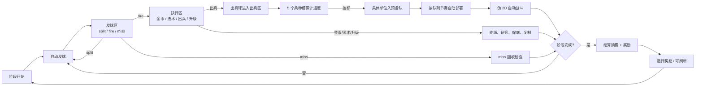

# planB Current Gameplay Design

更新时间：2026-05-29

本文梳理当前工作区已经实现或代码支持的全部玩法。它是现状策划说明，不是未来方案文档。默认玩家流程、构筑抽屉、调试抽屉和自动化探针的入口会分开描述。

## 1. 项目定位

`planB` 是一个用 Vite、TypeScript、Phaser 和 Matter 物理做出的可玩网页原型。核心玩法不是自由 RTS，也不是传统塔防，而是：

> 玩家通过观察和塑形一台三段式物理球机，把随机落球逐步改造成稳定的出兵与战斗引擎。

当前原型已经具备：

- 三段式球机：发球区、抉择区、出兵区。
- 伪 2D 3/4 自动战场：玩家和敌人单位自动推进、索敌、攻击。
- 两个可玩种族：虫群、机械。
- 六个连续阶段：战场、资源、单位、队列和构筑状态跨阶段保留。
- 多层构筑：遗物、科技、出兵区工事、阶段工具、旧版数值奖励、调试构筑预设。
- 鼠标可玩：奖励、构筑购买、研究、阶段工具、视野拖拽都可以用鼠标完成。

当前的玩家体验关键词是：看球、等落点、把非出兵收益回流成出兵、让队列自动部署、用构筑让机器越来越可靠。

## 2. 主循环

一局的基本流程如下：



实时阶段中有三条并行循环：

- 球机循环：自动投球、碰撞、命中槽、触发收益。
- 队列循环：单位入队后按释放间隔逐个部署。
- 战斗循环：双方单位与基地自动攻击，阶段敌军按时间刷出。

阶段完成后进入构筑暂停，玩家选择奖励后进入下一阶段。除临时效果外，玩家单位、精英、队列、金币、研究、遗物、科技、工事和构筑历史都会继续保留。

## 3. 屏幕布局和操作

### 3.1 默认画面

画面被分成三层：

| 区域 | 位置 | 用途 |
|---|---|---|
| 三段球机 | 顶部横排 | 发球区、抉择区、出兵区，是核心机器系统 |
| 自动战场 | 中部主视觉 | 长战场、基地、单位、投射物、接触标记、迷你地图 |
| HUD | 底部 | 战况、基地、资源、部队、下次出兵、抉择统计、遗物/科技/工事摘要 |

默认 `play` 模式会隐藏调试按钮、顶部说明、构筑身份线和转移轨迹，只保留最必要的信息。右上角有两个抽屉按钮：

- `构筑`：展开阶段工具、研究科技、出兵区工事购买。
- `调试`：展开测试按钮、魔法开关、指定单位生成、构筑预设、探针。

### 3.2 鼠标操作

默认可用操作：

- 点击奖励卡选择阶段奖励。
- 在奖励界面花 10 金刷新一次奖励。
- 点击 `构筑` 打开局内构筑抽屉。
- 点击阶段工具、研究科技、出兵区工事按钮购买。
- 拖动战场或迷你地图切换手动镜头。
- 点击 `回前线` 回到自动跟随前线。

调试抽屉操作：

- `投球`：生成发球区球。
- `进抉择`：生成抉择区球。
- `进出兵`：生成出兵区球。
- `切种族`：在虫群和机械之间切换当前种族。
- `继续阶段`、`跳过阶段`：手动推进阶段。
- `法术 开/关`：开关 MAGIC 槽实际法术效果。
- 5 个单位按钮：按当前种族的 5 个槽位直接生成对应单位。
- `探针`：运行全部构筑预设的自动验证。
- 5 个预设按钮：切换到虫群爆兵、法术复制、机械精英、经济工业、逆风修复。

自动化脚本也可以通过 `window.planBAction(...)` 触发相同操作，例如 `preset-swarm`、`probe`、`tool-marked_shot`、`tech-launch_extra_launcher`、`structure-unit_queue_conveyor`。

## 4. 三段式球机

### 4.1 发球区

发球区是球的入口。当前规则：

- 阶段进行中，每 1100ms 自动投一轮球。
- 每轮基础 1 颗球，`ballCount` 可以让同一轮追加多颗球。
- 多球之间间隔 120ms。
- 发球炮塔以 2400ms 为周期做 180 度往复扫摆。
- 球使用 Matter 物理，和墙、钉、槽位传感器发生碰撞。
- 球卡住时会被轻微 nudging，避免原型测试被物理静止拖死。
- launch 球掉出顶部区域会被当作 `miss` 处理。

发球区有三个结果槽：

| 结果 | 作用 |
|---|---|
| `split` | 当前球销毁，在发球区重新生成多颗同值 launch 球 |
| `fire` | 当前球转移到抉择区 |
| `miss` | 本次球链中断，并触发 miss 回收类建筑、遗物、科技、球标签 |

split 的基础再投数量是 2。以下系统会改变 split：

- `split+` 球标签：split 时额外 +1 颗，随后该标签被消耗。
- `分裂联箱` 建筑：每级让 split 额外再投 1 颗同值球。

### 4.2 抉择区

抉择区负责把球转成资源、出兵或升级。当前可见槽位顺序是：

1. 金币
2. 法术
3. 出兵
4. 升级

`special` 槽仍在类型和内部触发逻辑里保留，但当前默认可见抉择区不显示它。

抉择槽不是固定等宽，而是按 `widthWeight` 加权布局。奖励或科技改变权重后，视觉 plate 和 Matter sensor 会一起重建，确保实际命中面积和画面一致。

| 槽位 | 命中效果 |
|---|---|
| 金币 | 获得金币，基础值为 `15 + 当前阶段序号 * 2`，再乘金币倍率 |
| 法术 | 若 MAGIC 开启，对前排最多 3 个敌人造成法术伤害，并产生研究和复制相关收益 |
| 出兵 | 创建 unit ball，进入出兵区 |
| 升级 | 增加下次出兵等级加成；机械还会随机永久提升一个机械单位等级；每 3 次升级触发一次下一次高阶出兵精英化 |

非出兵命中不会只是空转。当前有多条回流规则：

- 金币、法术、升级都计入非出兵连击。
- 连续 3 次非出兵抉择会创建 1 个出兵标记。
- 法术和升级各给 1 点基础研究。
- 每 4 点基础研究回流进度会创建 1 个出兵标记。
- 科技、建筑、遗物还可以额外把金币、法术、miss、挡板弹回转成出兵标记或复制。

### 4.3 出兵区

只有命中 `出兵` 的抉择球才会进入出兵区。出兵区有 5 个当前种族的单位槽，每个槽绑定一个具体单位，不再随机从单位池直接抽。

槽位要求固定为：

| 槽位 | 需求进度 | 定位 |
|---|---:|---|
| 1 | 1 | 低阶、最快形成首个战场单位 |
| 2 | 3 | 低中阶，稳定补线 |
| 3 | 5 | 中阶，开始承担主力 |
| 4 | 7 | 高阶，构筑兑现点 |
| 5 | 9 | 终端单位，投入慢但单体强 |

unit ball 落入槽位后，将自身 `value` 加到该槽进度。进度达到需求时：

1. 该槽绑定的具体单位加入预备队。
2. 超出需求的进度保留在同一槽。
3. 如果有溢流孵化器，右侧相邻槽获得额外进度。
4. 如果有复制、额外出兵或精英状态，会在入队时兑现。

出兵区有一个连续高阶挡板：

- 开局只开放左侧约 20% 区域，也就是至少第 1 槽可用。
- 默认在阶段前 40% 时间内逐步开放到 5 槽全开。
- 高阶绞盘建筑会加快有效开放速度。
- 如果球在逻辑上命中未开放槽，会记录挡回，并把球弹回当前最高开放槽附近。
- 如果槽位已经物理上被球落入并通过 sensor 结算，则算有效落点；挡板是物理难度，不是事后否决。
- 连续弹回过多时会做安全重导向，防止球在挡板区永久反弹。

## 5. 球标签系统

球可以携带标签。标签让“这颗球是什么”变得比单纯 value 更重要。

| 标签 | 当前规则 |
|---|---|
| `split+` | 在发球区 split 时额外生成 1 颗球；split 后不继续保留 |
| `spawn-mark` | 在抉择区命中出兵时，让进入出兵区的球 value +1 |
| `copy-mark` | 在抉择区命中出兵时，给下一次具体出兵增加 1 个复制 |
| `heavy` | 在抉择区命中出兵时，让 unit ball value +1 |
| `recycle` | 如果 launch miss，按球 value 创建出兵标记 |

当前默认自然流程中，最常见的标签来源是：

- `棱镜弹匣` 遗物：每阶段开始时，下一颗 launch ball 带 `split+` 和 `spawn-mark`。
- `标记投球` 阶段工具：下一颗 launch ball 带 `split+`、`spawn-mark`、`copy-mark`。

标签在抉择区命中出兵时会被翻译：`spawn-mark` 和 `heavy` 变成 value，`copy-mark` 变成复制状态；只有 `recycle`、`split+` 会作为可继续传递的标签保留。

## 6. 种族与单位

当前可玩种族有虫群和机械。两者共用同一套三段球机，但单位池、数值曲线和部分奖励/升级收益不同。

### 6.1 虫群

虫群偏低阶铺场和孵化增殖。相关构筑可以通过额外幼虫、溢流、队列爆发和多球来形成密度优势。

| 槽位 | 单位 | 需求 | 角色 | Tier | 基础生命 | 基础伤害 | 说明 |
|---|---|---:|---|---:|---:|---:|---|
| 1 | 幼虫兵 | 1 | melee | 1 | 35 | 5 | 最快入场的低阶近战 |
| 2 | 喷吐虫 | 3 | ranged | 1 | 30 | 8 | 后排远程，补充早期输出 |
| 3 | 甲壳虫 | 5 | frontline | 2 | 88 | 7 | 更耐打的前排 |
| 4 | 巢群卫士 | 7 | frontline | 3 | 132 | 11 | 高阶前排 |
| 5 | 巨虫 | 9 | giant | 3 | 220 | 20 | 慢速终端巨型单位 |

### 6.2 机械

机械偏升级、等级、装甲和高阶精英。机械命中升级槽时收益更高，并会随机永久提升一个机械单位等级。

| 槽位 | 单位 | 需求 | 角色 | Tier | 基础生命 | 基础伤害 | 说明 |
|---|---|---:|---|---:|---:|---:|---|
| 1 | 无人机 | 1 | melee | 1 | 58 | 8 | 更扎实的低阶单位 |
| 2 | 机枪手 | 3 | ranged | 2 | 48 | 10 | 中低阶远程火力 |
| 3 | 步行机甲 | 5 | frontline | 3 | 135 | 14 | 中线主力前排 |
| 4 | 攻城履带 | 7 | siege | 3 | 150 | 19 | 中程攻城单位 |
| 5 | 泰坦 | 9 | giant | 3 | 245 | 24 | 机械终端单位 |

### 6.3 敌人

敌军由阶段时间表刷出，不依赖玩家是否出兵。

| 单位 | 角色 | Tier | 基础生命 | 基础伤害 | 说明 |
|---|---|---:|---:|---:|---|
| 劫掠兵 | melee | 1 | 34 | 5 | 基础近战压力 |
| 射手 | ranged | 1 | 30 | 7 | 后排远程压力 |
| 蛮兵 | frontline | 3 | 115 | 12 | 高压前排 |

敌方单位等级会随阶段提升，当前公式是 `1 + floor(阶段序号 / 2)`。

## 7. 预备队与部署

单位槽达标不会直接把单位放到战场，而是先加入预备队。预备队是阶段间持久系统。

入队条目包含：

- 单位 id。
- 阵营。
- 数量。
- 释放间隔。
- 等级。
- 生命周期：standard、elite、temporary、summon。
- 是否精英。
- 标签，例如 `basic`、`advanced`、`elite`、`queue-burst`。

默认释放间隔是 650ms。队列释放速度可以被以下系统提高：

- `增援鼓点` 奖励：释放速度 +25%。
- `联动动员学` 科技：释放速度 +20%。
- `队列脉冲` 阶段工具：释放速度 +35%。
- `队列输送带` 工事：让当前批次使用更短释放间隔，并带 `queue-burst` 标签。

部署限制：

- 标准玩家单位软上限：50。
- 精英玩家单位上限：8。
- 敌军队列不受玩家单位上限影响。

队列中相同单位、相同等级、相同标签、相同释放间隔的条目会合并。HUD 会显示预备队前几个条目的紧凑预览。

## 8. 战斗系统

战斗是确定性、可读、受限的伪 2D 自动战斗，不是自由 RTS。

当前战斗规则：

- 玩家基地位于长战场左侧，敌方基地位于右侧。
- 单位沿世界 x 轴推进，画面投影为 2D 3/4 斜向战场。
- 单位出生时按各自权重选择 top、middle、bottom 三条软 lane。
- 没有复杂寻路，目标选择只看轴向距离和 lane 偏移距离。
- 进入 aggro range 后锁定最近目标。
- 进入 attack range 后按冷却攻击。
- melee 立即结算伤害。
- ranged、caster、siege 使用投射物，到达 impact 时间后才结算伤害。
- 单位可攻击敌方基地。
- 双方基地都有低伤害防御射击，用来推迟被近身单位偷掉。
- 法术槽会对最靠前的最多 3 个敌人造成即时法术伤害。

单位等级影响：

- 最大生命按等级提升，当前每级约 +28%。
- 伤害按等级增加固定值。
- 基础单位可受 `基础训练` 奖励影响生命和伤害。

精英单位：

- 由下一次高阶出兵精英化产生。
- 存活过阶段后获得老兵经验。
- 老兵升级会提高等级、最大生命、当前生命和伤害。
- `老兵训练` 奖励会增加每阶段存活获得的老兵经验。

战场视野：

- 战场世界比屏幕更长。
- 默认自动跟随前线热点。
- 玩家可以拖动战场或迷你地图进入手动镜头。
- `回前线` 会恢复自动跟随。
- 迷你地图显示单位热度、接触热点和当前视口。

## 9. 阶段设计

当前使用 `fast_build_validation` 节奏预设：

- 自动发球间隔：1100ms。
- 多球间隔：120ms。
- 出兵区高阶挡板在阶段 40% 时间点全开。
- 阶段工具窗口在阶段 35% 时间点开启。
- 六个阶段时长：42s、44s、46s、50s、54s、55s。

阶段列表：

| 阶段 | 目标类型 | 时长 | 敌方目标 HP | 敌军刷出 |
|---|---|---:|---:|---|
| 阶段 1：外门 | destroy_gate | 42s | 500 | 2.5s 劫掠兵x2；12s 劫掠兵x2；27s 劫掠兵x3 |
| 阶段 2：增援 | survive_pressure | 44s | 650 | 2s 劫掠兵x2；10.5s 射手x2；28s 劫掠兵x3；35s 射手x2 |
| 阶段 3：小型 Boss | mini_boss | 46s | 900 | 3s 蛮兵x1；9s 劫掠兵x3；23s 射手x3；39s 蛮兵x1 |
| 阶段 4：内门 | destroy_gate | 50s | 1200 | 2.5s 劫掠兵x4；12s 射手x3；27s 蛮兵x2；43s 劫掠兵x4 |
| 阶段 5：精英守卫 | survive_pressure | 54s | 1450 | 2.5s 蛮兵x1；9s 劫掠兵x4；20s 射手x4；36s 蛮兵x3；50s 劫掠兵x5 |
| 阶段 6：核心 | destroy_core | 55s | 1800 | 2.2s 蛮兵x2；10s 射手x5；22s 劫掠兵x6；36s 蛮兵x3；52s 射手x5 |

完成规则：

- `survive_pressure`：撑到计时结束即可完成。
- 其他目标：击破敌方基地或撑到计时结束都会进入阶段完成结算。
- 玩家基地生命归零会失败。
- 第 6 阶段完成后通关。

阶段切换：

- 清理投射物和瞬时特效。
- 移除死亡单位、temporary、summon。
- 标准单位和精英单位保留。
- 敌方基地按新阶段 HP 重置。
- 玩家基地当前 HP 保留。
- 队列、金币、研究、构筑和单位等级保留。

## 10. 奖励和成长

### 10.1 阶段奖励

阶段结束会出现 3 张奖励卡。当前奖励生成规则：

1. 只要还有未拥有遗物，优先从遗物池抽满 3 张。
2. 遗物池耗尽后，才从旧版数值奖励池补足。
3. 奖励界面可以花 10 金刷新一次。
4. 每个奖励界面最多刷新一次。
5. 金币不足时不能刷新。

选择奖励后：

- 奖励立即应用。
- 阶段序号 +1。
- 刷新阶段工具 stock。
- 启动下一阶段。
- 自动投出下一颗球。

### 10.2 旧版数值奖励

旧版奖励在遗物拿完后进入阶段奖励池，也可被调试预设直接应用。

| 奖励 | 效果 |
|---|---|
| 扩宽出兵槽 | SPAWN 槽命中权重 +10% |
| 扩大出兵槽 | SPAWN 槽命中权重 +20% |
| 黄金槽扩张 | 金币槽命中权重 +20% |
| 战争储蓄 | 金币倍率 x1.5，SPAWN 槽宽度 -10% |
| 增援鼓点 | 预备队释放速度 +25% |
| 爆兵储备 | 每次具体出兵额外加入 1 个基础单位 |
| 副投球器 | 每轮自动投球 +1 |
| 双球投放 | 每轮自动投球 +1 |
| 基础训练 | 基础单位生命和伤害 +10% |
| 训练指令 | 后续出兵等级加成 +1 |
| 精英协议 | 当前下次出兵等级加成 +1，最多累计到 +3 |
| 老兵训练 | 精英存活阶段时额外获得老兵经验 |
| 精英晋升 | 下一次高阶出兵变为精英 |
| 魔法过载 | 法术伤害 x1.5 |
| 法术复制 | 每次法术后，下一次出兵复制 +1 |
| 机械校准 | 机械升级效率 +1 |
| 虫群孵化 | 虫群非幼虫单位出兵时，额外生成幼虫兵 |

## 11. 构筑层

### 11.1 遗物

遗物是当前默认阶段奖励的主池。每个遗物只能获得一次。

| 遗物 | 类型 | 效果 |
|---|---|---|
| 逆熵保险丝 | 事件遗物 | 每 3 次 launch miss，储存 1 个出兵标记 |
| 棱镜弹匣 | 发球遗物 | 每阶段开始时，下一颗 launch ball 带 `split+` 和 `spawn-mark` |
| 挡板动量芯 | 事件遗物 | 高阶挡板弹回时，储存 1 个出兵标记 |
| 法术回声石 | 事件遗物 | 法术命中后，复制下一次出兵 |
| 校准存储芯 | 事件遗物 | 基础单位吃掉升级时，保留 1 层等级给后续出兵 |

遗物触发会进入阶段统计，阶段总结会显示遗物触发数。

### 11.2 科技

科技用研究点购买。构筑抽屉中会显示当前可购买的前 3 个科技。

研究点来源：

- 法术命中：研究 +1。
- 升级命中：研究 +1。
- 损失回收学：每次 miss 研究 +1。
- 转译矩阵：每次非出兵抉择研究 +1。

基础研究回流：

- 法术和升级产生的基础研究会推进 `0/4` 回流进度。
- 每满 4 点，创建 1 个出兵标记。

科技列表：

| 科技 | 路线 | 成本 | 效果 |
|---|---|---:|---|
| 副投射学 | 发射学 | 4 | 每轮自动投球 +1 |
| 损失回收学 | 发射学 | 3 | 每 2 次落空，研究 +2 并储存 1 个出兵标记 |
| 中央校准学 | 抉择学 | 3 | 出兵槽宽度 +15% |
| 转译矩阵 | 抉择学 | 4 | 每 3 次非出兵抉择，研究 +3 并储存 1 个出兵标记 |
| 联动动员学 | 动员学 | 3 | 预备队释放速度 +20% |
| 精英保送协议 | 动员学 | 4 | 基础单位吃掉升级时，保留 1 层给后续出兵 |

### 11.3 仓室建筑和出兵区工事

代码支持三个仓室的建筑：

- 发球区建筑位：2。
- 抉择区建筑位：2。
- 出兵区工事位：3。
- 所有建筑最大等级：3。

当前默认局内购买入口只开放出兵区工事，使用金币购买或升级。发球区、抉择区建筑主要通过调试预设和 `applyReward` 路径进入当前状态。

出兵区工事金币价格：

- 基础价格：24。
- 每级额外：18。
- 已有等级越高，下一次升级越贵。

建筑列表：

| 建筑 | 仓室 | 效果 | 当前入口 |
|---|---|---|---|
| 分裂联箱 | 发球区 | split 额外再投同值球，等级越高额外球越多 | 调试预设 / 奖励 API |
| 回收缓冲 | 发球区 | launch miss 时储存出兵标记，数量等于等级 | 调试预设 / 奖励 API |
| 铸币导槽 | 抉择区 | 每若干次金币命中储存 1 个出兵标记；等级越高阈值越低 | 调试预设 / 奖励 API |
| 电弧回声 | 抉择区 | 法术命中后，下一次出兵复制 +等级 | 调试预设 / 奖励 API |
| 溢流孵化器 | 出兵区 | 任一单位入队时，右侧相邻单位槽 +等级 * 入队次数 进度 | 构筑抽屉 / 调试预设 |
| 高阶绞盘 | 出兵区 | 加快高阶挡板开放 | 构筑抽屉 / 调试预设 |
| 队列输送带 | 出兵区 | 单位入队时，本批单位获得更短释放间隔和 `queue-burst` 标签 | 构筑抽屉 / 调试预设 |

### 11.4 阶段工具

阶段工具是阶段中段的一次性消费。每阶段会生成 3 个工具 stock，开局可见，但必须等阶段进度达到 35% 后才能购买。

限制：

- 每阶段最多购买 1 个工具。
- 工具必须在当前 stock 中。
- 金币不足时不能购买。
- 购买后扣金币，并记录到阶段统计。

工具列表：

| 工具 | 成本 | 效果 |
|---|---:|---|
| 出兵信标 | 20 | 立刻获得 2 个出兵标记 |
| 热槽校准器 | 25 | 当前种族第 1 个单位槽 +2 进度 |
| 队列脉冲 | 18 | 本 run 预备队释放速度 +35% |
| 战地修复 | 15 | 我方基地恢复 80 HP，不超过最大值 |
| 标记投球 | 22 | 下一颗 launch ball 带 `split+`、`spawn-mark`、`copy-mark` |

## 12. 出兵标记、复制和升级兑现

### 12.1 出兵标记

出兵标记是当前最重要的回流资源。它不会直接生成单位，而是在下一次 `出兵` 抉择创建 unit ball 时兑现。

兑现规则：

- unit ball 基础 value 为当前 spawn ball value。
- 所有 pending 出兵标记一次性消耗。
- 消耗数量加到 unit ball value。
- 阶段统计记录创建数和消耗数。

来源：

- 非出兵三连保底。
- 基础研究每 4 点。
- 回收缓冲建筑。
- 铸币导槽建筑。
- 逆熵保险丝遗物。
- 挡板动量芯遗物。
- 损失回收学科技。
- 转译矩阵科技。
- 出兵信标工具。
- `recycle` 球标签 miss。
- debug preset 初始状态。

### 12.2 复制

复制会在下一次具体单位入队时放大数量。

来源：

- 法术复制奖励。
- 电弧回声建筑。
- 法术回声石遗物。
- `copy-mark` 球标签。

兑现规则：

- 单位入队数量 = `1 + 额外出兵数 + pendingSpawnCopies`。
- 兑现后 `pendingSpawnCopies` 清零。

### 12.3 升级

升级槽会提供 `pendingSpawnLevelBonus`。

虫群：

- 每次升级基础 +1 下次出兵等级加成。

机械：

- 每次升级基础 +2 下次出兵等级加成。
- 机械校准每级再提高升级效率。
- 同时按权重随机永久提升一个机械单位等级。

通用规则：

- `pendingSpawnLevelBonus` 最多显示为下次出兵 Lv+X。
- 每 3 次升级触发后，下一次高阶出兵会变为精英。
- 具体单位入队时，会消耗当前等级加成。
- 如果单位是基础单位，校准存储芯或精英保送协议可以保留 1 层给后续出兵。

## 13. 构筑身份和调试预设

当前有 5 套可复现构筑预设，用于验证不同流派。预设会清空旧构筑状态，再应用指定种族、建筑、奖励、遗物、金币、出兵标记和单位等级。

| 预设 | 种族 | 核心幻想 | 关键配置 |
|---|---|---|---|
| 虫群爆兵 | 虫群 | 多球、分裂、溢流、低阶密度 | 分裂联箱、溢流孵化器、队列输送带、棱镜弹匣、双球投放、爆兵储备、虫群孵化、扩大出兵槽 |
| 法术复制 | 虫群 | MAGIC 命中创造复制，下次出兵放大 | 电弧回声、分裂联箱、棱镜弹匣、法术回声石、法术复制、魔法过载、扩大出兵槽 |
| 机械精英 | 机械 | 提前高阶、等级滚动、精英单位 | 高阶绞盘、电弧回声、校准存储芯、挡板动量芯、机械校准、精英协议、训练指令、精英晋升 |
| 经济工业 | 机械 | 金币宽度、金币转标记、队列爆发 | 铸币导槽、回收缓冲、队列输送带、逆熵保险丝、黄金槽扩张、战争储蓄、增援鼓点 |
| 逆风修复 | 虫群 | miss、非出兵、挡板弹回都能回流 | 回收缓冲、铸币导槽、溢流孵化器、队列输送带、逆熵保险丝、挡板动量芯、黄金槽扩张、增援鼓点 |

构筑身份还会驱动顶部机器行的 debug 视觉摘要：

- 构筑身份徽章。
- 三仓强调色。
- 每仓图标签名。
- 结构 silhouette。

这些详细视觉在默认 play 模式隐藏，在 debug 模式显示。

## 14. 结算、遥测和探针

### 14.1 阶段总结

阶段结束时会记录并显示：

- 抉择命中数：金、法、出、升。
- 入队数、部署数、老兵经验。
- 伤害、击杀、基地伤害造成/承受。
- 构筑身份和主贡献仓。
- 发球结果：split、fire、miss。
- 回流工具购买数。
- 出兵标记创建/消耗。
- 复制创建。
- 遗物触发。
- 研究点和研究回流进度。
- 非出兵保底进度。
- 回流效率。
- 最长非出兵连击。
- 首次回流延迟。
- 回流来源。
- 具体入队/部署单位。
- 高阶入队比例。
- 建筑贡献、溢流、开门、挡回、爆发。

这些信息会存入 `chainHistory`，用于后续构筑分析。

### 14.2 构筑探针

`npm run probe` 和游戏内 `探针` 都会运行五套构筑预设的确定性脚本，验证：

- launch 阶段是否参与。
- decision 阶段是否产生指定收益。
- unit slot 是否累计并入队。
- queue 是否部署。
- 部署单位是否能造成战斗影响。
- 三仓链深度是否足够。
- 各预设的关键指标是否通过。

探针指标包括：

- 入队数、部署数。
- 精英入队数。
- 最高入队 tier。
- 最高入队等级。
- 金币收入。
- 出兵标记创建/消耗。
- 复制创建。
- 非出兵回流事件。
- 首次回流时间。
- 遗物触发。
- 溢流进度。
- 开门事件。
- queue burst 部署。
- 战斗影响伤害。
- 低阶部署占比。
- 平均单位等级。
- 每次 SPAWN 对应部署数。
- 第一个 T3 部署时间。
- 队列释放速率。
- 跨仓链深度。
- dead effect 警告数。

### 14.3 v1.2 审计

`npm run audit:v1.2` 会从数据、状态字段、节奏、debug 预设、跨仓链、回流护栏、阶段 telemetry、HUD 摘要、视觉 smoke 计划和运行时视觉时序等角度输出 readiness 报告。

当前代码里审计标准要求：

- 存在发球遗物、抉择科技、出兵工事三类构筑面。
- 状态持久化 `launchRelics`、`decisionTechs`、`unitStructures`、`researchPoints`、`ballTags`、`phaseToolStock`、`chainHistory`、`buildArchetypeHint`。
- 阶段为中短局，自动投球够快，挡板在 35%-45% 左右全开。
- 至少 5 套 debug 预设且能分辨构筑身份。
- 探针覆盖 launch -> decision -> unit slot -> queue -> deploy -> combat impact。
- 前 90 秒至少两个球仓出现可见结构变化。

## 15. 当前默认流程中的可达性说明

有些系统已经完整实现，但默认自然流程和调试入口的可达性不同。

| 系统 | 默认流程 | 构筑抽屉 | 调试/预设 | 说明 |
|---|---|---|---|---|
| 遗物 | 可达 | 不通过抽屉购买 | 可通过预设 | 阶段奖励优先给遗物 |
| 旧版数值奖励 | 遗物拿完后可达 | 不通过抽屉购买 | 可通过预设 | 包含槽宽、球数、法术、精英、种族奖励 |
| 研究科技 | 研究点购买可达 | 可达 | 可通过 action | 构筑抽屉展示前三个可买科技 |
| 出兵区工事 | 金币购买可达 | 可达 | 可通过预设 | 当前局内工事购买只开放 unit chamber |
| 发球/抉择建筑 | 默认奖励流不可直接获得 | 不可直接购买 | 可通过预设/API | 效果系统存在，主要服务 debug 构筑验证 |
| 阶段工具 | 金币购买可达 | 可达 | 可通过 action | 每阶段中段只可买 1 个 |
| 构筑身份视觉 | play 模式隐藏 | 无 | debug 模式显示 | 不影响规则，只帮助验证 |
| SPECIAL 槽 | 默认不可见 | 无 | 内部逻辑保留 | 当前不是可见抉择槽 |
| 指定单位生成 | 不属于正式流程 | 无 | debug 模式可点 | 用于作者验证战斗和视觉 |

## 16. 已知设计边界

当前原型明确不做：

- PVP。
- 联网。
- 账号。
- 后端服务。
- 匹配。
- Steam 集成。
- 自由 RTS 地图。
- 复杂 RTS 寻路。
- 键盘必需操作。

当前刻意保留的原型辅助：

- 开局前 10 秒如果还没有我方单位，会通过物理链路引导一次完整出兵闭环。
- 这个辅助不会直接凭空生成单位，仍会经过 decision spawn、unit ball、slot progress、queue、deploy。
- MAGIC 可以在 debug 抽屉中关闭，便于验证无魔法路径。
- 球会被轻微 nudging，避免物理卡死影响测试。
- 高阶挡板有安全重导向，避免无限弹回。

当前需要策划继续注意的点：

- 默认奖励已经改成遗物优先，因此发球/抉择建筑虽然实现存在，但默认自然流程里入口较弱。
- SPECIAL 仍在内部类型中存在，但不是当前可见玩法。
- 阶段工具、研究科技和出兵工事都在构筑抽屉中，默认 play 画面较干净，玩家需要主动展开。
- 回流系统很多，阶段总结和事件 feed 是理解构筑价值的关键。

## 17. 源码索引

关键数据：

- `src/data/races.ts`：种族、单位槽、槽位需求。
- `src/data/units.ts`：所有玩家和敌方单位数值。
- `src/data/slots.ts`：抉择槽定义和初始权重。
- `src/data/phases.ts`：六个阶段、敌方目标和刷怪时间。
- `src/data/pacing.ts`：当前节奏预设。
- `src/data/rewards.ts`：旧版数值奖励。
- `src/data/relics.ts`：遗物。
- `src/data/doctrineTechs.ts`：科技。
- `src/data/buildings.ts`：仓室建筑和工事。
- `src/data/phaseTools.ts`：阶段工具。
- `src/data/debugPresets.ts`：五套构筑预设。

关键系统：

- `src/systems/GameState.ts`：初始局状态。
- `src/systems/PinballMachineSystem.ts`：扫摆发射器、split、挡板反弹速度。
- `src/systems/BallTagSystem.ts`：球标签。
- `src/systems/SlotTriggerSystem.ts`：金币、法术、出兵、升级命中效果。
- `src/systems/UnitSpawnProgressSystem.ts`：出兵区槽位、挡板、具体单位入队。
- `src/systems/SpawnQueueSystem.ts`：预备队和部署。
- `src/systems/BattleSystem.ts`：自动战斗。
- `src/systems/PhaseSystem.ts`：阶段开始、刷怪、完成、切换。
- `src/systems/RewardSystem.ts`：奖励选择和应用。
- `src/systems/BuildingSystem.ts`：建筑、工事、出兵标记消费。
- `src/systems/RelicSystem.ts`：遗物。
- `src/systems/DoctrineSystem.ts`：研究、科技、非出兵回流。
- `src/systems/PhaseToolSystem.ts`：阶段中段工具。
- `src/systems/EliteSystem.ts`：精英老兵成长。
- `src/systems/BuildTelemetrySystem.ts`：阶段总结、构筑身份、HUD 摘要。
- `src/systems/BuildProbeSystem.ts`：构筑探针。
- `src/systems/V12ReadinessSystem.ts`：v1.2 readiness 审计。
- `src/systems/UiDensitySystem.ts`：play/debug UI 密度。
- `src/scenes/PrototypeScene.ts`：Phaser 场景、画面、输入、物理碰撞 wiring。

关键命令：

```bash
npm run dev
npm run typecheck
npm test
npm run build
npm run probe
npm run audit:v1.2
npm run smoke:build-visuals
```
