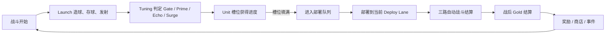

# planB 游戏设计总纲

**最后更新：** 2026-06-08
**仓库状态：** 纯文档态，无当前正式实现。
**类型：** 球机驱动的自动战斗 Roguelite。
**目标平台：** PC / 桌面优先。
**正式单局目标：** 45-60 分钟。
**商业模式：** 买断制，可考虑 DLC。不做当前 F2P / IAP 设计。

## 1. 一句话

玩家调校一台物理出兵机器，把 `Launch / Tuning / Unit` 某条轴推成构筑核心，并在三路自动战斗中看到它转化成真实战果。

## 2. 设计支柱

- 球机是主系统。
- 单局身份来自对 `Launch / Tuning / Unit` 的承诺，而不是直接操作单位。
- 主要决策语言是强化、转向、补洞。
- 战中基础输入是选择当前 `Deploy Lane`。
- 种族、Guardian、奖励、商店、遗物、事件和敌人都必须表达到 `Launch / Tuning / Unit`。
- 球机规则和核心术语跨种族通用；种族必须通过球机的可见表现、反馈语言和明确的 Machine Contract 改写来表达特色，而不是另起一套隐藏核心规则。命名包装可以用于具体效果或未来种族，但不是每个种族的核心轴必需项。
- 可读性优先于内容量。玩家看不出机器轴、反制或战场结果时，先减少内容并加强反馈。

## 3. 硬边界

- 不做 PVP、联网、账号、后端、匹配或 Steam 集成。
- 战场不是自由 RTS 地图。
- 不把复杂 RTS 寻路作为核心需求。
- 不直接控制已部署单位。
- 不把 `Overdrive` 作为 MVP 基础按钮。
- 不把建筑、Guardian、遗物或商店做成替代球机的主系统。
- 不为每个种族制作一套不同的球机核心规则、核心术语或基础 UI 语义。
- 不复制现有游戏的规则、素材、UI、名称或资产。

## 4. 正式文档边界

- `docs/machine-warehouses.md`：三仓机器细则。
- `docs/battlefield-rules.md`：基础战场规则。
- `docs/enemy-rules.md`：敌人波次与机器反制规则。
- `docs/deploy-lane-ui.md`：`Deploy Lane` 直接点路、选中高亮和路线危险提示。
- `docs/guardian-system.md`：Guardian 通用系统。
- `docs/mvp-learning-checkpoints.md`：MVP 玩家学习检查点、验收信号和失败信号。
- `docs/mvp-scope.md`：第一版 MVP 范围。
- `docs/PROGRESS.md`：近期决策日志。

候选草案：

- `docs/neutral-modifiers.md`：记录已确认的中立奖励 / 商店结构、Gold faucet、价格带、职责带平衡口径和休整结果页口径。精确 playtest 后最终平衡未确认。

本 GDD 只保留总设计、跨系统边界、单局结构和风险判断。

## 5. 核心循环

玩家视角循环：

1. 观察球机和战场信号。
2. 判断当前单局更适合强化哪条机器轴。
3. 通过奖励、商店、事件、Guardian 和种族规则强化、转向或补洞。
4. 战斗中选择 `Deploy Lane`。
5. 读取机器输出是否在战场上转成推进、僵持解除、守线或突破。

## 6. 三仓机器总览

| 轴 | 责任 | 战场读法 |
|---|---|---|
| `Launch` | 输入量、发射节奏、路线倾向、回流、污染压力。 | 持续流、稳定补兵、降低断档。 |
| `Tuning` | 球进入 Unit 前的转换质量。 | 高价值结算、重复重击、局部爆点。 |
| `Unit` | 低到高需求槽位、槽位闸门、进度、队列、部署节奏、批量出兵。 | 从稳定低阶出兵过渡到高承诺单位，蓄力后成批释放、阵线翻转。 |

通用目标不是“更快出兵”，而是让不同机器轴在战场上读成不同压力形态。

## 7. 战场总览

基础战场是两端基地圈加三条固定兵线路径：

- `Left`
- `Mid`
- `Right`

单位沿所属路径自动前进、索敌、攻击、受伤、死亡。玩家只选择后续队列部署到哪一路，不操作已部署单位。

战场必须能从单位位置和接战状态读出：

- 推进
- 僵持
- 漏兵
- 破门
- 进基地圈
- Guardian 受压

详细规则见 `docs/battlefield-rules.md`。

## 8. Guardian 总览

Guardian 有两层身份：

1. 战场基地对象
   它固定在基地圈内，可被攻击，可攻击进入基地圈的敌人，不移动、不寻路、不接受直接操作。单位进入基地圈后，Guardian 的基础攻击和战术技能按基地圈内空间关系判断，不再按路线筛选；`entered_from = Left / Mid / Right` 只能作为危险来源、日志或结果页字段。

2. 开局构筑锚点
   MVP 第一版使用 2 个可选 `Player Guardian`。Guardian 有固定属性、一个战术技能、一个战略技能。技能在单局开始时固定，不解锁、不升级、不换状态，除非后续特殊事件或机制明确改写。

Guardian 不能成为第四机器轴，不能变成英雄养成系统。详细规则见 `docs/guardian-system.md`。

## 9. 奖励、商店与经济

`Gold / 金币` 是可见资源名。

当前方向：

- Gold 主要来自战后结算。
- 开局 Gold 为 0。
- MVP 第一版逐战斗 Gold faucet 为 `6 / 6 / 8 / 0 / 0 / 0`：Battle 1 胜利 6，Battle 2 胜利 6，Battle 3 强反制胜利 8，Battle 4 / Battle 5 / Endpoint 不给 Gold。
- MVP 第一版不做失败后继续，因此不定义失败 Gold；失败不返还 Gold，不续关，不给下一局资源补偿。
- 不做击杀、破门、快胜、剩余 HP 或战中 Gold 槽奖励。
- 商店卖机器组件和构筑修正，不卖泛用大数值。
- 奖励和商店效果必须声明影响哪个机器组件。
- MVP 中立奖励 / 商店结构、Gold faucet、价格带、职责带平衡口径和休整结果页口径见 `docs/neutral-modifiers.md`；精确 playtest 后最终平衡仍未定。
- MVP 第一版会话口径为 Battle 1 后给第一次奖励，Battle 2 后进入第一次商店。若前两战都是普通胜利，第一次商店通常是 12 Gold，并通过“最多购买 1 个中立修正”控制信息量和买穿风险，剩余 Gold 用于休整或保留到后续节点。
- Battle 4 后给第二次奖励，用于主轴深化或补洞；第二次奖励不消耗 Gold，不开第二次商店。
- 高 Gold 构筑可以存在，但必须是命名构筑，有机会成本和反制。
- 休整可以存在，第一版价格为 3 Gold，恢复 `Player Guardian` 20 当前 HP，不提高最大 HP；休整不是中立机器修正，不触发中立修正购买额度。休整只在第一次商店、Battle 3 反制战胜利后和 Battle 5 反制战胜利后的 Endpoint 前整备窗口开放；第一次商店和 Battle 3 后最多各 1 次，Endpoint 前整备最多 2 次。
- 失败恢复只通过结果页信息完成：显示主要断裂原因和下一局观察标签，不通过资源补偿改写经济。

无效方向：

- 纯加全部伤害。
- 纯加所有单位血量。
- 用 Gold 买穿所有轴。
- 让商店替代战斗和机器判断。

## 10. 敌人方向

敌人应该测试机器，而不只是加血加攻。

已接受的反制家族：

- `Pool Polluter`：攻击 Pool 容量和回流节奏。
- `Echo Breaker`：攻击 Echo 窗口或热槽。
- `Stagger Punisher`：攻击队列断档和蓄力空窗。

反制必须有预警，且应给玩家机器层面的解法，例如过滤、扩容、换路、补低阶、保护窗口、转向或补洞。

## 11. 种族方向

种族是球机主系统的表达层，不是独立玩法包。

球机主题采用“通用规则 + 种族化球机表现”：

- `Launch / Tuning / Unit` 保持通用结构和通用标签。
- `Gate / Prime / Echo / Surge` 保持通用 Tuning 槽。
- `Unit slot` 保持独立单位模板槽，不是部件槽、配方槽或合成槽。
- `Unit.Slot.Exposure Gate` 的 baseline 节奏跨种族通用，种族不能默认持有隐藏的专属挡板时间表。
- 种族可以改变外壳、颜色、材质、图标风格、组件表现、反馈语言和必要的效果命名，但不能遮住通用机器标签。
- 种族可以通过 Machine Contract 改写特定组件，但不能把整台球机替换成种族专属系统。

种族可以提供：

- 单位模板。
- Guardian 池。
- 机器轴的命名表达。
- 种族专属构筑词汇。
- 特定机器组件的改写。

当前原则：

- MVP 第一种族方向已确认为 Hive。
- MVP Hive 采用 `Caste Hive` 方向：巢群分工阶级，从低承诺到高承诺表达 4 个 `Unit slot` 的职责梯度。
- Hive MVP 机器包装采用视觉区分：不为 `Launch / Tuning / Unit`、`Gate / Prime / Echo / Surge`、`Unit slot`、`Queue` 或 `Deploy Lane` 设置 Hive 副名；Hive 特色通过虫壳、酸液、巢脉材质、图标风格、组件外观、运动反馈和命名效果表达。
- Hive MVP 单位采用轻技能深度：每个单位只保留 1 个可见行为特征，不做主动技能、单位成长线、复杂状态或独立种族资源。单位行为必须服务球机读法，不能抢走 `Launch / Tuning / Unit` 的主系统位置。
- Hive MVP 单位属性采用职责优先属性表，并使用中对比职责表作为第一版数值口径；只锁第一版核心属性起点，服务 4 个槽的职责读法，不在当前阶段追求完整战斗平衡表。
- Hive 4 个 `Unit slot` 的第一版属性起点已确认：`短牙虫` hp 6 / damage 1 / 0.7s / range 1.5 / speed 10；`盾壳虫` hp 18 / damage 2 / 1.4s / range 1.5 / speed 6；`酸囊虫` hp 8 / damage 3 / 1.8s / range 7 / speed 7；`碾壳兽` hp 26 / damage 6 / 2.6s / range 2 / speed 5。具体表见 `docs/mvp-scope.md`。
- Hive 4 个 `Unit slot` 的第一版攻击几何已确认：`短牙虫` 和 `盾壳虫` 都是同路最近目标单体近战，不带隐藏行为；`酸囊虫` 弹道速度 14 路径单位/s，命中点同路溅射半径 2.5，最多命中主目标 + 2 个附近目标，目标死亡时打到目标死亡位置；`碾壳兽` 同路接战点横扫 3.5 路径单位，最多命中 3 个目标，不击退、不跨路。
- Hive 第一种族数值采用职责带口径，不采用一次性精确终局表：`短牙虫` 快速接线但不抗压，`盾壳虫` 抗压但不推进，`酸囊虫` 破僵但不做持续炮台，`碾壳兽` 晚到翻线但不常驻清场；两个 `Player Guardian` 只能提供软轴倾向和弱守家，不能替代奖励、商店或持续稳线。具体职责带见 `docs/mvp-scope.md`。
- Hive 4 个 `Unit slot` 的 MVP 职责骨架已确认：
  - Slot 1：`短牙虫`。稳定补线，低需求、低承诺，快速接线，低血低伤，近战轻咬，主要提供持续前线存在。可见行为特征为快速进入接战点，无额外状态。占位剪影为小体型、低伏身体、短牙前突。
  - Slot 2：`盾壳虫`。守线抗压，中低需求，较慢但更硬，近战稳定攻击，优先承受接战压力，减少漏兵。可见行为特征为接敌后更能站住，承受第一轮接触压力。占位剪影为宽壳、低重心、前盾状甲壳。
  - Slot 3：`酸囊虫`。破僵持，中高需求，发射短程酸液弹道，命中后在接战点产生小范围溅射，负责打破一路持续接战或门前卡住的局面。占位剪影为背部或腹部酸囊、短喷口、短程喷射弧线。
  - Slot 4：`碾壳兽`。高承诺翻线，高需求，慢到场的重单位，以同一路线接战点的横扫重击压制并推回战线，在 70s 后的构筑兑现阶段制造路线翻转。占位剪影为大型厚壳、重前肢或重头部、明显压线体量。
- Slot 3 的半远程单位是 MVP 初期验证目标，用来测试 Hive 中短程远程单位是否能被玩家读懂；它不能变成持续炮台，不能留下持续酸池或 DoT，也不能把 `Tuning` 的重复重击读法吃掉。最终平衡仍未定。
- Slot 4 的横扫只作用于同一路线接战点附近，不跨路线，不做持续控场，也不频繁出现。
- Hive MVP 两个 `Player Guardian` 的开局构筑入口已确认：
  - `巢脉母`：偏 `Launch`，让玩家更容易读到稳定补线和持续压线。它是软倾向，不锁死本局主轴。
  - `酸冠母`：偏 `Tuning`，让玩家更容易读到高价值命中、酸囊弹道和小范围破点。它是软倾向，不替代后续奖励、商店和反制决策。
- Hive MVP Guardian 技能结构已确认：
  - 每个 Guardian 有 1 个低强度自动守家战术技能，用来让 Guardian 在战场上可见，但不能独自解决漏兵或让玩家忽略三路稳线。
  - Player Guardian 有基础普通攻击作为防偷家手段，独立于战术技能存在；普通攻击可以清理少量入侵单位，但不能替玩家稳住持续漏线。
  - 两个 Guardian 的战术技能采用完全不同的自动守家规则，而不是同结构换表现；英雄特色需要在战术技能上可见。
  - 战术技能效果已确认：`巢脉母` 使用 `巢脉牵缚`，敌人进入玩家基地圈后，低频牵缚 / 减速最接近 Player Guardian 的入侵者并造成低伤害，距离并列时选最低 HP；`酸冠母` 使用 `酸冠反喷`，玩家 Guardian 受到实际 HP 伤害后，以攻击者位置为中心在 Player base circle 内半径 3.0 反喷酸液并造成小范围低伤害。
  - 战术技能第一版参数起点已确认：`巢脉牵缚` 为 8s 冷却、单目标、短暂停顿 / 减速、低伤害；`酸冠反喷` 为 6s 冷却、受到实际 HP 伤害后触发、一次受击最多触发一次、冷却中受击不储存额外触发次数。
  - 战术技能伤害 / 范围采用中数值起点：`巢脉牵缚` 造成 4 damage，停顿 0.5s，并使目标减速 40% 持续 1.2s；`酸冠反喷` 对攻击者造成 4 damage，并对半径内最多 2 个附近入侵者各造成 1 damage。基地圈内不按 `entered_from` 路线筛选。
  - `酸冠反喷` 允许有限卖血打法：玩家可以接受少量漏线，用 Guardian HP 换一次反击清理机会；它不治疗、不返还资源、不提高最大 HP、不降低本次受击伤害，也不能让玩家长期忽略三路稳线。
  - 每个 Guardian 有 1 个轻量战略技能，必须走 Machine Contract，服务其轴倾向，并保持为开局软倾向。
  - Hive Guardian 采用单一 `Guardian Contract` 表记录战略和战术效果；表内用 `contract_layer=strategic_machine / tactical_battle` 区分结算层。`strategic_machine` 行遵守 Machine Contract 并进入机器结算；`tactical_battle` 行只进入战场 / Guardian 结算，不改变 `Launch / Tuning / Unit`。
  - 技能方向采用轴内种族化表现改写：`巢脉母` 的战略技能只在 `Launch` 内表达 Hive 回流 / 巢脉输送，`酸冠母` 的战略技能只在 `Tuning` 内表达酸液弹道 / 命中反馈；两者都不跨轴直接补 `Unit`。
  - 战略技能目标采用折中方案：`巢脉母` 规则目标为 `Launch.Recycle / Launch.Pool`，表现包装使用 `Route Board / Recycle path` 的巢脉回流；`酸冠母` 规则目标为 `Tuning.Prime`，表现包装使用 `Gate -> Prime ingress` 的酸冠入槽和 Prime 命中反馈。
  - 战略技能 operation 已确认：`巢脉母` 采用隐藏 pity 伪随机的 Recycle 强化，合法 Recycle 未触发强化时推进隐藏保底，触发时该次 Recycle 额外返回 1 个 clean ball，触发后重置；`酸冠母` 采用 Gate miss 计数，只有 `Tuning.Gate` 计数，计数满后下一次本应进入 `Gate` 的结果改为 `Prime`，触发后重置。两个战略计数都在每场战斗开始时重置为 0，不跨战斗保留。
  - `酸冠母` 不把 `Echo / Surge` 计入 Prime miss，也不统计 `Launch` 的 Split / Recycle / Waste；`巢脉母` 不改变 Route Board 概率、Pool 容量、Recycle 标签继承规则，也不绕过 Pool 满时的 Recycle 回流失败规则。
  - 战略技能强度采用保守起点：`巢脉母` 的 Recycle 强化基础触发概率为 15%，第 6 次合法 Recycle 保底触发；`酸冠母` 第一版调参起点为 6 次 `Tuning.Gate` miss 后，下次本应进入 `Gate` 的结果改为 `Prime`。
- `Infection Hive` / 感染、孵化、寄生方向不进入 MVP 第一种族 baseline，保留给未来其他种族或后续大内容方向。
- Hive 4 个 `Unit slot` 的 MVP 工作名、占位剪影、轻技能深度和第一版攻击几何已确认；两个 `Player Guardian` 的身份、轴倾向、技能结构、技能方向、差异化战术技能效果、战术技能冷却和中数值起点、战术技能目标优先级、`酸冠反喷` 第一版范围、战略技能目标、战略技能 operation、保守强度起点、战略计数重置口径和 `Guardian Contract` 第一版表已确认；最终美术资源和最终数值仍未定，需要在第一种族设计阶段继续展开。
- 第一种族设计必须沿用通用球机结构，通过种族化视觉表现、反馈语言和明确的 Machine Contract 改写表达 Hive 特色。
- Hive 若要影响 `Unit.Slot.Exposure Gate`，必须通过可见的命名规则改写，不能作为 Hive 默认隐藏节奏。
- 如果一个种族机制不表达到 `Launch / Tuning / Unit`，它不属于当前设计边界。

## 12. 范围路线

| 阶段 | 目的 | 内容边界 |
|---|---|---|
| 基础机制锁定 | 先让球机、三路战场、Guardian、反制的基础合同清晰。 | 不展开具体种族、完整敌人表、完整商店。 |
| 第一版 MVP | 做一个 15-20 分钟完整短局。 | 1 个正式种族、3 个构筑方向、3 个反制家族、1 个终点战。 |
| 付费验证版本 | 验证有限内容能否卖。 | 增加第二种族、更多敌人、遗物、事件和 Boss。 |
| 正式发布 | 完整买断制版本。 | 多种族、多构筑、多终点战、挑战层级和完整 UI。 |

MVP 具体边界见 `docs/mvp-scope.md`。
MVP 学习验收见 `docs/mvp-learning-checkpoints.md`。
MVP 第一轮 playtest 使用软阈值护栏观察 Guardian 选择率 / 成功率差距、Unit slot 关键贡献占比和连续空窗战斗；这些护栏不是最终平衡。

## 13. 主要风险

| 风险 | 严重度 | 应对 |
|---|---|---|
| 玩家看不出机器轴如何改变战场。 | 高 | 使用 `docs/mvp-learning-checkpoints.md` 的节点验收，少做内容，强化因果反馈。 |
| `Deploy Lane` 变成主要玩法，球机退成经济背景。 | 高 | Lane 只决定部署位置，不改变产出。 |
| `Unit` 永远最好。 | 高 | 槽位闸门不能无代价全开，高需求 slot 必须有时间、进度或构筑代价；敌人和奖励仍要测试 Launch / Tuning 的独立价值。 |
| Guardian 变成第四主系统。 | 高 | Guardian 战略技能必须走 Machine Contract。 |
| Tuning 变成隐藏数学。 | 中 | `Gate / Prime / Echo / Surge` 必须有可见反馈。 |
| Gold 买穿单局。 | 中 | 每个商店项只卖 1 次，不做战中刷钱；第一次商店最多购买 1 个中立修正，避免 12 Gold 直接买穿两个机器修正。 |
| Guardian 或 Unit 出现默认最优。 | 高 | 用 `docs/mvp-learning-checkpoints.md` 的软阈值护栏观察选择率、成功率差距和关键 queue entry 占比，不在小样本下直接锁最终数值。 |
| 范围膨胀。 | 高 | 基础机制未清楚前不加种族、敌人表、遗物池。 |

## 14. 下一批设计问题

1. 新实现计划开始前，把完整 MVP 的实现输入边界补齐。
2. 如实现需要，再收束 `Unit.Slot.Exposure Gate` 暴露插值方式。
