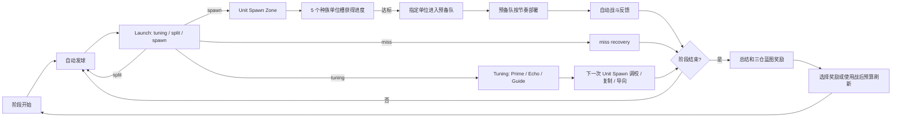

# planB 游戏设计文档

**最后更新:** 2026-06-02  
**项目状态:** 可玩的 Web MVP, 用于验证玩法。  
**当前平台:** Vite / TypeScript / Phaser 浏览器原型。  
**正式方向:** Godot / Steam 买断制, 可扩展 DLC。  
**类型:** 球机驱动的 auto-battle roguelite。  

## 文档规则

这是当前唯一的权威设计文档。旧研究稿、目标文件、执行计划和技能 artifact 的有效内容已经并入本文件, 后续不需要再从那些历史文件取设计真值。

保留的文档只有三类:

| 文件 | 用途 |
|---|---|
| `README.md` | 运行方式、验证命令、当前原型入口。 |
| `docs/gdd.md` | 玩法设计、当前实现、未来方向、边界和源码索引。 |
| `docs/PROGRESS.md` | 最近进展、验证记录、后续工作入口。 |

状态词:

| 状态 | 含义 |
|---|---|
| 当前原型 | 已在当前 Web MVP 中有源码、测试、probe 或 README/进度记录支持。仍以源码和运行结果为最终真值。 |
| 已定方向 | 已经接受的设计方向, 用于后续实现和评审, 但不等于已完成代码。 |
| 未来方向 | 正式版或后续里程碑的候选方向。 |
| 待验证 | 文档或计划里说过, 但还需要通过源码、测试、probe 或实际游玩确认。 |
| 不做 | 当前项目明确排除。 |

## 1. 项目意图

`planB` 是一个球机驱动的自动战斗 roguelite 原型。它不是最终产品代码库, 目标是验证核心玩法是否值得继续做。

核心幻想:

> 玩家从一台随机、不稳定的物理出兵机器开始, 通过奖励、槽位调校、种族机制和小型支援建筑, 把它塑造成稳定的战争引擎。

硬边界:

- 球机必须是主系统。建筑、奖励、遗物、科技和工具都服务于球机, 不能替代它。
- 战场是受限的伪 2D / 3/4 自动战场, 不是自由 RTS 地图。
- 不做复杂 RTS 寻路。
- 不做 PVP、联网、账号、后端、匹配或 Steam 集成。
- 鼠标必须能完整游玩。键盘快捷键只能是可选项。
- 原型要本地自包含、可运行。
- 不接受纯矩形占位。可用生成 PNG 或 SVG fallback。

参考来源只用于方向, 不用于复制规则、资产或表达:

- `Castle Fight`: 间接出兵、力量碰撞、自动推进压力。
- Z-Arcade stickman league 视频: 大量单位的可读性、夸张反馈和战斗观赏性。
- `Slay the Spire`: 45-60 分钟完整 run 长度参考和三幕节奏参考, 不是机制模板。
- `Monster Train`: 主副阵营组合的启发, 但要改写成球机链路, 不能照搬卡牌结构。

## 2. 当前可玩原型

当前原型是浏览器内的 Phaser 游戏。默认入口会进入 run setup 面板, 玩家可以选择 Hive 或 Mech 主族, 并可开启 Arcane secondary support。当前默认初始状态在源码中是 Hive + Arcane secondary。

当前内容:

| 类别 | 当前原型 |
|---|---|
| 主族 | Hive, Mech |
| 副族切片 | Arcane Council / 秘仪议会, 作为 secondary support package |
| 玩家单位 | Hive 5 个槽位单位, Mech 5 个槽位单位 |
| 敌方单位 | Raider, Shooter, Brute |
| 阶段 | 6 个连续阶段, 合计 291 秒战斗时间, 不含奖励暂停 |
| 球机 | Tuning Zone / Launch Zone / Unit Spawn Zone。当前 Web MVP 仍有 legacy Standby / `decision` 实现名。 |
| 战场 | 长轴伪 2D / 3/4 自动战场, soft lanes, 可拖动视角和 battle-line strip |
| 奖励 | 阶段结束固定出现 Launch / Tuning / Unit 三仓蓝图。当前数据仍可能用 legacy `decision` 存 Tuning 仓。 |
| 构筑面 | 建筑、遗物、doctrine tech、Unit Spawn 工事、phase tool、旧版数值奖励 |
| 结算 | victory/failure run summary, chain history, machine diagnosis tags |
| 验证 | `npm test`, `npm run typecheck`, `npm run build`, `npm run probe`, `npm run audit:mvp`, `npm run smoke:build-visuals` |

当前 MVP 已经足够回答一个核心问题: 玩家是否真的在玩“塑造机器”, 而不只是看随机球掉下去。

## 3. 核心循环



同时运行的三条循环:

- 球循环: 发球、物理碰撞、三仓路由、标签、建筑和遗物触发。
- 队列循环: 单位从槽位进度进入预备队, 再按释放间隔部署。
- 战斗循环: 双方单位推进、索敌、攻击、死亡和基地伤害。

原型教学假设:

- 不能假设玩家会自然学会读构筑。
- 游戏必须通过敌方压力、阶段规则、失败诊断、HUD 摘要和 reward 结果训练玩家。
- 好的重复 run 决策不是“再拿更多出兵”, 而是“这局卡在 Tuning 转化 / Unit 转化 / Queue 节奏 / Battle 压力, 所以这次奖励修这个瓶颈”。

## 4. 三仓球机

正式设计术语是 Tuning / Launch / Unit 三仓。当前 Web MVP 左仓仍使用 legacy Standby 文案和 `decision` 类型名, 这是实现债, 不再作为未来设计命名。

### Launch Zone

状态: 当前原型。

- 自动发球间隔: 1100ms。
- 多球延迟: 120ms。
- 发射器 2400ms 完成 180 度扫摆循环。
- 结果槽: Tuning / Split / Spawn。当前代码 id 仍是 `standby / split / spawn`。
- 槽权重: Tuning 2, Split 1, Spawn 2。
- Split 通常生成两颗同值 launch ball。
- 同一原始球最多 split 两次, 之后强制转为 Spawn。
- `split+` 标签和 Splitter Rack 可以增加 split 子球。
- Miss 可被标签、建筑、遗物或 doctrine 回收。

### Tuning Zone / 调校仓

状态: 已定方向。当前 Web MVP 用 legacy Standby / `decision` / Gold-Magic-Upgrade 临时代替, 但后续设计和评审都按 Tuning 处理。

当前 Web MVP legacy 可见槽:

- Gold: 产出金币。
- Magic: 对前方敌人造成法术伤害, 并可触发研究、复制、Arcane Rune。
- Upgrade: 增加下次出兵等级加成, Mech 还能提升机械单位等级。

内部仍有 `spawn` 和 `special` 兼容字段, 但当前可见左仓不展示它们。不要把 `SPECIAL` 当成当前玩家可用玩法。

已定重做方向:

- 调校仓不直接出兵、不直接造成主要伤害、不开放战斗中商店、不做第二套法术系统。
- 调校仓职责是把非直接 Spawn 命中转成下一次 Unit Spawn 的机器调校: 让下一次 Spawn 更大、复制或更明确地命中需要的 Unit 槽。
- 基础槽是 3 个:

| 槽位 | 中文 | 长期语义 | 玩家读法 |
|---|---|---|---|
| Prime | 预充 | 下一颗 Unit Spawn ball 的 value 增加。 | 下一次出兵进度更大。 |
| Echo | 复写 | 下一次 Unit slot 命中额外应用一次进度。 | 这次命中会多算一次。 |
| Guide | 导向 | 下一颗 Unit Spawn ball 更容易命中需要的槽, 例如低进度槽、高阶开放槽或当前热槽。 | 下一次更可能打到我需要的位置。 |

边界:

- `Gold` 不再作为调校仓基础槽。Gold 可保留为战后 Salvage / planning value, 用于 reroll、shop、repair、machine part 或战后调校, 不应成为战斗中万能消费入口。
- `Magic` 不再作为直接伤害基础槽。Magic 可以作为 Arcane、遗物或视觉表现挂在 Prime / Echo / Guide 上, 但底层职责仍是机器调校。
- 当前 `Upgrade` 的合理部分归入 Prime, 但长期语义不是直接给单位泛用升级, 而是强化下一次机器产出。
- Overflow 更适合作为 Unit 仓建筑、Unit reward 或主族特性。
- Gate 更适合作为 Unit 仓拓扑、阶段 pacing、建筑或高阶奖励, 不作为调校仓基础槽。

### Unit Spawn Zone

状态: 当前原型。

- 只有 Launch 的 Spawn 结果会创建 Unit Spawn ball。
- 每个主族有 5 个固定单位槽, 需求分别为 1 / 3 / 5 / 7 / 9。
- Unit Spawn ball 的 value 加到命中的槽位。
- 槽进度达标后, 该槽对应的具体单位进入预备队。
- 溢出进度保留在同槽。
- 高阶挡板开局只开放左侧低阶区域, 当前 pacing 约两阶段才完全打开。
- 命中关闭的高阶区域时, 球会被弹回或导向当前最高开放槽, 并记录 gate-block 事件。

## 5. 阶段和战场

当前 phase pacing 来自 `src/data/pacing.ts`:

| 阶段 | 名称 | 目标 | 时长 | 敌方目标 HP |
|---|---|---|---:|---:|
| 1 | 外门 | destroy_gate | 42s | 500 |
| 2 | 增援 | survive_pressure | 44s | 650 |
| 3 | 小型 Boss | mini_boss | 46s | 900 |
| 4 | 内门 | destroy_gate | 50s | 1200 |
| 5 | 精英守卫 | survive_pressure | 54s | 1450 |
| 6 | 核心 | destroy_core | 55s | 1800 |

完成规则:

- `survive_pressure`: 时间结束即完成。
- 其他目标: 敌方目标 HP 到 0 或时间结束即完成。
- 玩家基地 HP 到 0 会失败。
- 完成第 6 阶段结束当前 run。

战场规则:

- 玩家基地在左, 敌方目标在右。
- 单位沿长轴推进, 渲染为伪 2D / 3/4 战场。
- 单位有 top / middle / bottom soft lane 权重。
- 没有自由寻路、阵型控制或单位微操。
- 索敌使用轴向距离和 lane offset。
- 近战立即结算, 远程、caster、siege 用 projectile 延迟命中。
- 双方基地有低伤害防御射击。
- 标准玩家单位软上限 50, 精英玩家单位上限 8。
- 预备队默认释放间隔 650ms。

长期方向:

- 正式版可以用 race-specific Guardian Hero 替代抽象玩家基地。
- Guardian Hero 应是固定防御目标和 build anchor, 不移动、不追击、不装备 RPG 装备, 不成为主要伤害来源。

## 6. 种族和单位

### Hive

状态: 当前原型。

| 槽 | 单位 | 需求 | 角色 | Tier | HP | 伤害 |
|---|---|---:|---|---:|---:|---:|
| 1 | 幼虫兵 | 1 | melee | 1 | 35 | 5 |
| 2 | 喷吐虫 | 3 | ranged | 1 | 30 | 8 |
| 3 | 甲壳虫 | 5 | frontline | 2 | 88 | 7 |
| 4 | 巢群卫士 | 7 | frontline | 3 | 132 | 11 |
| 5 | 巨虫 | 9 | giant | 3 | 220 | 20 |

当前身份: 更偏 swarm 和额外低阶单位。

### Mech

状态: 当前原型。

| 槽 | 单位 | 需求 | 角色 | Tier | HP | 伤害 |
|---|---|---:|---|---:|---:|---:|
| 1 | 无人机 | 1 | melee | 1 | 58 | 8 |
| 2 | 机枪手 | 3 | ranged | 2 | 48 | 10 |
| 3 | 步行机甲 | 5 | frontline | 3 | 135 | 14 |
| 4 | 攻城履带 | 7 | siege | 3 | 150 | 19 |
| 5 | 泰坦 | 9 | giant | 3 | 245 | 24 |

当前身份: 更偏升级效率、高阶单位和精英成长。

### Arcane Council / 秘仪议会

状态: 当前原型里的 secondary support 切片, 不是完整主族。

当前 secondary package:

- 2 个 support unit 定义: Rune Acolyte / 符文侍从, Refraction Guard / 折光卫士。当前只作为身份标记, 不作为完整战斗队列插入系统。
- 1 个核心 trait: Rune Conversion / 符文转译。
- 1 个 support hook: 每消耗 3 Rune 记录一次 main-race building socket charge 机会。如果没有 socket, 只记录 no-socket 事件, 不给 fallback 效果。
- 1 个 machine modifier: 当前 Web MVP 的 legacy Magic 和 legacy Upgrade 生成 Rune, 下次 Unit Spawn 自动花掉 Rune 加主族单位槽进度。

Rune 当前规则:

- Arcane secondary 激活时才生效。
- Legacy Magic: +1 Rune。
- Legacy Upgrade: +1 Rune。
- Legacy Gold: 不产生 Rune。
- Rune cap: 5。
- 下次 Unit Spawn 事件发生时, 自动消耗全部 Rune。
- 每消耗 1 Rune, 给该次命中的主族 Unit slot +1 progress。
- 没有手动 Rune 按钮, 没有 Rune 商店, 没有第二套法力条。
- Rune 不跨 run 保留。

边界:

- Arcane 作为 secondary 不给 Guardian Hero。
- Arcane 作为 secondary 不给第二套建筑池。
- Arcane 作为 secondary 不给第二套五槽 Unit Spawn board。
- Arcane 主族、完整单位表、主族建筑、Guardian Hero 和敌人克制关系仍是未来方向。

## 7. 构筑和奖励

当前阶段结束奖励是“三仓构筑蓝图三选一”。每次固定给:

1. Launch blueprint。
2. Tuning blueprint。
3. Unit blueprint。

候选池规则:

- 优先给当前仓可安装或可升级的建筑。
- 建筑不可用后, 给同仓遗物或 doctrine tech。
- 仍不足时, 给同仓可重复旧版数值奖励。
- 不可重复遗物已拥有后不再出现。
- 已解锁 tech 不再出现。
- 已满级建筑不再出现。
- 某仓建筑位满时, 不继续给新增建筑, 但可给已有建筑升级。

当前建筑:

| 名称 | 仓 | 作用 |
|---|---|---|
| 分裂联箱 | Launch | Split 额外再投球。 |
| 回收缓冲 | Launch | Launch miss 生成 spawn mark。 |
| 铸币导槽 | Tuning, legacy current | Gold 命中周期性生成 spawn mark。正式方向中应改成战后 Salvage 或 Tuning charge, 不再是战斗中基础金币槽。 |
| 电弧回声 | Tuning, legacy current | Magic 命中生成 pending spawn copy。正式方向中应改成 Echo / Arcane 表现, 不再是直接伤害基础槽。 |
| 溢流孵化器 | Unit | 单位入队后把进度溢向下一个槽。 |
| 高阶绞盘 | Unit | 更早打开高阶挡板。 |
| 队列输送带 | Unit | 单位入队后以更短间隔爆发部署。 |

当前遗物:

| 名称 | 作用 |
|---|---|
| 逆熵保险丝 | 每 3 次 launch miss 创建 1 个 spawn mark。 |
| 棱镜弹匣 | 阶段开始给下一颗 launch ball `split+` 和 `spawn-mark`。 |
| 挡板动量芯 | 高阶挡板弹回时创建 spawn mark。 |
| 法术回声石 | 当前 legacy Magic 命中后给下一次具体出兵 pending copy。正式方向应挂到 Echo 或 Arcane support 触发。 |
| 校准存储芯 | 基础单位消耗升级加成时, 保留 1 点等级加成给之后单位。 |

当前 doctrine tech:

| 名称 | 路径 | 当前成本 | 作用 |
|---|---|---:|---|
| 副投射学 | Launch | 4 research | 自动发球球数 +1。 |
| 损失回收学 | Launch | 3 research | Miss 产研究, 并周期性回流 spawn mark。 |
| 中央校准学 | Tuning | 3 research | 当前 legacy 效果是 Spawn route 权重 +15%。正式方向应改成 Guide 或路线调校 milestone。 |
| 转译矩阵 | Tuning | 4 research | 当前 legacy 效果是非 spawn 左仓命中产研究并回流 spawn mark。正式方向应改成 Prime / Echo / Guide 的 doctrine progress。 |
| 联动动员学 | Unit | 3 research | Queue release speed +20%。 |
| 精英保送协议 | Unit | 4 research | 基础单位消耗升级加成时保留 1 点。 |

当前 phase tools:

| 名称 | 当前成本 | 作用 |
|---|---:|---|
| 出兵信标 | 20 gold | +2 spawn marks。 |
| 热槽校准器 | 25 gold | 当前主族第 1 槽 +2 progress。 |
| 队列脉冲 | 18 gold | 本 run queue release speed +35%。 |
| 战地修复 | 15 gold | 恢复 80 player base HP。 |
| 标记投球 | 22 gold | 下一颗 launch ball 获得 `split+`, `spawn-mark`, `copy-mark`。 |

重要经济边界:

- 当前原型仍有 combat 中用 gold 买 phase tool 和 Unit structure 的入口。
- 已定方向是 Gold 不该在战斗中消费。Gold 应用于战后 planning, shop, reward reroll, relic 或 machine purchase。
- Combat 中允许非 gold 的有限调整, 例如 Prime / Echo / Guide charge、tech milestone、relic trigger、machine-generated charge、pre-battle tool charge。
- 研究点当前可在 build drawer 购买 doctrine tech。已定方向是 Research 应转成 doctrine progress 或 milestone, 不应长期保留为战斗中自由购买科技的货币。

## 8. 经济和反馈

当前 Web MVP legacy 资源和值载体:

- Gold。
- Research。
- Spawn mark。
- Pending spawn copy。
- Pending spawn level bonus。
- Unit slot progress。
- Unit levels。
- Rune, 仅 Arcane secondary 激活时。

已定 Tuning 值载体:

- Prime: 下一颗 Unit Spawn ball 的 value 更大。
- Echo: 下一次 Unit slot 命中额外应用一次进度。
- Guide: 下一颗 Unit Spawn ball 更容易命中需要的槽。

设计目标:

- 非 Spawn 结果不能只是空转。当前原型的 Gold / Magic / Upgrade / Miss / Gate Block 都应该被迁移或收束成 Tuning value、未来出兵、复制、进度、诊断或明确 planning value。
- Tuning 的核心值载体是 Prime / Echo / Guide: 多少、几次、去哪。
- 玩家不应该被迫记住所有内部账本。主 HUD 应翻译成 chain diagnosis、next-wave payoff 和 build identity。
- 如果玩家赢了却只觉得“我买了足够多的泛用数值”, 球机主系统失败。

主要失败模式:

| 失败模式 | 风险 | 处理方向 |
|---|---|---|
| Gold 过多 | 战后 shop / reroll / relic 选择被买穿, 构筑方向变平。 | 限库存、限 reroll、互斥路径、不要卖泛用 raw stat。 |
| Research 过多 | doctrine 路线过快补全, Launch / Tuning / Unit 身份塌陷。 | 路线承诺、门槛、互斥 milestone、act 限制。 |
| 奖励都像加产量 | 玩家学到“更多 spawn 永远正确”。 | 用敌方规则、boss 压力和诊断让不同仓在不同节点变重要。 |
| 队列假繁荣 | 入队很多, 部署慢或上限卡住, 战场没变化。 | Queue diagnosis、queue burst、release speed 构筑和拥堵惩罚节点。 |

## 9. 玩家动机和留存方向

目标玩家:

- Roguelite 玩家: 喜欢重复 run、构筑身份、挑战规则和 mastery。
- Auto-battle / 斗蛐蛐玩家: 喜欢准备系统后观看单位碰撞。
- Castle Fight 风格玩家: 喜欢间接出兵、战线推进、力量相撞, 但不要求 PVP 或 Warcraft IP。

非目标主玩家:

- 要实时 PVP、天梯、匹配和直接对抗的玩家。
- 要聊天、公会、强社交身份的玩家。

短线动机:

- 预测球会去哪个仓。
- 看非 Spawn 结果如何变成未来 Spawn value。
- 看 slot progress 变成 queue, queue 变成部署, 部署改变战线。
- 阶段结束后根据上一波瓶颈改机器。

长线动机:

- D1: 上一次失败报告指出具体机器问题, 下一次回来测试修法。
- D7/D30: 掌握不同 race/build identity, 学会读多重瓶颈。
- Meta loop: 解锁新 race、trait、relic、machine part、build identity、compendium entry。
- 高难: 用 Ascension-style 规则改变读机器方式, 不靠纯数值门槛。

FTUE 方向:

- 前两分钟不要只是看机器。
- 制造一个轻微、非致命瓶颈, 例如 Queue congestion 或 Tuning consequence 弱。
- 给两个修复选择。
- 下一波立刻让玩家看到部署更快、slot progress 明显、base pressure 降低或战线推进。

## 10. 正式版方向

当前 Web MVP 只验证核心。正式 Godot / Steam 方向是三幕 roguelite run:

- 每幕 5-7 个短战斗节点。
- 每幕一个 boss。
- 节点之间有路线、事件、shop、repair/tuning、battlefield rule。
- 每个战斗节点结束仍要有 machine-shaping decision。
- Act 1 可继续用固定 Launch / Tuning / Unit 三仓选择教学。
- Act 2 应转为 diagnosis work order, 从上一战的瓶颈生成修复选项。
- Act 3 应转为 tradeoff / refinement, 例如替换模块、更高上限但带副作用、路线承诺或风险调校。

War Engine Buildings:

- 可以在 run 内永久强化单位线。
- 必须绑定机器触发, 例如 Prime hit、Echo hit、Guide hit、overflow、Queue congestion、high-tier completion、Tuning conversion。
- 不要成为传统 RTS 泛用 attack / armor / HP 科技树。
- 主副族组合中, building vocabulary 属于主族。副族可以提供 tag、socket 或触发燃料。

Bastion Buildings:

- 允许固定 base-defense/support slot。
- 不允许自由摆塔、堵路、塔防迷宫或静态塔替代单位生产。
- 必须 race-specific。Hive 像巢穴、孢子、囊体、牺牲链。Mech 像电池、轨道炮、无人机坞、护盾投射器、热量/充能链。

Guardian Hero:

- 正式版可替代抽象 player base。
- 每个主族可有多个 Guardian Hero 起始选择。
- 初始作用应是 passive build anchor。
- Active skill 以后可以讨论, 但不能移除调校仓作为机器 outcome。
- 主副族组合中, Guardian Hero 只来自主族。

主副族边界:

- 主族拥有 Guardian Hero、War Engine Buildings、Bastion Buildings、五个 Unit Spawn 槽和主要战斗身份。
- 副族是受控 support package, 不是第二个完整种族。
- 副族应该专注一个主要 machine modifier layer, 例如 tag generation、chamber conversion、Queue/Deploy timing 或 support-trigger routing。

三个月提前发版 cut line:

- 如果 Demo / EA 必须提前三个月, 先砍主副族组合。
- 保留三个单族 run、球机核心循环、阶段奖励、机器诊断和 race-specific build identity。
- 这样不会验证 Monster Train-style 组合 hook, 但能保住核心机器构筑验证。

## 11. 已知风险和待定问题

当前最大设计风险:

- 玩家是否能在第三局前说清楚某个 reward 改变了哪段机器。
- 固定三仓蓝图是否会变成“永远选 Unit 或永远选产量”。
- Gold / Research / phase tool 是否继续把 combat 变成 shop UI, 盖过 Tuning 决策。
- Arcane secondary 是否只是多一个资源条, 而不是 Tuning conversion 身份。
- 当前 run summary 和 HUD 是否足够让玩家读出失败原因。

待定问题:

- 精确 FTUE 脚本和两分钟内的修复选择。
- Post-battle diagnosis/workshop 的评分方式和预算模型。
- 正式版 shop inventory、价格、reroll、relic 稀有度和 DLC 切分。
- Guardian Hero 完整 roster、HP scaling、passive taxonomy 和 UI。
- War Engine / Bastion 的 race-specific 目录。
- Arcane 主族设计、单位表、建筑、Guardian Hero、敌人克制和视觉。
- Rune pip 视觉、socket catalog、targeted spend catalog。
- Save/load 和长期 unlock cadence。
- 性能目标、可访问性要求和发布流程。

## 12. 源码索引

关键数据:

- `src/data/races.ts`: 主族、单位槽和槽需求。
- `src/data/secondaryRaces.ts`: Arcane secondary support package。
- `src/data/units.ts`: 玩家和敌方单位数值。
- `src/data/slots.ts`: 当前 Web MVP legacy Tuning/Standby 槽定义和权重。
- `src/data/phases.ts`: 六阶段、敌方目标和刷怪。
- `src/data/pacing.ts`: 当前节奏常量。
- `src/data/rewards.ts`: 旧版可重复奖励和三仓归类。
- `src/data/relics.ts`: 遗物。
- `src/data/doctrineTechs.ts`: doctrine tech。
- `src/data/buildings.ts`: 仓室建筑和 Unit 工事。
- `src/data/phaseTools.ts`: 阶段工具。
- `src/data/debugPresets.ts`: 五套构筑预设。

关键系统:

- `src/systems/GameState.ts`: 初始 run 状态, 默认 Hive + Arcane secondary。
- `src/systems/PinballMachineSystem.ts`: Launch 槽、split、发射和 gate pacing。
- `src/systems/BallTagSystem.ts`: 球标签。
- `src/systems/SlotTriggerSystem.ts`: 当前 Web MVP legacy Gold / Magic / Upgrade / Spawn 触发。正式方向应迁到 Prime / Echo / Guide。
- `src/systems/ArcaneSecondarySystem.ts`: Rune 生成、消耗、HUD 和 phase summary。
- `src/systems/UnitSpawnProgressSystem.ts`: Unit slot progress、挡板、入队。
- `src/systems/SpawnQueueSystem.ts`: 预备队和部署。
- `src/systems/BattleSystem.ts`: 自动战斗。
- `src/systems/BattlefieldViewSystem.ts`: 长战场 camera / minimap strip。
- `src/systems/RewardSystem.ts`: 三仓奖励选择、刷新和应用。
- `src/systems/BuildingSystem.ts`: 建筑安装、升级和触发。
- `src/systems/RelicSystem.ts`: 遗物。
- `src/systems/DoctrineSystem.ts`: 研究和 doctrine tech。
- `src/systems/PhaseToolSystem.ts`: 阶段工具。
- `src/systems/EliteSystem.ts`: 精英和老兵成长。
- `src/systems/RunFlowSystem.ts`: setup、summary 和 run flow 文案。
- `src/systems/BuildTelemetrySystem.ts`: 阶段总结、构筑身份和 HUD 摘要。
- `src/systems/BuildProbeSystem.ts`: debug 构筑 probe、natural blueprint probe、Arcane Rune probe。
- `src/systems/BuildProbeValidationSystem.ts`: `npm run probe` 报告。
- `src/systems/MvpReadinessSystem.ts`: `npm run audit:mvp` 审计。
- `src/systems/V12ReadinessSystem.ts`: 旧 `audit:v1.2` 兼容入口。
- `src/scenes/PrototypeScene.ts`: Phaser 场景、输入、UI、物理和主要 wiring。

## 13. 验证命令

常规验证:

```bash
npm run typecheck
npm test
npm run build
npm run probe
npm run audit:mvp
```

视觉烟测:

```bash
npm run smoke:build-visuals
```

本地运行:

```bash
npm install
npm run dev
```

## 14. 下一步建议

当前最应该继续的是 `/game-review`, 但评审范围要看这份 GDD, 不再读旧研究稿。评审重点:

1. 核心循环是否足以支撑 45-60 分钟正式 run。
2. 三仓 blueprint 是否只是 MVP 教学脚手架, 还是应该演化为 diagnosis/workshop。
3. Tuning / Prime-Echo-Guide 是否足以替代当前 Gold / Magic / Upgrade, 并避免 combat shop 抢走球机主系统。
4. Arcane secondary / Rune 是否真的让玩家读到 chamber conversion。

如果目标改成“哪些文档声明真的已经实现”, 用 `/gameplay-implementation-review` 或 focused source audit。
