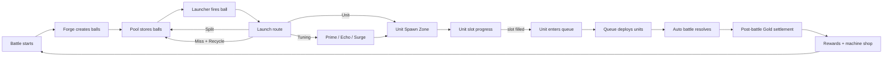

# planB Game Design Document

**Last updated:** 2026-06-02
**Repository state:** docs-only. No implementation code is active in this repo.
**Genre:** ball-machine-driven auto-battle roguelite.
**Platform target:** PC / desktop first.
**Session target:** 45-60 minute formal run.
**Monetization:** premium buy-to-play plus possible DLC. No F2P or IAP model in the current design.
**Formal design status:** accepted direction, not implemented in this repo.

## 1. Intent

The player starts with an unstable physical spawning machine, then gradually shapes one or two machine directions into overloaded war engines through routing, tuning, race mechanics, enemy pressure, relics, and machine-shop choices.

The core question is not "can the player buy enough stats?" It is:

> Can the player identify which machine axis this run wants to amplify, commit to that direction, and see it become a visible frontline pressure pattern?

Design pillars:

- The ball machine is the main system.
- Run identity comes from committing to `Launch`, `Tuning`, or `Unit`, then seeing that commitment change the frontline.
- The main decision language is polarize, pivot, or patch.
- `Overdrive` is build amplification, not a universal panic button.
- Races, enemies, rewards, relics, events, economy, and shop items must express through `Launch / Tuning / Unit`.
- Readability comes before content breadth. If players cannot identify the axis, counter, or `Overdrive` effect, add less content and improve feedback.

## 2. Hard Boundaries

- The ball machine is the main system.
- Buildings, relics, rewards, economy, races, and enemies support the machine. They do not replace it.
- No PVP, networking, accounts, backend, matchmaking, or Steam integration in this design scope.
- The battlefield is a constrained fake 2D / 3/4 auto-battle field, not a free RTS map.
- No complex RTS pathfinding.
- Mouse-only play should be possible.
- Do not copy rules, art, UI, names, or assets from existing games.

## 3. Core Loop

The three machine responsibilities:

- `Launch`: create, hold, fire, tag, route, split, recycle, and pollute balls.
- `Tuning`: convert non-Unit outcomes into machine adjustments.
- `Unit`: convert ball value into unit progress, queue entries, deployment timing, and battlefield pressure.

Player-facing loop:

> Observe amplification signals -> choose whether to double down, pivot, or patch -> use rewards, shop items, and events to commit -> trigger a low-frequency Overdrive during battle -> read the frontline result.

Diagnosis is still useful, but it is not the main fantasy. Diagnosis helps the player decide which machine axis to amplify or protect. The main run memory should be the axis that was pushed into overload and whether it converted into frontline pressure.

## 4. Launch Zone

Launch owns the ball supply and routing layer.

Accepted modules:

- `Forge`: creates balls over time.
- `Pool`: visible FIFO queue.
- `Launcher`: fires the head of the Pool.
- `Route`: sends fired balls toward Tuning, Unit, Split, Miss, or other future routes.
- `Tags`: ball modifiers that change how a ball resolves.

Accepted baseline:

- Ball Pool belongs to Launch Zone. It is not a fourth warehouse.
- Forge generates slightly faster than Launcher fires.
- First target values: Forge creates 1 ball about every 1.0s, Launcher fires 1 ball about every 1.3s.
- Pool baseline capacity is 5.
- Pool is FIFO. The head of queue should be visually highlighted.
- When Pool is full, newly entering balls overflow and are discarded. Existing Pool contents are not pushed out.
- Overflow is a capacity pressure signal. It does not default into Gold or damage.

Split:

- Split returns balls to Pool instead of immediately relaunching them into the field.
- Baseline Split creates 2 value-1 clean balls.
- `split+` creates 3 value-1 clean balls.
- Split children do not inherit parent value or tags by default.
- Tag/value inheritance is reserved for relics, builds, or race mechanics.

Recycle:

- Miss + Recycle returns 1 value-1 clean ball to Pool.
- Recycle does not preserve parent tags by default.
- Pool full means recycle overflow fails.

Junk Ball:

- Junk is an enemy mechanic, not a default Boss mechanic.
- First accepted enemy pattern is a burst polluter: after a clear warning, it inserts 2-3 Junk Balls into Pool.
- Junk occupies Pool capacity.
- Junk fires normally through the physical route, then disappears with no effective settlement.
- Junk cleanup, filtering, purification, or conversion can exist through relics, events, or special builds.
- Delete-ball attacks are not part of the current baseline. Revisit only during enemy design.

## 5. Tuning Zone

Tuning is the non-direct-output machine adjustment layer. It does not directly create units, does not directly deal primary damage, and does not open a combat shop.

Accepted baseline slots:

| Slot | Chinese | Meaning | Player read |
|---|---|---|---|
| Prime | 预充 | Increase the current Unit ball value. | This Unit hit is bigger. |
| Echo | 复写 | After a Unit ball hits a slot, apply its base value one extra time. | This hit counts again. |
| Surge | 脉冲 | If the Unit ball causes a unit to enter queue, deploy that batch faster. | This batch reaches the field faster. |

Accepted boundaries:

- `Guide` is not a baseline slot.
- Baseline play should not secretly force ball trajectory.
- Slot width, slot mechanisms, cross-slot progress, chaining, and preferred outcomes can be changed by builds, relics, races, or enemy rules.
- Chain behavior is not a baseline Tuning rule. It belongs to race identity, relics, or builds.
- Magic can return later as Arcane presentation or support behavior, but not as a baseline direct-damage Tuning slot.

## 6. Unit Zone

Unit owns progress, queue, deployment, and battlefield conversion.

Accepted baseline:

- Unit balls add value to the unit slot they hit.
- Each race has fixed unit slots.
- Filling a slot queues the corresponding unit.
- Queue deployment is a separate timing layer. It should not be treated as instant spawn, even when first deployment feels immediate.
- Surge only accelerates the batch caused by the triggering Unit result.
- Unit-side mechanics may later include queue burst, slot adjacency, overflow progress, gate topology, high-tier access pacing, or race-specific deployment rules.

Open design:

- Exact unit roster.
- Exact slot thresholds.
- Exact queue release timings.
- Race-specific unit identities.
- Whether Unit has five slots by default in the formal build.

## 7. Gold And Machine Shop

The visible resource name is `Gold / 金币`.

Accepted Gold sources:

- Primary source is post-battle settlement.
- Base Gold rises slightly as the run advances. This is the economic floor.
- Small performance bonuses can be added for:
  - remaining player base HP,
  - low overflow / machine efficiency.
- Performance bonuses should stay small, roughly up to 20% of base Gold total.
- No speed bonus in the baseline. Avoid making pure rush the best economic strategy.
- No kill Gold in the baseline.
- Overflow does not default into Gold.
- Junk purification does not default into Gold.
- Extra Gold can come from relics, events, or special builds only.

Post-battle settlement panel:

- Shows base reward.
- Shows defense integrity bonus.
- Shows machine efficiency bonus.
- Shows total Gold gained.
- Shows current Gold.
- Then routes into rewards and machine shop.

Machine shop:

- Gold mainly pays for post-battle machine shop decisions.
- Shop is split into `Launch / Tuning / Unit` columns.
- Each column offers 1-2 limited-stock items.
- Every item must show its warehouse and machine segment, for example:
  - `Launch - Pool Capacity`
  - `Tuning - Prime Width`
  - `Unit - Queue Burst`
- Buying multiple items from the same column raises prices only within the current shop.
- Next shop resets same-column price increase.
- The shop does not sell generic raw stats:
  - no all-unit attack percent,
  - no all-unit HP percent,
  - no player base max HP stat item.

Economic overload:

- Default Gold curve should not let the player buy out all strong options across all three machine columns.
- Same-column price pressure and limited stock should make extra Gold support commitment instead of flattening commitment.
- High-Gold runs can be valid if they are earned through a named build, relic, event, or race hook.
- A high-Gold build must have:
  - identity: the player can name why this run is rich,
  - opportunity cost: it gives up frontline pressure, repair safety, future node safety, or another machine-axis investment,
  - counterplay: elite, Boss, or event pressure can test whether the rich build is still converted into frontline pressure,
  - boundary: it can buy through part of a node sequence, but should not freely buy out all machine axes.
- Gold build is not one of the early build shapes. Treat it as a later special build, relic, event, or race/support hook until the core three machine axes are proven.

Repair:

- Repair is a fixed survival slot in the shop.
- Repair is not part of the three warehouse columns.
- Repair does not trigger same-column price increase.
- At most one Repair purchase per shop.
- Hidden or disabled at full HP.
- Restores current base HP only, never max HP.
- First target value: price around 70% of current base Gold, restore 30% max HP.

## 8. Rewards And Builds

Accepted reward structure:

- Rewards should teach the player which warehouse is being changed.
- Launch rewards affect Forge, Pool, Launcher, routes, tags, Split, Recycle, Junk handling, and overflow handling.
- Tuning rewards affect Prime, Echo, Surge, slot width, trigger rules, and conversion rules.
- Unit rewards affect unit slot progress, queue timing, deployment burst, slot adjacency, gate topology, and battlefield conversion.
- Generic output-only rewards are a failure mode unless they are tied to machine behavior.

Reward UX rule:

- A reward should make the player able to say, "This changes this part of the machine."

Early build shapes:

| Build shape | Machine axis | Core behavior reward | Overdrive | Enemy counter | Frontline read |
|---|---|---|---|---|---|
| Launch Flood | Forge / Pool / Launcher / Split | `Front Return`: Split or Recycle balls returning to Pool enter near the front instead of waiting at the tail. | For a short window, Split / Recycle returns enter the front and Launcher throughput spikes. | `Pool Polluter`: inserts Junk into Pool and breaks return rhythm. | Continuous small-flow pressure, like the frontline water level rising. |
| Tuning Echo | Prime / Echo / Surge trigger | `Echo Hot Slot`: an Echo-hit Unit slot becomes hot for a short window, causing the next relevant Unit hit to copy again. | The next few Echo Hot Slot triggers do not consume the hot state. | `Echo Breaker`: marks slots or windows where Echo triggers are weakened or swallowed. | Few high-value repeated waves, more like a heavy punch than a flood. |
| Unit Queue Burst | Unit slot / queue / deployment batch | `Squad Merge`: same-unit consecutive queue entries merge into a squad release. | Immediately release the current squad and let the next same-unit queue entry continue the squad chain. | `Stagger Punisher`: applies periodic frontline pressure that punishes long charge-up gaps. | Batch surge, with a visible group push rather than continuous flow. |

Early build boundaries:

- These are generic machine-axis shapes, not final race kits.
- A run can pivot or patch, but the main memory should be one shape pushed far enough to change the frontline.
- Overdrive should amplify the chosen shape. It should not solve every emergency state.
- Enemy counters should pressure a shape into a decision: keep polarizing, pivot, or patch. They should not hard-delete a build.

Early node chains:

| Build shape | Battle reward | Shop item | Event mutation | Node-chain purpose |
|---|---|---|---|---|
| Launch Flood | `Front Return`: Split / Recycle returns enter near the front of Pool. | `Overflow Buffer`: when Pool is full, one returning ball can wait in a short-lived buffer instead of being discarded immediately. | `Uncapped Intake`: for the next 2 battles, Forge runs faster, but Junk is also more likely to enter Pool. | Start the return flood, protect it from capacity breaks, then offer a high-risk throughput push. |
| Tuning Echo | `Echo Hot Slot`: Echo-hit slots become hot for a short follow-up copy window. | `Echo Lock`: choose one Unit slot; hot state prefers that slot or its neighborhood this battle without secretly steering the ball path. | `Overtone`: for the next 2 battles, Echo copies are thicker, but Echo Breaker enemies prioritize hot slots. | Start the repeated wave, make it chaseable, then offer a high-risk thickness push. |
| Unit Queue Burst | `Squad Merge`: same-unit consecutive queue entries merge into one squad release. | `Queue Brace`: while a squad is charging, the frontline gets temporary holding support or base buffering. | `Delayed Muster`: squads take longer to form, but release with extra bodies or stronger formation value. | Start the group push, survive the charge-up gap, then offer a high-risk burst push. |

## 9. Enemies

Accepted direction:

- Enemies should pressure the machine, not only the battlefield.
- Special enemy mechanics must be visible and warned before they affect Pool or slots.
- Junk pollution is the first accepted machine-pressure family.
- Delete-ball attacks are deferred.
- Not every Boss uses Junk.
- Boss identity should come from specific mechanics, not from always applying the same economy or Pool disruption.

Open design:

- Enemy roster.
- Enemy warnings.
- Which enemy first introduces Junk.
- Whether elite enemies can combine machine pressure with battlefield pressure.

## 10. Races

Accepted direction:

- Main race owns primary unit identity, main build vocabulary, Guardian / base identity, and race-specific machine hooks.
- Secondary race can exist as a support package.
- Secondary race should focus on one machine modifier layer, not become a second full race.
- Race-specific chain mechanics are allowed, but not baseline Tuning behavior.

Accepted candidate directions:

- Hive and Mech remain candidate first-race identities, but their formal unit rosters are not locked.
- Arcane can return as a support/race direction through Tuning conversion, Rune/socket, or tag behavior.

Race build rewrites:

| Generic build shape | Hive rewrite | Hive frontline read | Mech rewrite | Mech frontline read |
|---|---|---|---|---|
| Launch Flood | `Brood Flow`: returning balls carry Brood value, and repeated returns increase low-tier hatching frequency. | Constant biological replenishment, with small units filling gaps. | `Ammo Chain`: returning balls become ammunition or charge links that reduce waste and feed fire units steadily. | Stable fire line, fewer bodies than Hive but more reliable pressure. |
| Tuning Echo | `Infection Echo`: Echo spreads hatch / infection marks to adjacent slots or the next relevant hit. | Pressure spreads from the hit point into multiple hatch points. | `Calibration Echo`: Echo copies calibration or charge into high-value units or weapon triggers. | Precise repeated heavy hits, with fewer but clearer impact waves. |
| Unit Queue Burst | `Nest Surge`: Squad Merge releases a nest of weak units at once. | Swarm surge, many bodies arriving in one push. | `Formation Release`: Squad Merge releases a synchronized formation of tougher units. | Heavy formation push, fewer units but a harder battle line. |

Race rewrite boundaries:

- Races should rewrite the same machine-axis shapes instead of becoming unrelated systems.
- Hive should not make every build read as "more bodies." Launch is replenishment, Tuning is spread, and Unit is nest burst.
- Mech should not make every build read as "stronger units." Launch is stable supply, Tuning is precision repetition, and Unit is synchronized formation.
- If a race mechanic does not express through `Launch / Tuning / Unit`, it is outside the current race design boundary.

Open design:

- Formal first two races.
- Unit rosters.
- Guardian / base identities.
- Race-specific relics, buildings, and machine hooks.

## 11. Run Structure

Accepted direction:

- Full formal runs target a Slay-the-Spire-like 45-60 minute shape.
- Three-act structure is a useful reference.
- Each combat should feed into machine-axis commitment, reward, and machine-shop decisions.
- Node-room structure is the preferred run structure:
  - normal battles expose amplification signals,
  - rewards let the player keep polarizing, pivot, or patch,
  - shops turn Gold into `Launch / Tuning / Unit` investment,
  - events offer high-risk machine changes,
  - elites test whether the current machine axis is actually forming,
  - Bosses or act endpoints validate whether that axis can become decisive frontline pressure.
- Fail states should show the run's main machine axis, strongest pressure window, the enemy pressure that disrupted it, and the frontline moment where the build failed to convert.

FTUE direction:

- First battle should demonstrate the three early machine axes before asking the player to commit:
  - trigger a small `Front Return` moment so the player sees continuous replenishment,
  - trigger a small `Echo Hot Slot` moment so the player sees a high-value repeated wave,
  - trigger a small `Squad Merge` moment so the player sees a group release.
- First battle enemies should be weak enough that the goal is comprehension, not failure.
- The first real build commitment should happen after that battle, through a reward choice between `Front Return`, `Echo Hot Slot`, and `Squad Merge`.
- The second battle should make the chosen axis appear more often so the player can validate the choice.
- The third battle may introduce a light counter:
  - Launch path sees light Pool pressure,
  - Tuning path sees light Echo disruption,
  - Unit path sees light stagger pressure.
- Early counters should invite polarizing, pivoting, or patching. They should not punish the player for choosing an axis.

Retention direction:

- D1 should mainly come from untried machine axes and race rewrites:
  - after a run, show which axis the player used and which early axes remain untried,
  - show that the same axis reads differently through Hive and Mech rewrites.
- Unlocks and challenge tiers can support retention, similar to Brotato-style character/item/challenge pull, but they should not replace run-internal machine-axis learning.
- D7/D30 retention should use an `Axis Mastery Ladder`:
  - D7 asks the player to master how one machine axis handles its counters,
  - D30 asks the player to master how the same axis changes through race rewrites and higher challenge tiers.
- Run achievements can provide concrete goals for that ladder, for example:
  - win a Pool Polluter elite after committing to Hive `Brood Flow`,
  - win an Echo Breaker segment after committing to Mech `Calibration Echo`,
  - clear a challenge tier with Mech `Formation Release` under low-unit-count pressure.
- Unlocks should feed back into machine-axis mastery, such as Overdrive variants, race rewrites, event variants, or shop item variants.
- Unlocks should not become an external checklist that replaces run-internal machine learning.
- Exact unlock cadence and challenge tier structure remain open.

Player motivation and emotional arc:

- The primary player motivation is machine mastery:
  - autonomy comes from choosing whether to polarize, pivot, or patch a machine axis,
  - competence comes from reading amplification signals, predicting enemy counters, and converting the chosen axis into frontline pressure,
  - relatedness is not a social-system target in this repo state; the lighter attachment target is run identity, race expression, and recognizable machine behavior.
- Primary target players are systems roguelite players and auto-battle optimizer players.
- Secondary target players may include casual physics players only if battlefield outcomes remain readable.
- Non-target players include high-frequency action players, RTS micro players, PVP-first players, live-service progression players, and pure physics score-chasers.
- The main emotional cadence should be:
  - power moment: an `Overdrive` turns the committed `Launch / Tuning / Unit` axis into a visible frontline break,
  - vulnerability moment: the next `Stress` enemy or counter exposes that axis' weak point,
  - decision moment: the player chooses whether to keep polarizing, pivot, or patch.
- In mid-run play, power and vulnerability moments should usually be 2-4 minutes apart. The FTUE version can be shorter and lower-stakes.
- Reward, shop, and event chains can create anticipation before the power moment, but their value should be proven in battle.
- Race rewrites can make the same emotional cadence feel different, but they should not become a separate motivation layer outside the machine axes.

Difficulty curve:

- Early difficulty should use an `Expose / Stress / Validate` pattern, not simple linear stat growth.
- `Expose`: normal battles reveal how the current axis changes the frontline. The goal is comprehension and axis confidence.
- `Stress`: elite or mid-segment enemies pressure the current axis' weak point, such as Pool pollution, Echo disruption, or stagger pressure. The goal is to force a decision: keep polarizing, pivot, or patch.
- `Validate`: Bosses or endpoints test whether the current axis converts into decisive frontline pressure. Boss identity should come from the tested pressure, not from always applying the same disruption.

Early churn points:

| Churn point | Player reaction | Mitigation |
|---|---|---|
| First battle is unreadable. | "I see balls and units moving, but I cannot tell what changed the frontline." | First battle demonstrates `Front Return`, `Echo Hot Slot`, and `Squad Merge` before the first build commitment. |
| First counter feels like punishment. | "I picked Launch and the game immediately targeted me with Junk." | First counters are light and paired with polarize / pivot / patch choices instead of build deletion. |
| Mid-run choices flatten into buying everything. | "The best play is just buy all strong-looking items." | Limited stock, same-column price pressure, no raw stat shop, and node rewards tied to machine-axis identity. |

Open design:

- Act map structure.
- Boss roster.
- Event types.
- Shop frequency.
- Exact battle count and economy curve.
- Exact unlock cadence.
- Exact challenge tier structure.

Scope roadmap:

| Stage | Purpose | Content boundary | Gate |
|---|---|---|---|
| Gameplay validation slice | Prove that machine-axis commitment becomes readable frontline pressure. | 1 race, `Launch / Tuning / Unit`, 3 early build shapes, 1 shop, 3 enemy counters, 1 Boss or endpoint. | 3-5 target players can identify which axis changed the frontline, what counter pressured it, and whether `Overdrive` felt like build amplification. |
| Itch sale validation | Test whether the bounded game shape can sell as an actual paid product. | 2 races, 3 machine axes, 3 early build shapes, 18-24 shop items, 12-18 relics, 9-12 normal enemies, 3 elite counters, 3 Bosses or act endpoints, about 12 events, and 1 `Axis Mastery Ladder`. | Sales, refunds, session completion, and player feedback show that the core fantasy is understandable without the full launch content set. |
| Steam demo candidate | Test Steam-facing acquisition and demo response. | Same as Itch sale validation, or a slightly expanded version with a small number of extra enemies, events, or challenge modifiers. | Demo players understand the machine-to-frontline promise and wishlist or follow at a rate worth pursuing. This does not imply Steam integration inside this repo state. |
| Launch target | Ship the full premium first release. | Finite B-scope target: 4 race identities, 3 machine axes, 12 core build families, 36-42 shop items, 36-42 relics, 18-24 normal enemies, 6 elite counters, 4-5 Bosses or act endpoints, 18-24 events, 5-8 challenge tiers, and a polished interface. | Only enter full production after the earlier gates prove readability, conversion, and content demand. Before production, validate this list against production capacity and cut any item that does not support machine-axis mastery. |

Scope compression rule:

- There is no fixed release-date target in the current design state.
- Quality gates should matter more than calendar pressure.
- If the Launch target must be compressed, cut high-order breadth before cutting the core machine:
  - first reduce high challenge tiers,
  - then reduce event count or event variants,
  - then reduce optional enemy variants or optional relic variants.
- Do not cut the three machine axes, the basic `Overdrive` cadence, or the minimum race rewrite proof.
- Do not use "make a better game" as an open scope rule. Before production, "better" must be translated into concrete gates: readability, conversion, run completion, replay demand, and content exhaustion.

## 12. Failure Modes

Accepted pillar tensions:

- `Unit` can accidentally become the only axis that matters. This pressures the three-axis pillar because players may treat `Launch` and `Tuning` as support layers instead of run-defining choices.
- `Overdrive` can accidentally become a generic emergency button. This pressures the Machine-to-frontline pillar because players may save it for danger instead of using it to amplify the committed axis.
- Race, relic, shop, and event systems are accepted as support systems for the ball machine. Their risk is implementation drift: if their strongest effects win outside `Launch / Tuning / Unit`, they stop being support systems.
- High-Gold builds are accepted when they are named builds with cost, counterplay, and machine-axis identity. Their risk is flattening, not automatic pillar violation.

Known risks:

| Risk | Category | Probability | Impact | Severity | Direction |
|---|---|---|---|---|---|
| Launch target becomes an Ocean. | Scope | Medium | Critical | High | Treat C and A as validation gates. Keep the B launch list finite, and do not add content categories until earlier gates pass. |
| Players cannot read what changed the frontline. | Technical / UX feasibility | Medium | Critical | High | The validation slice must use blind observation: players should identify the axis, the counter, and the `Overdrive` effect without strategy explanation. |
| Race, relic, shop, or event power overrides the ball machine. | Pillar drift | Medium | Critical | High | Every race rewrite, relic, shop item, and event must trace to `Launch / Tuning / Unit`; content that wins outside the machine axis is cut or rewritten. |
| Gold buys through the run. | Economy / retention | Medium | Significant | Medium | Limited stock, small performance bonuses, same-column price pressure, no raw stat shop, and high-Gold builds treated as named builds with counters. |
| Unit is always best. | Pillar tension / core loop | Medium | Critical | High | Enemy rules and amplification signals must make Launch and Tuning worth committing to as run-defining axes. |
| Overdrive becomes a generic emergency button. | Pillar tension / motivation | Medium | Significant | Medium | `Overdrive` should amplify already-invested direction. It should not solve every emergency state, and weak-axis Overdrive should be visibly weaker. |
| Pool pressure becomes punishment. | Core loop / churn | Medium | Significant | Medium | Clear warnings, visible Pool, and build tools to filter, convert, or exploit pressure. |
| Tuning becomes hidden math. | UX / competence | Medium | Significant | Medium | Strong HUD/result feedback and slot-level visuals for `Prime / Echo / Surge`. |
| Market reads this as generic auto-battler plus pinball gimmick. | Market differentiation | Medium | Significant | Medium | The public promise should focus on machine-axis commitment becoming visible frontline pressure, not on references to other games. |
| "Quality" becomes unbounded scope. | Scope | Medium | Critical | High | Use quality gates instead of a fixed release date: readability, conversion, run completion, replay demand, and content exhaustion. |

## 13. Next Decisions

Current highest-value open questions:

1. Formal first race roster and unit slots.
2. First enemy set, including the first Junk polluter.
3. First machine shop inventory table.
4. First post-battle Gold curve.
5. FTUE sequence for teaching Pool, Tuning, Unit, and shop.
6. Implementation target and slice plan, if code restarts.
