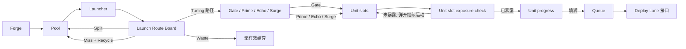

# 三仓机器规格

**最后更新：** 2026-06-08
**仓库状态：** 文档主导，当前活动 MVP v0 实现目录为 `godot/`；本文不作为代码状态证明。
**权威范围：** `Launch / Tuning / Unit` 三仓机器规则。

本文只定义机器规则。战场规则见 `docs/battlefield-rules.md`，Guardian 规则见 `docs/guardian-system.md`。

## 1. 目标

三仓机器的目标是把球路和机器构筑转化成可见战场优势，而不是简单“更快出兵”。

| 仓 | 核心职责 | 战场形态 |
|---|---|---|
| `Launch` | 造球、存球、发球、路线倾向、回流、污染压力。 | 持续流、稳定补线、减少断档。 |
| `Tuning` | 球进入 Unit 前的转换质量。 | 高价值命中、重复结算、触发加速。 |
| `Unit` | 槽位进度、队列、部署节奏、批量释放。 | 蓄力、成批部署、阵线翻转。 |

## 2. 基础流程

设计锁：

- Ball Pool 属于 `Launch`，不是第四仓。
- 有效 Unit 输入必须先经过 Tuning 路径。
- `Gate / Prime / Echo / Surge` 是 Tuning 同级槽。
- `Gate` 是最宽的普通入 Unit 槽。
- `Unit` 当前基础方向使用 4 个独立单位槽。
- 队列部署是独立节奏层，不是瞬间出兵。
- `Deploy Lane` 是 `Unit.Deploy.route` 接口，不是第四仓。
- `Overdrive` 不属于 MVP 基础按钮。
- 三仓机器是跨种族通用规则，不随种族替换为另一套核心结构。
- 种族必须通过球机的可见表现、反馈语言和明确的 Machine Contract 改写表达特色，但 `Launch / Tuning / Unit`、`Gate / Prime / Echo / Surge`、`Unit slot`、`Queue`、`Deploy Lane` 的通用标签必须保留可见。
- 种族可以改变组件外壳、颜色、材质、图标风格、运动反馈和必要的效果命名；不能把三仓机器替换成另一套隐藏核心规则。命名包装不是每个种族的核心轴必需项。
- 每个 `Unit slot` 是独立单位模板槽，不是部件槽、配方槽或跨槽合成槽。
- `Unit.Slot.Exposure Gate` 是基础 Unit 组件，用于控制槽位从左到右逐步暴露。
- `Unit.Slot.Exposure Gate` 的基础暴露节奏是跨种族通用 baseline，不按种族拥有隐藏的默认时间表。
- 种族、Guardian、奖励、商店、遗物、事件或敌人若要改变闸门，必须作为命名规则通过 Machine Contract 声明，显示它改了初始遮挡、缩短速度、槽位优先级或短时暴露窗口。
- Debug 工具可以临时加宽槽、指定结果或指定目标，但不构成玩家规则。

## 3. Machine Contract 1.0

所有会改变机器的规则都必须声明：

- 来源：种族、Guardian、奖励、商店、遗物、事件、敌人或其他命名来源。
- 所属仓：`Launch`、`Tuning` 或 `Unit`。
- 目标组件，例如 `Launch.Pool.capacity`、`Tuning.Echo.copy_count`、`Unit.Queue.deploy_interval`。
- 操作类型：add、multiply、replace、trigger、convert。
- 作用范围：单场、节点、整局、临时预警窗口或永久单局状态。
- 玩家读法：玩家应该如何看出它生效。
- 失败风险：它可能如何抹掉机器身份或造成不可读。

禁止默认使用：

- “全部输出增加”
- “所有单位变强”
- “所有敌人变弱”
- “更快出兵”

除非这些效果被重写成明确组件修改，否则不进入基础设计。

## 4. 规则结算顺序

同一结果被多个规则影响时，按以下顺序：

1. 基础机器规则。
2. 种族模板。
3. 已选择 Guardian 的战略技能。
4. 永久奖励、遗物、商店修正。
5. 临时事件修正。
6. 敌人减益和反制干扰。
7. 安全上限和循环保护。

类似 `Overdrive` 的未来效果也必须按 Machine Contract 声明来源、目标组件和风险。它不是基础结算层。

## 5. Ball Payload

基础球携带少量机器数据：

| 字段 | 含义 |
|---|---|
| `kind` | 球类型，例如 clean ball、Junk Ball 或未来特殊球。 |
| `value` | 有效 Unit 命中前的基础进度值。基础 clean ball 为 1。 |
| `tags` | 显式标签，默认空。 |
| `tuning_mark` | 当前 Tuning 结果，例如 Gate、Prime、Echo、Surge。 |
| `source_pass` | 防止递归和循环的结算代数。 |

锁定规则：

- 基础 clean ball：`kind=clean`、`value=1`、无 tags、无 tuning mark。
- Junk Ball 占 Pool 容量，照常路由，但不产生有效结算。
- Split 和 Recycle 默认生成 clean value-1 balls。
- Split / Recycle 子球默认不继承父球 value、tags 或 tuning mark。
- 继承、复制、多结算、递归和额外造球都必须由命名规则显式允许。

## 6. Loop Safety

基础安全规则：

- 一个物理球最多获得一个基础 Tuning 结果。
- 一个物理球最多产生一个基础 Unit hit。
- 一个物理球最多造成一个基础 queue entry。
- Echo 复制的是 Unit 进度结算，不复制物理球。
- Echo 复制结算不能再触发 Split、Recycle、Tuning mark 或 Echo。
- Surge 只加速触发它的那个 queue entry，不全局加速队列。

## 7. Launch

Launch 管球的供应和物理路线。

组件：

- `Forge`：随时间生成球。
- `Pool`：可见 FIFO 球池。
- `Launcher`：发射 Pool 头部球。
- `Launch Route Board`：决定 fired ball 的结果倾向。
- `Split`：回流并增加球。
- `Recycle`：miss 后回流。
- `Waste`：无有效结算。

第一版目标：

- Pool 容量：5。
- Pool 通常维持 2-4 / 5。
- Forge 约每 2.2s 生成 1 球。
- Launcher 约每 1.3s 发射 1 球。
- Forge 本身慢于 Launcher，Split / Recycle 回流负责维持压力。

Route Board 第一版倾向：

| 结果 | 目标倾向 | 含义 |
|---|---:|---|
| `Tuning 路径` | 65% | 进入 Tuning。 |
| `Split` | 15% | 生成回流压力。 |
| `Miss + Recycle` | 15% | 回收 1 个 clean value-1 ball。 |
| `Waste` | 5% | 无有效结算。 |

这些是调试目标，不是必须暴露给玩家的精确概率承诺。

## 8. Split、Recycle、Junk

Split：

- 默认返回 Pool。
- 默认生成 2 个 clean value-1 balls。
- `split+` 可作为命名规则生成 3 个 clean value-1 balls。
- 子球默认不继承父球标签或价值。

Recycle：

- Miss + Recycle 默认返回 1 个 clean value-1 ball 到 Pool。
- Pool 满时，Recycle 回流失败。
- Recycle 默认不保留父球标签。

Junk：

- Junk 是敌人机制，不是基础 Boss 通用机制。
- Junk 占 Pool 容量。
- Junk 照常发射和路由，但不产生有效结算。
- 清理、过滤、净化、转换 Junk 必须来自命名规则。

## 9. Tuning

Tuning 是 fired ball 进入 Unit 前的转换区。

基础槽：

| 槽 | 中文读法 | 第一版宽度倾向 | 基础效果 |
|---|---|---:|---|
| `Gate` | 出口 / 出兵入口 | 55% | 普通进入 Unit，无额外奖励。 |
| `Prime` | 预充 | 15% | 当前 Unit hit value 变成 `value + 1`。 |
| `Echo` | 复写 | 15% | 同一 Unit 进度值额外结算一次。 |
| `Surge` | 脉冲 | 15% | 若该 hit 生成 queue entry，该 entry 使用 0.25s 部署延迟。 |

设计锁：

- `Gate` 与 `Prime / Echo / Surge` 平级。
- `Gate` 是普通路径，必须比奖励槽更宽。
- 如果每个球都拿奖励，奖励就不值钱。
- Chain、偏向、复制增强、槽宽改写都属于命名构筑、种族、中立修正、遗物或敌人规则，不是基础 Tuning。

## 10. Unit

Unit 管槽位进度、队列和部署接口。

基础规则：

- 当前 MVP 方向使用 4 个独立单位槽。
- 4 个槽从左到右是低需求到高需求，通常也对应低承诺到高承诺单位模板。
- 每个槽加载一个种族定义的单位模板。
- 每个槽是独立出兵源，进度满后生成该槽加载单位的 queue entry。
- 基础规则不做跨 slot 合成、跨 slot 部件装配或跨 slot 配方结算。
- 不同种族可以用不同单位模板解释同一个低到高需求梯度。
- 槽位的基础物理宽度可以相等，但有效命中区域受 `Unit.Slot.Exposure Gate` 影响。
- Unit 队列是 FIFO。
- 队列每 0.5s 最多部署 1 个条目。
- 新入队条目等待下一个部署节拍，不瞬间出生。

Unit slot 字段：

| 字段 | 含义 |
|---|---|
| `slot_id` | 1-4。 |
| `loaded_unit` | 当前种族定义的单位模板。 |
| `progress_current` | 当前进度。 |
| `progress_required` | 填满所需进度。 |
| `slot_width` | 槽位基础物理宽度。 |
| `exposure_current` | 当前暴露比例或暴露范围。 |
| `exposure_required` | 允许球落入该槽的暴露条件。 |
| `queue_entry_rule` | 填满后生成什么队列条目。 |
| `deployment_rule` | 条目如何进入战场，包含 `Deploy Lane` 接口。 |

Slot Exposure Gate：

- 基础每场战斗开始时，最左侧 slot 完整暴露。
- 其余 slot 被 `Unit.Slot.Exposure Gate` 挡住未暴露区域。
- 随战斗时间推进，闸门从左到右逐步缩短，逐步暴露更高需求 slot。
- 球打到已暴露区域时，可以正常落入对应 slot 并结算 Unit progress。
- 球打到未暴露区域时，会像碰到其他物理障碍一样弹开，不直接消失，也不立即转成 Waste。
- 基础规则下，所有 slot 最终都会完整暴露。
- 基础暴露时间表在同一战斗模板下跨种族一致，不做 Hive 或未来种族的隐藏默认分表。
- 第一版 baseline：

| Slot | 暴露开始 | 完全暴露 | `progress_required` |
|---|---:|---:|---:|
| Slot 1 | 0s | 0s | 3 |
| Slot 2 | 12s | 24s | 5 |
| Slot 3 | 36s | 54s | 8 |
| Slot 4 | 72s | 96s | 12 |

- 这组 baseline 的目标是让 Battle 1 前 30 秒看到 Slot 2 完整开放，让 35-70s 的路线压力阶段看到 Slot 3 进入舞台，让 70s 后的构筑兑现阶段看到 Slot 4 完整参与。
- 暴露开始到完全暴露之间的插值方式仍属于实现调试项；当前只锁定开始时间、完全暴露时间和 `progress_required` 起点。
- 命名构筑可以影响闸门参数，例如初始长度、缩短速度、特定 slot 的暴露优先级或短时暴露窗口。
- 闸门参数改写必须可见、可命名、可复盘；玩家应该能把异常开放节奏归因到某个 Guardian、奖励、商店项、遗物、事件或敌人规则。
- 命名构筑不能无代价地让所有高需求 slot 开局全开。

Overflow：

- 槽满时生成 1 个对应队列条目。
- 减去一次 `progress_required`。
- 剩余进度留在同槽。
- 若剩余进度仍超过阈值，基础规则下等待后续 hit，除非命名规则允许多条目生成。
- 基础 Unit 不把溢出进度转移到其他槽。

## 11. Deploy Lane 接口

`Deploy Lane` 是 Unit 到战场的接口。

基础规则：

- 战场有 `Left / Mid / Right` 三路。
- 玩家选择当前 `Deploy Lane`。
- 队列条目在部署节拍结算时部署到当前路线。
- 玩家选择的是部署路线，不是单位类型。
- 已部署单位不能直接控制。
- 路线选择不改变造什么单位、造多少单位、机器多快产生队列条目。
- 玩家直接点击战场路线，点击后立即更新当前 `Deploy Lane`。
- 没有切路冷却。
- 没有待切路线。

战场细则见 `docs/battlefield-rules.md`。UI、直接点路和路线危险提示见 `docs/deploy-lane-ui.md`。

## 12. 敌人反制边界

反制是预警过的机器组件攻击。

| Counter | 攻击组件 | 预警读法 | 预期解法 |
|---|---|---|---|
| `Pool Polluter` | Pool 容量和回流节奏。 | Junk 预留格或插入预警。 | 过滤、扩容、前插、净化、转换、绕路。 |
| `Echo Breaker` | Echo 窗口或热槽。 | Echo 槽或窗口被标记。 | 换槽、保护热槽、诱饵、转 Prime / Surge。 |
| `Stagger Punisher` | 队列断档和蓄力空窗。 | 无部署时 gap timer 出现。 | 低阶填充、Queue Brace、拆批、提前小部署。 |

反制不应硬删除构筑，而应逼玩家强化、转向或补洞。

## 13. 仍未定

1. 三个反制家族的第一版数值和预警时长。
2. 中立修正和 Hive 的精确 playtest 后最终平衡。
3. 未来种族单位模板。
4. 是否让未来 `Overdrive` 类效果以命名修正回归。
