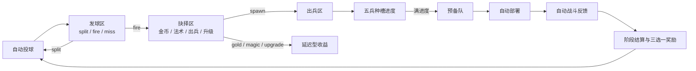
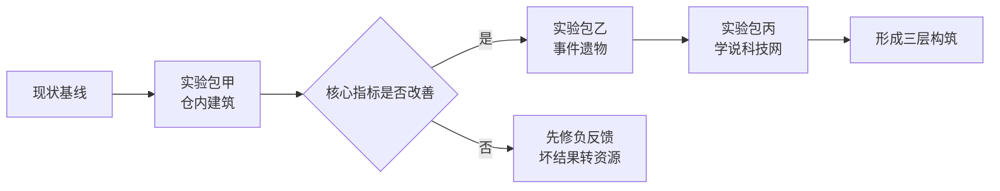

# moxxxYc planB 玩法研究与构筑方案报告

## 执行摘要

这份报告只讨论 **玩法**，不讨论架构、工时、技术债或“最小改动”。从公开仓库内容看，`moxxxYc/planB` 已经不是一个只会演示单点机制的小样，而是一个具备完整 run 骨架的三段式玩法原型：自动投球进入发球区，经由 split / fire / miss 预处理，进入抉择区决定金币、法术、出兵、升级，再由出兵区五兵种槽累计进度、进入预备队、自动部署到战场，最后用连续阶段制承接战斗与奖励。仓库还明确把它定义为“用于验证玩法的可玩原型”，并强调 ball machine 必须始终是主系统。citeturn48view0turn37view1turn39view1turn43view0

现阶段最大的问题，不是“系统不够多”，而是 **核心因果链太长、太慢、太容易在中途失真**。金币与升级命中经常不能在数秒内回流到战场；高阶挡板在阶段前半把高阶槽位压回低阶槽位；升级收益是“一次性待消费”的，常被低阶单位吞掉；金币目前的明确消费基本只是一阶段一次 reroll；仓库还专门加入了“前 10 秒至少打一条完整出兵闭环”的 author assist，这恰恰证明自然情况下主循环的自证能力还不够强。citeturn37view0turn20view0turn20view2turn16view0turn31view0turn17view2

因此，我的结论不是继续堆“数值型奖励卡”，而是把 **构筑层** 前置到三仓本身：以 **仓内建筑系统** 作为主系统，以 **事件遗物系统** 作为连锁层，以 **学说科技网** 作为长线方向层。这样的三层结构最符合仓库自身“ball machine 是主系统、建筑和奖励只能服务于它”的原则，也最接近成功同类里常见的构筑逻辑：Peglin 的 “orbs + relics”，Luck be a Landlord 的 “symbols + items”，Slay the Spire 的 “deck + relics”，以及 TFT / 金铲铲反复强调的“多条 comp / 羁绊 / 阵容都应可成立”的方向。citeturn37view1turn45view1turn45view0turn45view2turn45view3turn45view4

如果你现在只做一件事来验证玩法，我建议不是再加一批 reward 数字牌，而是直接上 **仓内建筑蓝图三选一**：让发球区、抉择区、出兵区都出现可放置、可升级、可联动的构筑点，并把所有“坏结果”逐步转化为一种未来可兑现的资源。这样才能真正回答这个 MVP 最关键的问题：**玩家玩的，究竟是“看球掉下去”，还是“亲手把机器构筑成战争引擎”。** 这一点与仓库当前目标完全一致。citeturn37view1turn39view1turn37view0

## 证据基础与现状复盘

本报告的主要证据来自仓库自身的 README、`CODEX_GOAL.md`、`AGENTS.md`、`docs/PROGRESS.md`、`docs/PLAYTEST_CHECKLIST.md`，以及 `PrototypeScene`、`GameState`、`PhaseSystem`、`RewardSystem`、`SlotTriggerSystem`、`SpawnQueueSystem`、`UnitSpawnProgressSystem` 和 `prototypeRules.test.ts`。也就是说，下面的判断优先依据 **项目自述 + 实际玩法规则 + 测试断言**，而不是主观想象。citeturn48view0turn37view0turn37view1turn39view0turn39view1turn18view3

当前 repo 的玩法主循环可以抽象成下面这条链：



在具体规则上，这个循环已经相当完整。`PrototypeScene` 进入场景后会直接 `startPhase` 并先投一颗球，之后在阶段进行中大约每 1300ms 自动投球一次；`ballCount` 提升后会在同一批投射中追加多球。发球区使用一个 180 度往复扫射的炮塔，测试规则明确：split 结果会在发球区内部生成两颗等值球，而不是直接送去抉择区。citeturn43view0turn33view0

抉择区的可见结果槽，目前实际是 **金币 / 法术 / 出兵 / 升级** 四槽，而且槽宽已经不是等宽固定列，而是由 `widthWeight` 做加权布局；奖励可以改变出兵槽或金币槽的宽度，测试也验证了物理 sensor 与视觉 plate 一起变宽变窄。与此同时，README 仍然把 `SPECIAL` 写进了 Decision slots，`slots.ts` 也保留了 `special` 状态，但进度日志写明它已从可见抉择行移除，实际布局也只按四槽生成。这说明仓库里已经存在一处 **规则文档与当前可玩态的轻微漂移**。citeturn21view0turn17view2turn33view2turn11view1turn48view0turn39view1

出兵区是整个 repo 最有价值的部分。README 与测试都表明：只有命中 `spawn` 的球才会进入 Unit Spawn Zone；每个兵种槽都维护自己的 `UnitSlotState`，要求值固定为 1 / 3 / 5 / 7 / 9，且允许进度溢出保留。阶段前半存在一块连续的高阶挡板，开局只开放最左边低阶槽，随后在前半阶段逐步打开全部五槽；如果球真的落进已部分暴露的高阶槽，仍然算有效命中，不会因为“挡板还在”而作废。citeturn48view0turn17view0turn33view1turn34view0

当某个兵种槽进度达标后，系统不会随机抽兵，而是把 **该槽对应的具体兵种** 放入预备队。这个具体兵种的出兵等级由“单位固有等级 + 下一次出兵等级加成 + 下一阶段等级加成”共同决定；数量由“基础 1 + 额外出兵数 + 待消费复制数”决定；如果满足升级计数与兵种 tier 条件，还会生成精英单位。之后预备队按自己的释放节奏自动部署上场，并受到标准单位软上限与精英上限的约束。仓库测试还验证了入队与部署的反馈文字会带上等级。citeturn31view0turn16view2turn17view1turn20view0

阶段系统同样已经较成熟。`phaseDefs` 里有 6 个连续阶段，从 52 秒到 80 秒不等，敌方目标血量从 500 递增到 1800，刷怪在固定时间点触发，而且 **不依赖玩家先出兵**；测试明确验证了“即使玩家一个兵都没出，敌军也会按阶段计时刷出来”。阶段结束后不会清空我方标准单位、精英单位、金币和长期修正，只会清掉临时/召唤物与瞬时效果。也就是说，repo 的 run 结构已经天然支持更深的构筑层。citeturn48view2turn18view0turn20view1turn39view1

从成长手段看，当前奖励主要还是一组数值/宽度/节奏修正：包括加大 spawn 或 gold 槽宽、提高预备队释放速度、增加额外出兵数、提升精英老兵经验、增加 ballCount、提高基础兵血量与伤害、提高金币倍率、加大法术伤害、让法术复制下次出兵、提高机械升级效率、让虫群在高阶孵化时额外带出幼虫等。`GameState` 还预留了 `machineUpgrades`、`slotUpgrades`、`buildings`、`relics` 数组，但这些构筑位在当前可玩内容里基本还是空壳。我的判断是：**仓库已经把“更深层的构筑系统”留好了玩法地基，只是还没真正启用。** citeturn17view2turn31view1turn14view0turn39view1turn6view0

## 当前玩法问题诊断

### 反馈链过长

当前 MVP 的“有感收益”出现得太晚。一次投球如果没有直接命中 `spawn`，通常只会变成金币、升级或法术；这三者里，金币要等到阶段后才能明确消费，升级要等下一次具体出兵才兑现，法术虽然能立即打伤敌人，但它对“我自己的兵越来越强”的构筑感贡献有限。于是玩家从“我操作或观察到一个结果”到“战场上看到我方战线变化”，中间常常隔着 **抉择结果→出兵结果→槽进度→入队→释放→接敌** 这一长串延迟环节。仓库自己之所以加上“前 10 秒保一次完整出兵闭环”的 first spawn loop assist，就是因为自然流程里这个闭环未必能很快、很稳定地自己亮出来。citeturn37view0turn20view0turn20view2turn43view0

更关键的是，球本身现在几乎还只是“带着一个 value 的 token”。`PrototypeScene` 里球的核心可见属性只有 `stage`、`value`、`blockedGateHits`；而在 Unit Spawn Zone 里，`ballValue` 只是被直接加到目标槽位进度上，split 也只是复制等值球。这意味着机器物理是有了，但“球属性构筑”几乎还没被真正挖出深度。换句话说，现在决定玩法的主要还是 **命中哪一槽**，而不是 **这颗球带着什么身份进入下一仓**。这也是为什么我后面三套方案都会把“球属性扩展”当作关键动作。citeturn24view2turn17view0turn33view0

### 负反馈环

当前最明显的负反馈，来自高阶策略在前半阶段的天然饥饿。Unit Gate 在前半阶段从 1 槽逐步开到 5 槽；开局打到高阶槽会被挡住并重导到当前最高可开槽位，测试甚至明确断言“打到 5 号位时会被重导到 0 号位，且高阶槽不累积进度”。这让玩家在最需要“找到高阶梦想局手感”的开局，反而会被系统强行推回低阶单位。citeturn17view0turn33view1turn34view0

升级系统则把这种负反馈再放大了一层。命中升级槽会增加 `pendingSpawnLevelBonus`，机械种族还会随机永久提升一个 mech 单位等级；每 3 次升级槽触发，下一次高阶出兵会变精英。但 `queueSpecificUnit` 里这个“下一次出兵等级加成”会在 **第一次具体入队** 后立刻清零。如果它被 1 费幼虫兵/无人机吃掉，玩家主观上就很容易觉得“升级白给了”；如果你正想做高阶流，前半阶段挡板又会让你更容易先产出低阶单位，于是升级收益和高阶锁门恰好形成一组互相放大的负反馈。citeturn16view0turn31view0turn17view0

预备队系统也有一个更隐性的负反馈风险。玩家单位入队后不是立刻上场，而是按 release interval 逐个部署，同时又受标准单位软上限 50 与精英上限 8 的限制。这样一来，强力的多球、额外出兵、复制出兵，表面上看会制造很热闹的短期高潮，但在单位上限与释放节奏的夹击下，部分收益会变成 **排队等待**，甚至接近“看起来很强、实际没上桌”的假繁荣。对玩家而言，这种落差比直接弱还危险，因为它会制造错误的 build 判断。citeturn43view0turn17view1turn14view0

### 理解摩擦

仓库当前已经意识到“可见性”是问题，并明确把“升级收益和预备队状态更可见”写进了 `CODEX_GOAL.md`。这说明理解摩擦不是推测，而是项目作者自己承认的现状。虽然最新进度已经补上了部分 HUD、等级浮字、预备队预览，但玩法判断点依旧分散：有的收益写在浮字，有的体现在槽宽变化，有的体现在下次出兵等级，有的又要阶段后才兑现。玩家要正确读懂一次 build 的价值，必须把多个系统放在脑中联立，这对一个“看球掉下去”的上手体验来说仍然偏重。citeturn37view0turn39view1

另外还有一处不容忽视的认知噪音，即 `SPECIAL`。README 仍把它列为 Decision slot，`SlotTriggerSystem` 里也保留了 `triggerSpecial`，但可见布局与进度日志又说明它已经从实际可玩行移除。这种“代码里还有、文档里还写、画面里却没给玩家看见”的状态，会在后续继续加构筑层时迅速放大理解风险。尤其当你以后要引入遗物、建筑、科技树时，任何隐藏/半隐藏规则都会把玩家对因果链的判断进一步拖乱。citeturn48view0turn16view0turn11view1turn39view1

### 平衡风险

当前 reward 设计已经具备一定方向性，但还没有形成足够清晰、可持续的 **流派闭环**。项目自检清单写着“至少一个 reward 支持 swarm play、至少一个支持 elite play”，进度日志则把下一步写成“继续 playtest phase pacing、reward card variety、elite readability”。这意味着仓库已经意识到“能跑”和“能形成稳定 build 身份”仍是两回事。现在的奖励大多还是系数型修正，它们当然能加快或放大当前系统，但还不足以让玩家在第三阶段前明确地说出：“这局我是贪金转兵、法术复制流、还是高阶精英流。” citeturn39view0turn39view1

两种种族当前也更像“单位表不同 + 少量修正不同”，而不是“同一机器玩法下产生显著不同的决策重心”。仓库自述希望 Hive 更 swarm-like，Mech 更 elite/upgraded，这一点在单位名、被动描述和少数 modifier 上是成立的；但真正进入三仓决策时，玩家面对的还是几乎同构的路线。因此，后续构筑系统最重要的任务之一，不只是“让数值更有差异”，而是让 **同一颗球在不同 build 下被看成不同资源**。citeturn6view0turn39view0turn49view1

## 构筑系统方案

从外部成熟案例看，值得借鉴的不是“照搬规则”，而是它们如何把玩家的长期决策嵌入基础循环。Peglin 把“orb 弹珠 + relic”做成会彻底改变一局走向的双层构筑；Luck be a Landlord 把“symbols + items”做成高互动、强连锁的组合系统；Slay the Spire 则把 relic 定义成能与卡组发生强交互的长期能力；而官方的 TFT / 金铲铲一直在围绕“更多可行 comp、更多成型路线、不要被过窄线条锁死”做持续平衡。换到 `planB` 上，真正需要的不是再多几个数值修正，而是 **让三仓本身成为 build 的舞台**。citeturn45view1turn45view0turn45view2turn45view3turn45view4turn46search9

下面三套方案，我都遵循同一条底层原则：  
**坏结果不能只是坏结果；它必须被转译成未来资源、未来偏置，或者未来确定性。**  
只有这样，三仓玩法才会从“看运气掉球”升级成“用构筑驯服随机”。

```text
┌────────────── 发球区 ──────────────┐      ┌────────────── 抉择区 ──────────────┐      ┌───────────────── 出兵区 ─────────────────┐
│ [建槽A]   炮塔 / split / fire / miss │ ───▶ │ [金] [法] [出] [升]   [建槽C]        │ ───▶ │ [槽1] [槽2] [槽3] [槽4] [槽5]   [建槽D] │
│ [建槽B]   负责球的生成、复制、偏置    │      │ 负责转化、偏向、复制、保底、回流       │      │ 负责溢出、门控、预备队、精英化、连锁      │
└───────────────────────────────────┘      └────────────────────────────────────┘      └────────────────────────────────────────┘
```

### 仓内建筑系统

**简述**：这是我认为最优、也最该优先验证的一套方案。每个仓不再只是“被动承受球的区域”，而是成为可放置、可升级、可串联的构筑棋盘。玩家每阶段从 3 张蓝图里选 1 张，在发球区、抉择区、出兵区的固定建筑位上建造或升级模块；模块直接改变球的流向、槽位的意义、进度的传递方式，最终改变战场输出曲线。它最符合仓库自己的原则：ball machine 必须是主系统，建筑只能服务于它。citeturn37view1

**玩家规则**：每阶段结束，提供 3 张蓝图三选一。每个仓默认有 2 个建筑位，整局最多启用 6 个模块，单模块最多 3 级。建筑不需要复杂经济门槛；为了降低负反馈，所有 `gold / magic / upgrade / blocked bounce / miss` 都会额外产出一种统一资源，例如“零件”或“控制能”，用于后续升级建筑。这样一来，玩家哪怕暂时没打到 spawn，也仍在推进自己的机器。规则对玩家是可见的、可解释的，而且能直接落在三仓画面里。  

**资源流**：我建议采用双资源。其一是 **零件**，主要来自金币命中、坏结果补偿、阶段结算；其二是 **脉冲**，主要来自连续命中、split、法术连锁、挡板反弹。零件负责“永久建造/升级”，脉冲负责“本阶段临时超频”。这样可以避免所有成长都压到 phase-end reward 上，也能让局内每次命中更有前后关系。  

**进程循环**：玩家先用阶段奖励建立建筑骨架，再通过过程中的球命中积累零件与脉冲，进一步激活同一建筑的连锁效果，最终把“更宽的 spawn”“更快的 queue”“更高的高阶命中率”统一成一条看得见的机器改造曲线。它把当前仓库里分散在 reward modifier 里的数值，重新组织成空间化、可连锁、可观察的三仓玩法。citeturn17view2turn31view1turn39view1

**组合示例**：  
“中央出兵引擎”可以是：发球区放“稳压炮闸”，让 fire 更偏向中线；抉择区放“中央导槽”，让连续两次非 spawn 后第三次决策球向中间吸附；出兵区放“孵化分流器”，让 1 号槽和 2 号槽的溢出进度向右扩散。这样，前期低阶兵更稳定，中期又能把低阶累计过量转译成中阶曲线。  
“贪金转兵”可以是：抉择区放“铸币机”，金币命中除给钱外还存 1 层“铸压”；铸压到 3 层时，自动让下一颗 decision ball 带 `spawn+1` 标记；出兵区再放“战备输送带”，让带 `spawn+1` 的 unit ball 优先通行到当前最高开放槽位。这样 gold 不再是纯延迟收益，而是会明确回流到核心 loop。  
“高阶跃迁”可以是：发球区放“反冲缓垫”，miss 不消失，而是转成一颗带 2 点 `momentum` 的回弹球；出兵区放“高阶蓄势器”，只要球曾被挡板弹过，就保留 30% 进度溢出到右侧槽。这样被挡板拒绝不再只是负反馈，而是高阶 build 的燃料。  

**优点**：它最强的地方是 **可感知、可解释、可形成流派身份**。玩家不是在读一堆 buff 文本，而是在看自己的机器真的被改造了。它也天然能把“球属性/球流”抬成玩法核心，而不是只用槽宽和数值修正堆变化。  

**缺点**：风险在于系统一旦做得太多，认知负担会猛增。所以第一轮验证必须克制：每仓只放 2 个建筑位，蓝图库一开始只做 6 到 9 个，且每个建筑的文字描述必须是“触发条件 + 改造结果”两段式，不要做长段说明。  

**对三仓的影响**：发球区负责“球从哪里来、带什么属性来”；抉择区负责“这些属性如何被转译成资源或偏置”；出兵区负责“偏置如何变成具体兵种、队列节奏和战场波峰”。这正是三仓玩法最该有的职责分工。

### 事件遗物系统

**简述**：如果说建筑系统是“把机器做成棋盘”，遗物系统就是“把事件做成连锁”。我建议把它做成一个偏 Slay the Spire / Peglin / Luck be a Landlord 的轻量层：每个遗物只盯一个事件触发点，但它会把这个事件和另一个仓的结果绑起来。这样做的好处是 cognitive load 比建筑低，却依然能得到很深的 emergent combo。citeturn45view1turn45view0turn45view2

**玩家规则**：每阶段结束同样三选一，但给的是遗物而不是建筑。整局最多携带 6 个遗物。遗物分成三类：发射遗物、抉择遗物、动员遗物。为了控制理解成本，每个遗物都只允许有一个主触发条件，外加一个明确的回报，不做多层嵌套文本。  

**资源流**：遗物系统最好尽量少引入新资源，而是直接寄生在已有事件上，比如“连续 split 次数”“本阶段被挡板弹回次数”“金币命中次数”“第一次高阶入队”等。这样玩家不用再学第三套货币，更容易读懂因果。  

**进程循环**：拿到遗物之后，玩家在三仓里的常规命中就会开始自动积累“蓄层”或“记号”，这些记号再在别的仓里兑现。例如：金币不是直接更肥，而是开始为下一颗 spawn 球蓄层；挡板反弹不是纯挫败，而是给你下次高阶穿透权；升级也不再只能被第一只兵吃掉，而是能被保留、分裂或延后兑现。  

**组合示例**：  
“逆熵保险丝”：每次 miss 或高阶挡板反弹，都得到 1 层逆熵；到 4 层时，立即在 decision 区顶部生成一颗带中心偏置的球。这个遗物本质上是在把坏运气翻译成未来确定性。  
“校准存储芯”：如果 `pendingSpawnLevelBonus` 将被 1 费单位消耗，则保留 1 点等级给下一只非基础单位。这个遗物直接修复当前升级系统最伤手感的地方。  
“虫巢余温”：高阶 Hive 单位入队后，额外给 1 号槽和 2 号槽各加 1 点进度；它会让 swarm build 不只是“人海更大”，而是“高阶反哺低阶循环”。  
“电弧回声”：法术命中后，下一个 spawn 球复制一次，但复制球只保留 50% value。这样 magic build 终于不只是纯伤害支线，而能真正并入出兵循环。  

**优点**：它对负反馈的改造能力非常强，因为它最擅长做“把坏结果翻译成未来价值”的桥。它也更适合做那种一看就懂、但叠起来很深的连锁体验。  

**缺点**：最大的风险是“看不见”。如果遗物只是后台生效而缺少强反馈，它会比建筑系统更像一堆挂件。所以遗物必须配套做极短的事件提示，例如“逆熵 3/4”“存储等级 +1”“回声复制已就绪”，否则玩家感知不到 build 在成长。  

**对三仓的影响**：与建筑不同，遗物不是改变物理空间，而是改变 **事件之间的翻译关系**。它特别适合补强当前仓库最薄弱的一点：非 spawn 结果如何可靠地回流到 spawn 结果。

### 学说科技网

**简述**：第三套系统我建议做成一张短而清晰的 **三路线科技网**，不是大而全科技树。它的作用不是抢镜，而是给整个 run 一个长期方向：你是想把这局做成发射控制流、抉择转译流，还是动员爆兵流。与建筑和遗物相比，它最抽象，但也最适合用来建立“这一局到底是什么 build”的宏观身份。  

**玩家规则**：科技网只有三列：发射学、抉择学、动员学。每列三层，总量控制在 9 到 12 个节点。每阶段结束时，玩家从当前可达节点里二选一，点亮一个。部分节点允许跨列连接，用于转线。这样既保证 build identity，又保留 pivot 空间。  

**资源流**：科技点不要只靠阶段结束发，而要把当前 repo 里最值得鼓励的行为做成研究来源，例如“第一次完整闭环”“第一次高阶入队”“本阶段第一次精英部署”“同阶段内 gold→spawn 的成功回流”。这会把“研究点”变成玩法表现的总结，而不是纯通关工资。  

**进程循环**：玩家先用一两层科技确定方向，再让建筑和遗物去填肉。换句话说，科技网不是替代另外两套系统，而是给它们设主题。比如你点了“发射学”第二层，那后续你更该拿偏 split / fire 控制的建筑与遗物；如果点了“动员学”第二层，你就该强化队列速度、溢出传播和高阶保留。  

**组合示例**：  
“中央化理论”：连续两次非 spawn 后，spawn 槽临时变宽 20%，直到被命中。这个节点服务于中线 build。  
“损失回收学”：miss 或高阶挡板反弹时，获得 1 点研究并让下一颗球 +1 value。它是低负反馈的核心科技。  
“精英保送协议”：升级收益不会被基础单位吃掉，而是优先等待下一只 costTier>1 单位。这个节点直接修掉当前 upgrade 的大部分手感问题。  
“联动动员学”：预备队里每多一种不同标签单位，队列释放速度额外提升。它鼓励玩家做“多样兵种组合流”，而不是纯刷一种。  

**优点**：它最适合做 **宏观流派身份** 和叙事感。玩家很容易说出“这局我是发射流/转译流/动员流”，也很适合做实验统计，因为路径离散、易分类。  

**缺点**：它的触感最弱。如果单独上线，很容易变成“读菜单做题”，反而削弱 ball machine 的主体性。所以科技网不适合最先验证，更适合在建筑/遗物已经把三仓手感立起来之后，再作为第三层补上。  

**对三仓的影响**：它主要改变的是 **你如何理解三仓分工**。建筑在改“机器形状”，遗物在改“事件翻译”，科技网在改“整局目标函数”。

## 快速验证计划

先说结论：验证顺序不该是“三套都堆进去再看”，而应该是 **先验证最能改变三仓体验、最能缩短核心反馈链的那一层**。按这个标准，我建议的优先级是：  
**仓内建筑系统 → 遗物系统 → 科技网**。  
其中建筑系统是主实验，遗物系统是负反馈修正器，科技网是第三阶段才该上的宏观方向层。这个次序既贴合仓库的设计原则，也最容易回答“这个游戏的核心爽点到底是什么”。citeturn37view1turn39view1



### 优先实验顺序

**实验包甲：仓内建筑蓝图替换部分数值 reward。**  
把当前 reward 池里约三分之一的纯数值牌替换成建筑蓝图，先只做 6 张：发球区 2 张、抉择区 2 张、出兵区 2 张。目标不是追求平衡，而是先回答一个问题：**当玩家能直接改造机器空间时，是否更快形成可感知 build 身份。** 如果这个实验成功，你会看到玩家更早开始主动“追某条线”，而不是被动等待球给答案。  

**实验包乙：坏结果转未来价值。**  
在保留实验包甲的前提下，额外上线 4 到 6 个遗物，专盯 miss、blocked bounce、gold hit、upgrade hit 这些当前最容易造成“没有手感”的事件。目标是验证：**能否把非 spawn 结果的体感，从“空转”改成“在蓄势”。** 这一包的成败，直接决定这个游戏能不能把随机视作乐趣，而不是挫败。  

**实验包丙：方向层成型。**  
只有在前两包已经证明“机器改造”和“坏结果回流”成立后，再上三列科技网。目标不是提升数值强度，而是验证玩家是否会在 phase 2 或 phase 3 前形成稳定的流派自我认知。这一步如果过早上，会把菜单策略噪音引入得太快。  

### 关键指标与成功线

| 指标 | 定义 | 为什么关键 | 建议成功线 |
|---|---|---|---|
| 首次完整闭环时间 | 从阶段开始到第一只我方单位成功部署 | 直接衡量主循环自证速度 | 中位数 < 8 秒，且不依赖强制 assist |
| 非出兵结果回流率 | gold / magic / upgrade 命中后 10 秒内，最终导致 queue 或 deploy 的占比 | 衡量“坏结果是否只是坏结果” | > 60% |
| 高阶实现率 | 到 phase 3 结束前，至少出现一次 2 费以上或精英入队的局占比 | 衡量高阶幻想是否能自然发生 | > 45% |
| 队列拥堵率 | 由于 unit cap 或释放速度导致的“已入队未上场”时间占比 | 衡量假繁荣/隐性浪费 | < 15% |
| 构筑分化度 | 到 phase 3 时已形成至少 2 件同流派组件的局占比 | 衡量 build identity 是否真的出现 | > 70% |
| 提前流失率 | phase 3 前结束或主动放弃的占比 | 衡量前期是否无聊/无助 | 明显低于当前基线 |
| 阅读摩擦代理指标 | 奖励选择犹豫时长、错误选择后重启率、单局内 reward reroll 依赖度 | 衡量系统是否“看不懂才乱刷” | 趋势下降 |

### 建议 A/B 测试

最值得先做的 A/B，不是平衡数值，而是验证 **结构性假设**。

| A/B | A 组 | B 组 | 主看指标 | 判定逻辑 |
|---|---|---|---|---|
| 奖励形态 | 当前数值 reward 为主 | 建筑蓝图占主要奖励池 | 构筑分化度、提前流失率、首次完整闭环时间 | 若 B 组显著更早成型，即证明“空间构筑”是主爽点 |
| 升级兑现方式 | 当前单次待消费升级 | 升级优先保留给下一只高阶兵 | 高阶实现率、升级命中后的正反馈感 | 若 B 组更稳，说明当前 upgrade 被低阶吞掉是硬伤 |
| 挡板反馈 | 当前 blocked 后硬性重导 | blocked 额外提供动量/溢出/未来穿透 | 高阶实现率、队列多样性 | 若 B 组更好，说明当前高阶负反馈过强 |
| 金币价值 | 仅阶段后 reroll 一次 | 阶段内可作为建筑超频/局内小消费 | 非出兵结果回流率、gold hit 后的二次行为 | 若 B 组更好，说明 gold 需要即时回路 |
| assist 干预 | 保留首轮 author assist | 关闭 assist，但给出更强回流构筑 | 首次完整闭环时间、前期流失率 | 若 B 组仍成立，说明新系统已能取代保底补丁 |

这里有一个很重要的验证纪律：**当前 first spawn assist 必须单独分层统计。** 它适合作者测速，不适合当“玩家自然理解了玩法”的证据。否则你会把保底机制误判成系统本身的教学能力。仓库自己的目标文档已经把它定义为 prototype test assist，而不是长期接管随机物理的正式系统。citeturn37view0turn20view0turn20view2

## 方案对比与推荐次序

| 名称 | 核心机制 | 影响的仓 | 玩家决策点 | 典型流派 | 验证优先级 |
|---|---|---|---|---|---|
| 仓内建筑系统 | 在三仓内放置/升级模块，直接改变球流、槽位意义、溢出与队列 | 全三仓，尤其是发球区与出兵区 | 放哪、升哪、围绕哪一仓成型 | 中央出兵、贪金转兵、高阶跃迁、队列压缩 | 最高 |
| 事件遗物系统 | 用事件触发把坏结果翻译成未来价值，形成跨仓连锁 | 全三仓，但偏抉择区与出兵区联动 | 选什么触发器、围绕什么事件叠层 | 逆熵保底、法术复制、升级存储、虫群反哺 | 高 |
| 学说科技网 | 三路线短科技网，给 run 设长期方向与转线逻辑 | 间接作用全三仓 | 走哪条线、何时转线、何时拿救援科技 | 发射控制流、转译流、动员流 | 中 |

我的最终推荐很明确：

第一，**主系统上仓内建筑**。因为它最符合仓库“ball machine must remain the main system”的硬约束，也最能直接回答这款游戏到底是不是在卖“构筑机器”这件事。citeturn37view1

第二，**用事件遗物专门修负反馈**。它最适合把当前 gold / upgrade / blocked / miss 的“空转感”转成未来确定性，把随机从惩罚感拉回到构筑感。它不是抢主系统，而是给主系统续命。citeturn16view0turn17view0turn31view0

第三，**科技网放到第三阶段再做**。它不是不重要，而是不该先做。现在这个 repo 的主要矛盾不是“长期路线不够”，而是“短期闭环还不够有感”。在短期闭环没站稳之前，先上路线层，往往会把菜单策略噪音放大。citeturn37view0turn39view1

如果只允许一句话总结我的最优方案，那就是：

**把 `planB` 从“奖励修饰三仓”推进成“在三仓里构筑机器”，并用遗物把所有坏结果改写成未来价值。**  
这样它才真正有机会快速验证：三球三仓这条主链，能不能撑起一款值得继续做下去的自动战斗构筑游戏。