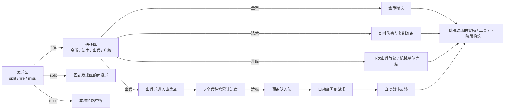
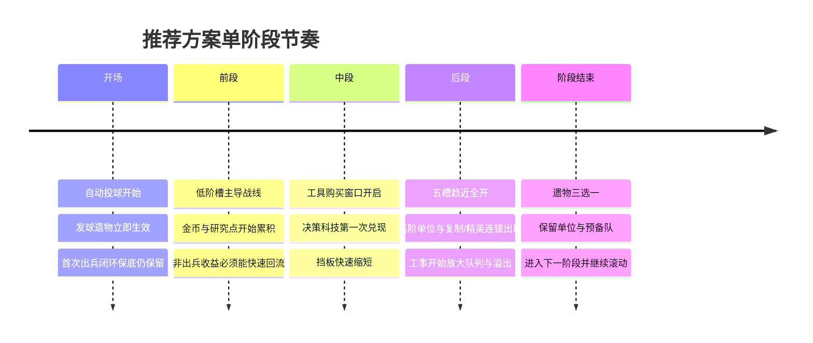

# planB 三仓构筑玩法研究与 Codex 目标文件

## 执行摘要

`moxxxYc/planB` 的 `mvp` 分支已经把核心原型做成了可玩闭环：发球区先把球处理成 split / fire / miss，抉择区再把球转成 金币 / 法术 / 出兵 / 升级，只有命中出兵的球才会进入出兵区；出兵区有 5 个种族兵种槽，按 1 / 3 / 5 / 7 / 9 的进度需求累计并生成指定单位，单位进入预备队后会自动释放到持续进行的战场；当前还有 Hive 与 Mech 两个种族、六个连续阶段、阶段奖励、预备队、精英与持续性战场状态。citeturn3view0turn5view0turn26view0turn8view2turn14view1turn14view2

这个闭环已经足够验证“球流 → 单位生成 → 自动战斗反馈”是否成立，而且近期还补上了抉择槽真实宽度、开局首次出兵闭环保底、金币单次重掷、升级与预备队可见性等关键可测性问题。真正还没做开的，不是“能不能玩”，而是“能不能形成强烈而低理解门槛的构筑分化”。当前构筑深度仍明显偏在抉择区和若干数值 modifier 上，发球区与出兵区都还缺少真正独立的 build layer。基于这一点，我给出的最优验证方向是：把三仓直接做成三种不同形态的构筑入口，其中发球区负责球的形态与节奏，抉择区负责转化与连锁，出兵区负责兵种进度、队列与高阶展开。citeturn3view1turn5view0turn14view0turn14view2turn25view0

## 当前玩法现状与问题

从源码和文档看，当前实际玩法链路是：活跃阶段开始后，场景会自动开局并立刻投出首颗 launch 球；之后在阶段进行中，系统大约每 1300ms 自动投一轮球，`ballCount` 会让单轮投球数增加。球先经过发球区，命中 split / fire / miss 之一；进入抉择区后命中 金币 / 法术 / 出兵 / 升级；只有出兵结果会创建 unit ball，unit ball 进入出兵区后再落到当前种族的 5 个兵种槽上，累计进度并在达标时把指定兵种加入预备队，预备队再按释放节奏自动部署到战场。阶段同时持续刷敌兵，战斗、队列释放与球流是并行实时更新的。citeturn33view7turn3view0turn13view2turn14view1turn14view2turn13view1

三仓对比如下。

| 球仓 | 当前用途 | 玩家当前作用方式 | 当前可被修改的量 | 主要痛点 | 依据 |
|---|---|---|---|---|---|
| 发球区 | 自动产出原始球，并由扫摆发射器送入 split / fire / miss | 主要是被动接受自动投球；长期决策里真正能稳定作用到这里的，基本只剩 `ballCount` 相关奖励 | 自动投球节奏约 1300ms、一轮可按 `ballCount` 多投；发射器扫摆周期约 2400ms；split 逻辑固定为再生成两颗 launch 球 | 构筑入口过少，miss 几乎是纯空转；“发球区”目前更像节拍器，不像玩家可塑形的 build layer | citeturn33view7turn13view14turn14view0turn3view0 |
| 抉择区 | 把球转成 金币 / 法术 / 出兵 / 升级；当前可见顺序是 金币 / 法术 / 出兵 / 升级 | 阶段奖励可改变部分槽宽；法术、金币、升级、出兵都是在这里决定本轮价值方向 | `widthWeight` 现在会真实改变槽位物理宽度；gold / spawn 宽度有奖励；各槽触发会直接改金币、法伤、复制、下次出兵等级等状态 | 这是当前唯一已经长成的结构化构筑层，导致整个 build 过于向抉择区倾斜；很多收益仍是“单次数值结算”，不是持续连锁 | citeturn8view1turn25view0turn18view0turn13view2turn14view0 |
| 出兵区 | 接收 spawn 结果产生的 unit ball；5 个兵种槽按 1 / 3 / 5 / 7 / 9 累计指定兵种进度；达标后入预备队并自动部署 | 玩家当前几乎不能直接构筑这个区，只能间接通过升级、复制、额外单位、队列速度等 modifier 影响结果 | 高阶挡板开局只放行低阶区，前半阶段会从 1 槽逐步开放到全部 5 槽；默认队列释放间隔约 650ms；软上限 50 普通单位、8 精英 | 当前“出兵区”的结构性变化几乎只有时间门控；前期高阶槽受挡板限制，易把 unit ball 反复压回低阶；这会让后期 build fantasy 出得慢 | citeturn14view2turn14view1turn13view0turn5view0 |

就“关键交互点”而言，当前 repo 的优点是链路极清楚：出兵不再直接随机抽兵，而是必须经过 `spawn` → unit ball → unit slot progress → queue → deploy 这条链；金、法、升也都已经能回写到 `GameState` 并在后续影响产出。问题是，真正持续可选的玩家决策仍偏少，主要集中在阶段结束后的奖励三选一，以及金币足够时的一次重掷。换句话说，当前“玩构筑”的主要感觉还是“挑 modifier”，还不是“改机器”。citeturn3view1turn14view0turn14view1turn14view2turn33view7

从玩法缺陷看，我认为最明显的有六个。其一，三仓构筑不对称。发球区长期只有球数变化；抉择区已经能改槽宽和收益；出兵区则几乎只剩固定 5 槽与时间挡板，这会让构筑重心天然挤到抉择区。其二，当前 build pool 主要还是数值加成：额外球、金倍率、法伤、复制、队列速度、基础兵属性、宽度乘算，这些都能工作，但缺少“跨仓联动的结构变化”。其三，Mech 的升级收益比 Hive 明显更陡：升级槽会给 Mech 更高的 `pendingSpawnLevelBonus`，还会随机抬高某个机械单位等级，而战斗层每级又会带来约 28% 生命提升与固定伤害增量，这很容易形成高阶滚雪球。citeturn14view0turn13view2turn14view2turn27view7turn26view0

其四，当前出兵区的时间门控太单一。挡板在阶段前半段从只开放 1 槽逐渐开到 5 槽，确实能形成早低阶、后高阶的节奏，但它更像关卡节奏，不像构筑层。其五，当前阶段长度偏长，六个阶段从 52 秒一路拉到 80 秒，这对“快速验证流派差异”并不理想；MVP 更需要在更短时间里看到构筑转折，而不是把差异压到长阶段后半才显现。其六，代码和数据里仍保留 `special` 槽定义，但可见抉择区已移除 SPECIAL 行，这说明当前输出空间在玩法概念上还没彻底稳定。citeturn14view2turn8view2turn8view1turn5view0

与本结论直接相关、我实际检查过的关键路径包括：`README.md`、`CODEX_GOAL.md`、`docs/PROGRESS.md`、`docs/PLAYTEST_CHECKLIST.md`、`src/types/game.ts`、`src/data/phases.ts`、`src/data/races.ts`、`src/data/rewards.ts`、`src/data/slots.ts`、`src/data/units.ts`、`src/systems/GameState.ts`、`PhaseSystem.ts`、`RewardSystem.ts`、`SlotTriggerSystem.ts`、`SpawnQueueSystem.ts`、`UnitSpawnProgressSystem.ts`、`DecisionSlotLayoutSystem.ts`、`FirstSpawnLoopAssistSystem.ts`、`BattleSystem.ts`、`PinballMachineSystem.ts`、`src/scenes/PrototypeScene.ts`。这些文件分别给出了状态结构、阶段逻辑、奖励池、槽触发、预备队、出兵进度、抉择槽宽度、首次闭环保底、战斗公式、发球规律以及整套场景 wiring。citeturn3view0turn3view1turn5view0turn5view1turn8view0turn8view1turn8view2turn8view3turn13view0turn13view1turn13view2turn14view0turn14view1turn14view2turn25view0turn25view1turn27view0turn33view7

## 设计目标与原则

- 三仓都必须有独立构筑入口，而且入口形态不同，不能只是都加数值。
- 负反馈要尽量小。任何非出兵收益，都要能在短窗口内回流成看得见的出兵或战场优势。
- 理解门槛要低。玩家一眼能看懂“这次改的是哪一仓、哪条链”，但深度要靠跨仓连锁而不是靠文字复杂度。
- 允许奇思妙想流派。目标不是平衡到完美，而是让爆兵、法术复制、经济转工事、精英高阶、溢出灌层等路线都能跑出来。
- 波次和阶段长度要为流派服务。只要能更快看到 build identity，就可以重写当前 phase 节奏。
- 任何方案都必须保住主链路：球进入三仓、球的性质和流向改变单位生成、自动战斗给出明确反馈。
- Codex 实现时优先做“可观测”。每个方案都必须有链路日志、关键计数和可复现实验预设。

## 可选构筑方案

下面三套方案都以同一结论为出发点：当前 repo 已经把三仓闭环打通，但发球区构筑不足、抉择区过载、出兵区偏被动，因此下一步不是再堆奖励卡，而是要把三仓本身做成三种不同的 build surface。citeturn14view0turn14view2turn33view7turn25view0

### 遗物驱动的三仓成长

**核心机制说明**  
这套方案直接沿用你最初的想法，但把它做得更干净：发球区用遗物，抉择区用科技，出兵区用工事。遗物只改“球”；科技只改“转化”；工事只改“出兵”。这样玩家不用理解复杂系统关系，也能天然知道自己在改哪一层。

**玩家可操作的构筑元素**  
每阶段结束后，从 3 件遗物里选 1 件，遗物只作用发球区，比如增加单轮球数、让 split 球带额外 value、把 miss 收回成弱 fire、改变扫摆角速度、给球附加“复制”“高阶”“脉冲”标签。抉择区不再主要靠随机奖励卡，而是累积“研究点”去点有限科技；研究点由升级与法术共同产出，科技主要改槽宽、槽效果和跨槽连锁。出兵区则增加 3 个工事位，用金币建造工事，工事负责改 slot progress、overflow、门控和 queue release。

**如何影响三个球仓**  
发球区的长线 fantasy 是“产球机器越调越离谱”；抉择区的 fantasy 是“转化逻辑被你改写”；出兵区的 fantasy 是“兵种培养和出兵节奏被你雕刻”。这样三仓不会再挤到同一个数值池里，而是各自承担不同乐趣：发球区负责前因，抉择区负责分流，出兵区负责兑现。

**波次、资源与升级节奏**  
阶段建议缩短到中短局，单阶段里给一次小工具购买点；阶段末给遗物，阶段中通过研究点推动科技，金币则用于工事与工具。这里最关键的一条是：金、法、升都必须能快速回流到出兵，不允许再出现“我这 20 秒一直没命中 spawn，于是什么都没看到”的长空窗。可以通过研究点阈值奖励、工事预装进度、或“非出兵三连后保底生成 1 个 unit mark”来兜底。

**允许的流派与组合**  
它天然支持四类高辨识流派：分裂虫潮流、法术复制流、机械高阶精英流、经济转工业流。更重要的是，这四类都能跨仓连锁，而不是只在一个仓里增长数字。

**潜在风险与负反馈点**  
最大风险是层太多，菜单感上升。解决方法不是砍深度，而是硬性约束展示量：同时可见遗物不超过 3 条摘要、科技树不超过 6 个节点、工事位固定 3 个。第二个风险是经济资源过多导致记忆负担，所以建议把升级和法术共用一套“研究点”，不要再造第四个货币。

**衡量成功的可量化指标**  
如果这套方案合格，那么玩家在前 90 秒内应该至少看到两个仓的可视化变化；到第 3 阶段，至少出现一次“发球遗物 → 抉择科技 → 出兵工事”完整跨仓连锁；非出兵收益回流成战斗增益的空窗不应超过 15 秒；到第 4 阶段，至少能明显分辨出 4 种不同 build identity。

| 参数 | 首测值或范围 | 作用 |
|---|---:|---|
| 单阶段时长 | 40–55 秒 | 比当前更短，更快看到 build identity |
| 自动投球间隔 | 1100–1300ms | 比当前略快，强化机器改造感 |
| 单轮投球基数 | 1 | 保持基线清楚 |
| 发球遗物获取 | 每阶段 3 选 1 | 形成强节奏的长线成长 |
| 工具购买窗口 | 每阶段中段 1 次 | 把非出兵资源尽快回流 |
| 工事位数量 | 3 | 限制复杂度但保留搭配空间 |
| 科技节点数量 | 6–8 个 | 保持足够深度，不做大树 |
| 研究点来源 | 升级与法术共同产出 | 降低货币种类 |
| 决策槽宽权重范围 | 0.7–2.2 | 让抉择区结构变化肉眼明显 |
| 出兵挡板全开时间 | 阶段 35%–45% 时点 | 让高阶 fantasy 更早出现 |
| 预备队释放间隔 | 500–700ms | 让工事能明显影响兑现速度 |
| 非出兵保底回流 | 连续 3 次非 spawn 后给 1 个出兵标记 | 压低空窗负反馈 |

### 构筑卡组与联动脚本

**核心机制说明**  
这套方案完全不同，不再把构筑拆成遗物 / 科技 / 建筑，而是做一套小而清晰的“协议卡组”。每张卡就是一条 if-then 连锁规则，分别挂在发球区、抉择区、出兵区三个事件点上。玩家 build 的不是数值，是连锁脚本。

**玩家可操作的构筑元素**  
卡组总量保持很小，比如 8–10 张，同时只展示未来 3 张将要触发的协议。每阶段 3 选 1 加卡，每两阶段允许 1 次删卡或替换。卡分三类：发球协议、抉择协议、出兵协议。例子：  
发球协议：“本轮 first split 额外生成 1 个带复制标签的球。”  
抉择协议：“命中 magic 后，下一次 spawn 复制 1 个单位并优先进中槽。”  
出兵协议：“高阶槽被挡板弹回时，把 50% progress 溢给相邻槽。”

**如何影响三个球仓**  
发球区由卡决定球的成分；抉择区由卡决定结果互相转化；出兵区由卡决定进度如何外溢、重定向、升阶和爆发。三仓仍然存在，但它们变成脚本触发点。

**波次、资源与升级节奏**  
为了让脚本有节奏感，建议把每阶段拆成 3 个微波段，每个微波段都更像一个“脚本验证窗口”。资源上保留金币，但把它主要用来重排、替换、清洗卡组，而不是直接买 stat。这样每局玩出来的差异会更像“引擎”而不是“加成”。

**允许的流派与组合**  
这套方案最适合做奇思妙想流派：法术电池流、溢出高阶流、低阶复制海、反弹灌层流、经济洗牌流。它的优点是连锁感最强。

**潜在风险与负反馈点**  
最大的风险是理解门槛高，尤其对第一次玩的人来说。第二个风险是“抽不到关键协议”的坏体验。解决方法必须一起上：卡组小、未来 3 张可见、每阶段 1 次低成本重排、8 秒没触发有效协议就给保底协议。

**衡量成功的可量化指标**  
如果这套方案合格，则 10 秒内平均至少能触发 1.8 次协议；死抽率要低于 10%；不同 run 的协议触发日志能够明显分出流派；玩家在不读长文案的前提下，能仅凭未来 3 张协议预测下一段 build 走向。

| 参数 | 首测值或范围 | 作用 |
|---|---:|---|
| 卡组大小 | 8–10 张 | 保持可理解 |
| 可视未来协议 | 3 张 | 降低信息焦虑 |
| 每阶段草案 | 3 选 1 | 稳定构筑分叉 |
| 每两阶段删/换卡 | 1 次 | 控制死卡 |
| 协议触发冷却 | 4–8 秒 | 防止单协议无限刷屏 |
| 保底协议触发 | 8 秒无有效联动时 | 压低负反馈 |
| 微波段数量 | 每阶段 3 段 | 增强“脚本验证”节奏 |
| 单阶段时长 | 36–48 秒 | 保证一局能经历多次连锁 |
| 金币主要用途 | 洗牌 / 替换 / 预览 | 经济服务构筑，而非单纯数值 |
| 出兵挡板全开时间 | 阶段 25%–40% 时点 | 给脚本更早接触高阶槽 |
| 单卡最大联动跨度 | 2 仓 | 降低规则爆炸 |

### 即时三选一注入

**核心机制说明**  
这套方案是最容易上手、也最适合快速验证的版本。取消复杂长期树，只保留“即时三选一注入”。每隔一小段时间，或累计一定事件数，暂停 3 秒给玩家一个三选一，每个选择都非常直接，而且只影响 1–2 条清楚的链路。

**玩家可操作的构筑元素**  
玩家始终只处理短句选择，例如“本阶段多投 1 球”“下一次 upgrade 让出兵球 value +2”“把 30% 的 miss 返还成 weak fire”“指定一个热槽，本阶段所有 unit ball 优先结算到它”。同时最多持有 3 个 active 注入，自动过期或续杯。

**如何影响三个球仓**  
发球区注入负责球数、分裂、扫摆与 miss 补偿；抉择区注入负责槽宽、结果转化与临时复制；出兵区注入负责热槽、溢出、早开门与 queue burst。和方案一相比，这套方案弱化长期规划，强化战中即刻决策。

**波次、资源与升级节奏**  
建议阶段进一步缩短，并在每个阶段中做 2–3 个小 checkpoint。资源统一成一个“势能”，任何非 spawn 成果都能涨势能，势能满了就立刻给三选一。这样负反馈最低，因为就算你一直没看到直接出兵，也在逼近下一次可操作选择。

**允许的流派与组合**  
它最适合爆兵快感、热槽抢层、法术电池、经济补偿、逆风修复这类“很快就能看懂”的流派。深度不是来自系统多，而是来自注入之间的堆叠。

**潜在风险与负反馈点**  
最大风险是“深度不够持久”。因此不能全做短效 buff，必须给每局保留 1 个“签名注入”常驻到 run 结束。第二个风险是过于频繁打断；所以 checkpoint 必须简短，且允许在 2–3 秒内点完。

**衡量成功的可量化指标**  
如果这套方案合格，那么玩家应在 45 秒内做出第一次有明显后果的 build 选择；到第 2 阶段，至少已有 3 个肉眼可见的变量改变；任何 run 都不该出现 20 秒以上“无选择、无成长、无回流”的真空段。

| 参数 | 首测值或范围 | 作用 |
|---|---:|---|
| 单阶段时长 | 30–42 秒 | 极快验证流派成型 |
| 自动投球间隔 | 1000–1200ms | 让注入反馈更快出现 |
| 注入触发条件 | 每 12–18 秒或每 3 次有效决策结果 | 稳定提供选择 |
| 单次选择停顿 | 3–5 秒 | 不拖慢节奏 |
| 同时生效注入上限 | 3 个 | 避免 UI 爆炸 |
| 注入持续时间 | 1–2 阶段 | 有短线规划感 |
| 常驻签名注入 | 每局 1 个 | 防止全是临时 buff |
| 势能来源 | 任何非 spawn 结果 + 挡板弹回 | 降低负反馈 |
| 热槽加成 | +1 进度或 +35%–60% 命中偏置 | 建立出兵区存在感 |
| queue burst | 2–3 个单位、250–400ms 间隔 | 让“兑现”非常显眼 |
| miss 回收率 | 20%–40% | 让发球区不再纯空转 |

## 推荐方案

从“快速验证这套三仓玩法到底有没有长期可玩性”这个角度，我推荐优先做 **遗物驱动的三仓成长**。原因不是它最省改动，而是它最能正面回答当前 repo 的核心问题：现有原型已经有阶段奖励、持续战场、真实槽宽、固定种族槽、预备队和连锁状态，但构筑实际只在抉择区长出来；如果下一步把三仓分别赋予遗物、科技、工事三种不同 build surface，就能最快验证“这套三仓框架是否真的配得上 roguelite 构筑深度”。citeturn3view0turn5view0turn14view0turn14view2turn25view0turn33view7

更具体地说，当前 repo 已经具备推荐方案最关键的基底：阶段结束后本来就有奖励选择，`GameState` 已经留有 `machineUpgrades`、`slotUpgrades`、`buildings`、`relics` 这类持续结构字段，抉择区宽度修改已经能真实作用物理碰撞，出兵区也已经有预备队、等级、精英、挡板进度与五槽累计逻辑。这意味着推荐方案不是凭空另起炉灶，而是在现有 MVP 闭环上，把三仓的成长层真正补全。citeturn8view0turn13view0turn25view0turn14view1turn14view2turn5view0

下面这段文本可以直接交给 Codex 作为 goal 模板使用。

**High-level goal**

- 在当前 `mvp` 分支的三仓闭环上，落地一个“遗物驱动的三仓成长”玩法验证版。
- 允许你重写当前 phase / reward / slot / build 节奏，只要保住主链路：`发球区 -> 抉择区 -> 出兵区 -> 预备队 -> 自动战斗反馈`。
- 不要为了最小改动、工程美观或实现成本缩小方案；只为玩法验证服务。

**Subgoals**

- 为发球区增加“遗物层”：遗物只能改球的数量、价值、标签、再投、miss 回收、扫摆模式。
- 为抉择区增加“科技层”：科技只能改槽宽、结果转化、结果连锁和跨槽转换。
- 为出兵区增加“工事层”：工事只能改进度、overflow、挡板、队列释放和高阶展开。
- 重写阶段节奏为中短局，让 build identity 更早出现。
- 给所有非出兵收益添加“快速回流通道”，确保短时间内能转成出兵或战场影响。
- 增加可观测 telemetry：每阶段结束必须输出三仓链路日志和 build summary。
- 加入至少 5 套可复现的 debug 预设，用来快速验证不同流派。

**Success criteria**

- 前 90 秒内，至少两个球仓出现肉眼可见的结构变化。
- 第 3 阶段前，至少出现一次跨越三仓的连锁：发球变化影响抉择，再影响出兵兑现。
- 连续 15 秒内禁止出现“只有经济/法术收益、但完全看不到后续出兵兑现”的真空状态。
- 第 4 阶段前，至少能清楚分辨四种 build identity：爆兵、法术复制、高阶精英、经济工业。
- 每阶段结束的 telemetry 能回答以下问题：  
  `球从哪里来`、`抉择怎么分流`、`哪些单位是如何入队和部署的`、`这阶段 build 主要靠哪一仓赢了`。

**Required game-state inputs**

- 直接复用并读取现有状态字段：`state.modifiers`、`state.gold`、`state.pendingSpawnLevelBonus`、`state.slots[slotId].widthWeight`、`state.unitSlotStates`、`state.spawnQueue`、`state.phaseElapsedMs`、`state.battle.units`、`state.selectedRewards`、`state.currentRaceId`。这些字段已经存在于 repo，足够作为新系统的核心输入。citeturn8view0turn13view0turn14view1turn14view2
- 新增并持久化：`launchRelics`、`decisionTechs`、`unitStructures`、`researchPoints`、`ballTags`、`phaseToolStock`、`chainHistory`、`buildArchetypeHint`。
- 直接复用现有基表：`phaseDefs`、`rewardDefs`、`raceDefs`、`unitDefs`、`slotDefs`。citeturn8view1turn8view2turn8view3turn26view0turn26view3

**Expected outputs**

- 一套新的三仓构筑数据定义：遗物表、科技表、工事表。
- 一个可切换的 balance preset，默认使用“推荐方案首测值”。
- HUD 上必须新增三项：当前遗物摘要、科技节点摘要、工事摘要。
- 每阶段结束必须生成 build summary：  
  `本阶段哪一仓贡献最大`、`主要单位来源`、`高阶单位占比`、`资源回流效率`、`被挡板弹回次数`。
- 至少 5 个 debug 预设按钮或预设 action，用于快速切到不同流派。
- 自动化或半自动验证脚本，至少能检查关键链路没有断：  
  `launch changes -> decision conversion -> unit slot progress -> queue -> deploy -> combat impact`。

**Stepwise tasks Codex should perform**

- 先把当前 reward 三选一重构成“遗物三选一”，并把现有偏 launch 的奖励迁移到遗物层，把现有偏 width/conversion 的奖励迁移到科技层，把偏 queue/gate/slot progress 的效果迁移到工事层。
- 再把阶段中段加入一个轻量工具购买窗口，工具只卖一次性 consumable，不做复杂商店。
- 然后重写发球区，使 launch ball 支持标签与球种；至少先支持：`split+`、`spawn-mark`、`copy-mark`、`heavy`、`recycle`。
- 再重写抉择区，使决策结果不只是直接加数值，而能写入“下一球 / 下一次出兵 / 下一段阶段”的条件状态。
- 最后重写出兵区，让工事能影响：热槽、overflow、挡板开放速度、队列 burst、出兵复制与高阶保底。
- 完成后加 telemetry，再做预设测试，不要等全部做完才验证。

**Recommended first implementation preset**

- 阶段时长先用 45 秒。
- 自动投球间隔先用 1200ms。
- 遗物每阶段 3 选 1。
- 工具窗口放在阶段 18–22 秒。
- 科技用统一研究点，第一层科技成本先用 3 点、第二层 6 点、第三层 9 点。
- 工事位固定 3 个。
- 挡板在阶段 40% 时全开。
- 预备队基础释放间隔先用 600ms。
- 非出兵保底回流：连续 3 次非 spawn 结果后，直接给 1 个 `spawn-mark` 进入下一颗 decision ball。

**Test scenarios**

| 场景 | 选择倾向 | 期望现象 | 必须记录的指标 |
|---|---|---|---|
| 虫群爆兵 | 优先球数、split、spawn 宽度、overflow 工事 | 第 2 阶段开始低阶单位密度明显高；第 3 阶段前战线稳定向前推 | `launch_ball_count`、`spawn_hits`、`tier1-2 deploy share`、`overflow conversions` |
| 机械高阶精英 | 优先 upgrade 科技、挡板加速、高阶工事 | 第 3 阶段前出现可见高阶单位与精英部署；单位平均等级明显高于虫群流 | `avg_unit_level`、`elite_deploy_count`、`tier3 deploy time` |
| 法术复制 | 优先 magic 科技、copy 标签、复制工事 | 即使 spawn 频次一般，也能靠 magic 连锁抬高实际部署数 | `magic_hits`、`pending_copy_consumed`、`deploys_per_spawn_hit` |
| 经济工业 | 优先 gold、工具、队列工事 | 开局略弱，但第 3 阶段后出现明显的 deploy burst | `gold_income`、`tool_purchase_count`、`queue_release_rate`、`burst_window_deploys` |
| 逆风修复 | 刻意让前段连续不命中 spawn | 仍能在 15 秒内看到回流成 unit mark、queue 或直接战力 | `non_spawn_streak_max`、`time_to_recovery_spawn`、`recovery_source` |
| 混搭实验 | 人为组合不直观效果，例如 recycle + magic-copy + hot-slot | 应能跑出意外但可解释的联动，而不是直接崩坏或无效 | `cross_chamber_chain_count`、`chain_depth`、`dead_effect_count` |

如果 Codex 在实现时需要决定“优先删什么、保什么”，优先级应当是：保住三仓主链路与 build 可读性；其次保住连锁与低负反馈；最后才考虑和当前数据结构的贴合度。当前 repo 已经证明这套闭环能跑，接下来真正要验证的，不是“还能不能继续加内容”，而是“这套三仓是否值得支撑多流派构筑”。上面的推荐方案，正是为这个问题服务的。citeturn3view0turn5view0turn14view0turn14view2turn33view7